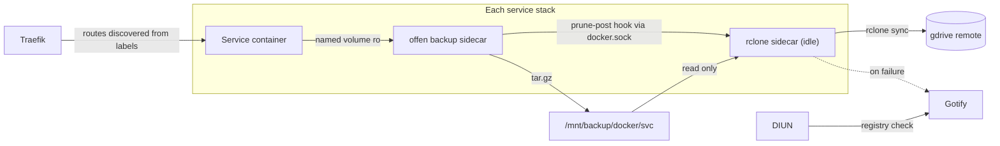

# Container Management Overhaul

Standardize the offsite backup tier into per-stack rclone sidecars triggered by the existing offen backup
lifecycle, add DIUN + Gotify for notify-only update tracking with every image tag pinned in git, and replace
the nginx + certbot + `service.sh` stack with Traefik, moving routing into each service's compose labels.

## Decisions

- **Updates**: notify-only. DIUN watches registries, every tag is pinned in this repo, and nothing pulls or
  restarts on its own. Git stays the source of truth for image versions.
- **Notifications**: self-hosted Gotify, as a new service stack.
- **Offsite tier**: per-service rclone sidecar rather than one central rclone service, so each stack owns its
  own offsite push.
- **Backup consistency**: `src/services/mariadb` is the only stack that stays up during its backup, because it
  is the only one close to needing 24/7 availability. That is exactly why it gets a logical dump instead: its
  `dump.sh` (`mariadb-dump --all-databases --single-transaction --routines --events --hex-blob`) runs as an
  `archive-pre` hook and offen archives the resulting `mariadb-dumps` volume, not `mariadb-data`. It stays
  as-is, and it is the only logical dump in the estate.

  **Every other stack stops all of its containers during backup**, via
  `docker-volume-backup.stop-during-backup=true` on each one. No dumps, no hot copies, no per-container
  judgement calls about which volumes hold a datastore. vaultwarden, unifi, and unifi-os already work this way
  and are the model.
- **Reverse proxy**: Traefik v3 replaces nginx + certbot. Routing lives as labels on each service, so proxy
  config travels with the service it belongs to and deploys through the existing gradle tasks.

### Why Traefik over Nginx Proxy Manager

NPM was the initial pick, but its config lives in a sqlite DB rather than in git. It has a full REST API
(`POST /api/tokens`, then `POST /api/nginx/proxy-hosts`) so it *can* be scripted, and there is an active
Terraform provider, but either route means maintaining a reconciliation layer on top of a UI-driven app whose
database stays the runtime source of truth. Traefik needs no such layer: the compose file is the config.

The tradeoffs accepted: no admin UI (the dashboard is read-only), and a bad label silently drops a route rather
than failing loudly the way `nginx -t` does.

## What exists today

- 5 stacks run an `offen/docker-volume-backup` sidecar writing tarballs to `/mnt/backup/docker/<svc>`:
  vaultwarden, unifi, unifi-os, mariadb, wiki.
- A host cron (`src/etc/cron.d/docker_gdrive_backup`) runs `src/bin/cron/docker_gdrive_backup.sh`, which shells
  out to a host-installed `rclone` on `/opt/rclone` using root's `rclone.conf`.
- nginx serves ~15 vhosts from `.conf.d`, populated by `src/bin/service.sh` copying each
  `src/services/<svc>/<svc>.conf`. A nightly cron does a full `docker compose down && up` on nginx purely so
  renewed certs get picked up.

### Gaps found while reading the repo

- `src/services/wiki/docker-compose.yml` is broken in two ways. Line 79 still has the upstream placeholder
  `- /path/to/your/backups:/archive`, so BookStack backups are not landing on the NAS and are not in the gdrive
  script at all. Worse, its sidecar uses `BACKUP_STOP_CONTAINER_LABEL: "bookstack.backup=true"` and that label
  is only on the `bookstack` container, not on `bookstack_db` — so `mariadb_data` is being tarred while MariaDB
  is running. That is a hot copy of a live InnoDB directory: it looks like a backup and almost certainly is not
  restorable.
- The wiki stack is also the only one using a custom stop label. Everywhere else uses the default
  `docker-volume-backup.stop-during-backup=true`, so it should be standardized onto that.
- 11 stacks keep state in named volumes with no volume backup of any kind: jenkins (`jenkins-home`), nexus
  (`nexus-data`), grafana/influxdb (5 volumes), openhab (3), sonarqube (5), portainer, timescaledb, obsidian,
  velxio, redis, rabbitmq. The `services_backup.sh` zip only captures `/mnt/raid/services` bind mounts, not
  these volumes.
- Only the mariadb backup container sets `EXEC_LABEL`. Per offen's docs, an instance without `EXEC_LABEL` will
  run lifecycle hook commands on *every* labeled container on the host, so this must be fixed before adding
  hooks anywhere else.
- `/mnt/backup/docker/services` and `/mnt/backup/weather/db` are synced to gdrive but have no owning compose
  stack in this repo (the weather service only ships a vhost conf here).

## Target state



## Phases

| Phase | Scope | Risk | Can ship independently |
|---|---|---|---|
| 1 | Offsite tier moves from host cron to per-stack rclone sidecars | low, reversible | yes |
| 2 | Pin all tags, add Gotify + DIUN | low | yes |
| 3 | Traefik replaces nginx + certbot | medium, short window | no — Gotify route depends on 2 |
| 4 | Backfill volume backups for the 11 unprotected stacks | low | yes, after 1 |

---

## Phase 1: offsite tier as rclone sidecars

Replace the host cron with one `rclone/rclone` sidecar per stack, triggered by offen rather than by a second
clock.

**Shared script, deployed everywhere.** Add `src/services/_common/rclone-sync.sh` and extend `deployService` in
`src/gradle/services.gradle` so every stack gets it:

```groovy
put from: "${project.rootDir}/src/services/_common", into: "/mnt/raid/services/${project.svc}"
```

The script reads `RCLONE_SRC` / `RCLONE_DEST`, runs `rclone sync`, and posts to Gotify via busybox `wget` on
non-zero exit.

**Sidecar shape** (example for vaultwarden; the container idles and is only exec'd by offen):

```yaml
  gdrive:
    image: rclone/rclone:1.71.0
    container_name: vaultwarden-gdrive
    restart: unless-stopped
    entrypoint: ["sleep", "infinity"]
    environment:
      RCLONE_SRC: /archive
      RCLONE_DEST: gdrive:/backup/services/vault
    volumes:
      - /root/.config/rclone/rclone.conf:/config/rclone/rclone.conf:ro
      - /mnt/backup/docker/vaultwarden:/archive:ro
      - ./_common/rclone-sync.sh:/rclone-sync.sh:ro
    labels:
      - docker-volume-backup.exec-label=vaultwarden
      - docker-volume-backup.prune-post=/bin/sh /rclone-sync.sh
```

`prune-post` (not `archive-post`) is the right hook: it fires after offen has written the archive *and* applied
`BACKUP_RETENTION_DAYS`, so `rclone sync` mirrors deletions instead of fighting them. The paired `backup`
service gets `EXEC_LABEL: vaultwarden`.

Destinations carry over unchanged from the current script: vaultwarden to `gdrive:/backup/services/vault`,
unifi to `/backup/services/unifi`, unifi-os to `/backup/services/unifi-os`, mariadb to `/backup/docker/mariadb`.

**Orphan paths.** `/mnt/backup/docker/services` and `/mnt/backup/weather/db` have no offen instance to hook
into, so they get one small `src/services/gdrive/` stack that runs busybox `crond` on a schedule. Once that
exists, delete `src/bin/cron/docker_gdrive_backup.sh` and its cron.d entry, and drop `/opt/rclone` from the
PATH line.

---

## Phase 2: updates via DIUN, notify-only

**Pin every floating tag** so a DIUN alert corresponds to a git commit. Currently unpinned:
`vaultwarden/server:latest`, `portainer/portainer-ce:latest`, `ghcr.io/sytone/obsidian-remote:latest`,
`ghcr.io/superioone/nut_webgui:latest` (x2), `ghcr.io/davidmonterocrespo24/velxio:master`,
`jenkins/jenkins:lts`, `sonarqube:lts-community`, `lscr.io/linuxserver/mariadb:latest`,
`lscr.io/linuxserver/bookstack:latest`, `certbot/dns-cloudflare` (no tag at all), and
`offen/docker-volume-backup:latest` in three stacks.

**New `src/services/gotify/`**: `gotify/server` pinned, named volume, on `share-net`, plus the offen + rclone
sidecar pair from Phase 1 (its app tokens are state worth keeping).

**New `src/services/diun/`**: `crazymax/diun` pinned, `command: serve`, docker provider with
`watchByDefault: true` and `watchStopped: true`, `DIUN_WATCH_SCHEDULE=0 6 * * *`, Gotify notifier pointed at the
container over `share-net`. Add `diun.enable=false` to throwaway containers (`restorer`), and
`diun.include_tags` regexes where upstreams publish noisy tags.

**Workflow**, documented in `README.md`: DIUN posts to Gotify, you bump the tag in this repo, run
`./gradlew deploy<Svc>`, then `docker compose up -d` on the host. Nothing pulls or restarts on its own.

---

## Phase 3: Traefik replaces nginx + certbot

**New `src/services/traefik/`**: `traefik:v3.5` pinned, publishing 80 and 443, on `share-net`, with
`docker.sock` mounted read-only (same exposure the offen sidecars already have), an `acme.json` volume, a
static `traefik.yml`, and a `./dynamic/` directory mounted read-only for the handful of things labels cannot
express. Set `providers.docker.exposedByDefault=false` so nothing is routed by accident.

**Issue one wildcard, not sixteen certs.** Put the domains on the entrypoint in `traefik.yml` so routers need
no TLS labels at all and Let's Encrypt is hit once:

```yaml
entryPoints:
  web:
    address: ":80"
    http:
      redirections:
        entryPoint:
          to: websecure
          scheme: https
  websecure:
    address: ":443"
    http:
      tls:
        certResolver: cloudflare
        domains:
          - main: tecronin.uk
            sans:
              - "*.tecronin.uk"
```

The resolver uses the DNS challenge with `CF_DNS_API_TOKEN`, reusing the token currently in `cloudflare.ini`.
This retires the certbot container and its 12-hour renewal loop.

**Per-service labels** are the whole config for 14 of the 16 routes. Nexus, for example:

```yaml
    labels:
      - traefik.enable=true
      - traefik.http.routers.nexus.rule=Host(`nexus.tecronin.uk`)
      - traefik.http.routers.nexus.entrypoints=websecure
      - traefik.http.services.nexus.loadbalancer.server.port=8081
```

Ports per route, taken from the current vhosts: nexus 8081, jenkins 8080, grafana 3000, influxdb 8086,
sonarqube 9000, portainer 9000, obsidian 8080, bookstack 80, vaultwarden 8860, upsdesktop 8010, upspimgr 8020,
velxio 80, rabbitmq 15672, openhab 8881. Websocket upgrade is automatic, so the `$connection_upgrade` map and
every `proxy_set_header` block disappear. Traefik imposes no request body limit, so `client_max_body_size` for
the wiki (256M) and unifi-os `.unf` restores (1G) stops being a concern entirely.

**The four non-trivial cases**, all verified against Traefik v3 behavior:

- **vaultwarden and unifi-os LAN restriction** becomes one `ipAllowList` middleware defined once in
  `dynamic/middlewares.yml` with `sourceRange: 192.168.1.0/24, 10.9.0.0/24`, referenced as
  `traefik.http.routers.<svc>.middlewares=lan-only@file`. Note v3 renamed this from v2's `ipWhiteList`.
- **velxio's `Host: localhost` override** is a label. Traefik's headers middleware special-cases Host
  (`req.Host = value`), so `traefik.http.middlewares.velxio-host.headers.customrequestheaders.Host=localhost`
  does what the nginx `proxy_set_header Host localhost` does today.
- **unifi-os** needs `insecureSkipVerify` for its self-signed backend plus long restore timeouts, and
  ServersTransport *cannot* be defined via docker labels. It goes in `dynamic/transports.yml` and is
  referenced with `traefik.http.services.unifi-os.loadbalancer.serverstransport=unifi@file`, alongside
  `loadbalancer.server.scheme=https` and `server.port=443`.
- **weather** points at `tec-weather.localdomain:8000`, which is not a container this Traefik can discover, so
  it gets a plain router plus service in `dynamic/external.yml`.

**Cutover is stageable**, which is the main advantage over the NPM plan. Labels are inert while Traefik is not
running, so add them stack by stack and redeploy ahead of time (a label change requires
`docker compose up -d` to recreate the container, so each service takes a few seconds, done at your
convenience). The actual window is then: stop nginx, start Traefik, watch the ACME challenge complete. Rollback
is starting the nginx stack back up, since Traefik never touches `certbot_etc`.

**Back up `acme.json`** with the offen + rclone sidecar pair. It is small and re-issuable, but Let's Encrypt
rate limits make a rebuild from scratch unpleasant.

**Document the route inventory** in `src/services/traefik/README.md`, following the convention of
`src/services/unifi-os/README.md`: the host-to-service table, the two file-provider exceptions and why they
exist, and how to add a route for a new service.

**Retire after verification**: the nginx stack and its certbot sidecar, `src/bin/service.sh`, the 15
per-service `<svc>.conf` files, and `src/bin/cron/docker_nginx_restart.sh` with its cron.d entry. Add
`deployTraefik`, `deployGotify`, and `deployDiun` gradle tasks to `deployAll` and drop `deployNginx`.

---

## Phase 4: backfill unprotected volumes

Add the offen + rclone sidecar pair to the 11 stacks that have named volumes and no backup today: jenkins,
nexus, grafana/influxdb, openhab, sonarqube, portainer, timescaledb, obsidian, velxio, redis, rabbitmq. Volume
copies only, no dumps.

Every container in each of these stacks gets `docker-volume-backup.stop-during-backup=true`, including the
multi-container ones — `sonarqube` and its `postgres:13`, `grafana` and `influxdb`. Give each stack a distinct
`EXEC_LABEL` and stagger `BACKUP_CRON_EXPRESSION` so the stop windows, NAS writes, and gdrive pushes do not all
land at once.

One thing to watch when scheduling: timescaledb and influxdb have writers outside their own stack, so their
stop window is a gap in weather and metrics ingestion rather than just a UI outage. Put them at the quietest
point in the rotation.

## Sequencing note

Phases 1 and 2 are independent and low risk. Phase 3 causes an HTTPS outage across all services while proxy
hosts are rebuilt, so it should be done last and in one sitting.

## Task list

Progress is tracked here, in the repo. This file is the only plan artifact.

### Phase 1

- [ ] Fix the wiki stack: point `/archive` at `/mnt/backup/docker/wiki` instead of the placeholder, add
  `BACKUP_PRUNING_PREFIX`, drop the custom `BACKUP_STOP_CONTAINER_LABEL` in favour of the default
  `docker-volume-backup.stop-during-backup=true`, and put that label on `bookstack_db` as well as `bookstack`
  so `mariadb_data` is copied cold rather than hot.
- [ ] Add `EXEC_LABEL` to every offen backup instance so lifecycle hooks do not cross-fire between stacks.
- [ ] Add `src/services/_common/rclone-sync.sh` and extend `deployService` in `src/gradle/services.gradle` to
  deploy `_common` into every service dir.
- [ ] Add idle rclone sidecars with `prune-post` hooks to vaultwarden, unifi, unifi-os, mariadb, and wiki,
  preserving the existing gdrive destination paths.
- [ ] Add `src/services/gdrive` stack (busybox `crond`) for `/mnt/backup/docker/services` and
  `/mnt/backup/weather/db`, then delete `docker_gdrive_backup.sh`, its cron.d entry, and the `/opt/rclone`
  PATH dependency.

### Phase 2

- [ ] Pin all floating image tags across the compose files.
- [ ] Add `src/services/gotify` stack with named volume, offen + rclone sidecars, gradle deploy task, and a
  vhost (nginx `.conf` now, Traefik labels after Phase 3).
- [ ] Add `src/services/diun` stack with docker provider, daily schedule, Gotify notifier, and
  `diun.enable`/`diun.include_tags` labels; document the alert-to-bump-to-deploy workflow in `README.md`.

### Phase 3

- [ ] Add `src/services/traefik` stack: pinned `traefik:v3.5`, static `traefik.yml` with the wildcard on the
  websecure entrypoint and the Cloudflare DNS resolver, `acme.json` volume with offen + rclone sidecars, and a
  gradle deploy task.
- [ ] Write `dynamic/middlewares.yml` (`lan-only` ipAllowList), `dynamic/transports.yml` (unifi-os
  insecureSkipVerify plus restore timeouts), and `dynamic/external.yml` (weather at
  `tec-weather.localdomain:8000`).
- [ ] Add router and service labels to all 14 container-backed stacks, redeploying each one ahead of the
  cutover while nginx still serves traffic.
- [ ] Cut over: stop nginx, start Traefik, confirm the ACME DNS challenge issues the `*.tecronin.uk` wildcard,
  and walk every route.
- [ ] Write `src/services/traefik/README.md` with the route inventory, the two file-provider exceptions, and
  the procedure for adding a new service.
- [ ] After verification, remove the nginx stack, certbot sidecar, `service.sh`, per-service `.conf` files, and
  the nightly nginx restart cron; update gradle `deployAll` accordingly.

### Phase 4

- [ ] Backfill offen + rclone sidecars for the 11 stacks whose named volumes have no backup today, volume-only,
  with `stop-during-backup=true` on every container in each stack and staggered schedules.
- [ ] Confirm whether `/mnt/backup/weather/db` is a dump the out-of-repo weather app produces itself, or
  whether timescaledb is the only copy of that data.
