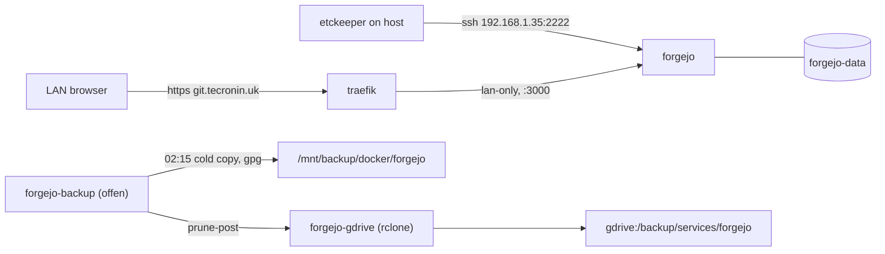

# Forgejo Git Server for etckeeper

> **This file is the source of truth.** `- [x]` done, `- [ ]` open.
> Written 2026-09-27.

Add a Forgejo stack at `src/services/forgejo` that serves as the etckeeper remote. The web UI is at
`git.tecronin.uk` through Traefik and reachable only from the LAN. Git pushes go over SSH on LAN
port 2222. Data lives in one named SQLite-backed volume, backed up with the same offen and rclone
sidecars Vaultwarden uses.

Decisions: SSH transport on published port `2222` (host sshd owns 22), bound to the LAN IP only;
SQLite rather than Postgres so there is one volume to back up; hostname `git.tecronin.uk`; the offen
archive is GPG-encrypted because etckeeper commits `/etc/shadow`, `/etc/ssh/ssh_host_*_key`, and
any WireGuard keys, and unlike Vaultwarden's data none of that is encrypted at rest. Reviewed
2026-09-27 (Fable): DNS override, backup encryption, LAN-IP port bind, version pin, and the
`middlewares.yml` comment added.

**Scope.** This plan is the git service only: the Forgejo stack, its route, its backups, the repo,
and the deploy key. Installing and configuring etckeeper on the host is the Ansible project's job
and is not tracked here; what it needs from this side is listed under [Handoff](#handoff-to-the-ansible-project).

## Shape

## Checklist

- [x] Create [`src/services/forgejo/docker-compose.yml`](../../src/services/forgejo/docker-compose.yml)
  with the `forgejo`, `backup`, and `gdrive` services and the named `forgejo-data` volume.
- [x] Add `deployForgejo` (with the backup dir `mkdir`) to
  [`src/gradle/services.gradle`](../../src/gradle/services.gradle) and to `deployAll`.
- [x] Update [`README.md`](../../README.md),
  [`src/services/traefik/README.md`](../../src/services/traefik/README.md), and the header comment in
  [`src/services/traefik/dynamic/middlewares.yml`](../../src/services/traefik/dynamic/middlewares.yml),
  and add the first-boot steps.
- [x] OPNsense: Unbound host override `git.tecronin.uk` → `192.168.1.35`. Required before anything
  else works, see [DNS](#dns).
- [x] Host: `BACKUP_GPG_PASSPHRASE` in `/mnt/raid/services/forgejo/.env`.
- [x] First boot: admin user, `etckeeper` user with the shared SSH key, repo per host via API token.
- [ ] Verification.
- [x] Hand the connection details to the Ansible project. The role is implemented: vault-encrypted
  private key, `/root/.ssh/config`, and an API token to create one private repo per host.

## New file: `src/services/forgejo/docker-compose.yml`

Model it on [`vaultwarden/docker-compose.yml`](../../src/services/vaultwarden/docker-compose.yml)
and [`gotify/docker-compose.yml`](../../src/services/gotify/docker-compose.yml).

**`forgejo` service**
- `image: codeberg.org/forgejo/forgejo:16.0.5`. Latest stable on Codeberg as of 2026-09-17
  (`15.0.9` was patched the same day and is the alternative). Use the standard image rather than the
  rootless one so everything stays in the single `/data` volume.
- `container_name`/`hostname: forgejo`, `restart: unless-stopped`, on `share-net`.
- `ports: - 192.168.1.35:2222:22`. Bind to the LAN IP, not `0.0.0.0`: Docker inserts its rules
  ahead of ufw, so a bare `2222:22` is reachable on every host interface regardless of the ufw
  allowlist in `docs/setup_guide.md`. WireGuard clients still reach `192.168.1.35` through OPNsense
  routing. The web port stays unpublished because Traefik reaches it over share-net.
- volumes: `forgejo-data:/data`, plus `/etc/timezone` and `/etc/localtime` mounted read-only.
- environment (`FORGEJO__section__KEY` form):
  - `USER_UID=1000`, `USER_GID=1000`
  - `FORGEJO__database__DB_TYPE=sqlite3`
  - `FORGEJO__server__DOMAIN=git.tecronin.uk`, `FORGEJO__server__ROOT_URL=https://git.tecronin.uk/`,
    `FORGEJO__server__HTTP_PORT=3000`
  - `FORGEJO__server__SSH_DOMAIN=git.tecronin.uk`, `FORGEJO__server__SSH_PORT=2222`. Put a comment
    next to these: **do not set the plain `SSH_PORT` env var.** The image's `s6/openssh/setup` reads
    plain `SSH_PORT`/`SSH_LISTEN_PORT` (default 22) for the sshd listen port; the `FORGEJO__` form only
    sets the advertised port in `app.ini`. Plain `SSH_PORT=2222` would move sshd inside the container
    and break the `2222:22` mapping. No `SSH_LISTEN_PORT` is needed: OpenSSH handles SSH in the
    standard image, not Forgejo's built-in server.
  - `FORGEJO__service__DISABLE_REGISTRATION=true`, `FORGEJO__service__REQUIRE_SIGNIN_VIEW=true`
    (no anonymous repo listing on the LAN), `FORGEJO__security__INSTALL_LOCK=true`
  - `FORGEJO__actions__ENABLED=false`. Already the default; set it so the intent is visible.
  - Optional: `FORGEJO__mailer__*` from `.env`, reusing the SMTP vars Vaultwarden uses.
- labels:
  - `docker-volume-backup.stop-during-backup=true`
  - `traefik.enable=true`
  - ``traefik.http.routers.forgejo.rule=Host(`git.tecronin.uk`)``
  - `traefik.http.routers.forgejo.entrypoints=websecure`: the `lan-only@file` middleware on the
    `websecure` entrypoint already limits this to the LAN, so do not add `public`.
  - `traefik.http.middlewares.forgejo-lan.ipallowlist.sourcerange=192.168.1.0/24,10.9.0.0/24` and
    `traefik.http.routers.forgejo.middlewares=forgejo-lan`. This matches the must-never-be-public
    marker Vaultwarden uses. The etc history can hold secrets, so it belongs in that category.
  - `traefik.http.services.forgejo.loadbalancer.server.port=3000`

**`backup` service.** Copy Vaultwarden's and change these values:
- `container_name: forgejo-backup`, `EXEC_LABEL: forgejo`
- `BACKUP_CRON_EXPRESSION: "15 02 * * *"`: this slot is free after wiki at 02:00.
- `GPG_PASSPHRASE: ${BACKUP_GPG_PASSPHRASE}` from `.env`. offen then writes
  `backup-<ts>.tar.gz.gpg` (symmetric AES256). This is the one stack that encrypts, because the
  archive holds `/etc/shadow` and private keys in plaintext git history. Restore is
  `gpg -d backup-<ts>.tar.gz.gpg | tar xz`; put that line in the README restore section and keep the
  passphrase in Vaultwarden. `BACKUP_PRUNING_PREFIX: backup-` still matches the `.gpg` names.
- mounts: `forgejo-data:/backup:ro`, `/mnt/backup/docker/forgejo:/archive`, the docker socket, and
  the timezone files.
- `labels: - diun.enable=false`

**`gdrive` service.** Copy Vaultwarden's and change these values:
- `container_name: forgejo-gdrive`, `RCLONE_DEST: gdrive:/backup/services/forgejo`
- mount: `/mnt/backup/docker/forgejo:/archive:ro`
- labels: `docker-volume-backup.exec-label=forgejo`,
  `docker-volume-backup.prune-post=/bin/sh /rclone-sync.sh`, `diun.enable=false`

**Top level**
- `volumes: forgejo-data: { name: forgejo-data }`
- `share-net` declared as an external network.

## Deploy wiring: `src/gradle/services.gradle`

- Add a `deployForgejo` task using the same pattern as `deployGotify`, with `svc: forgejo` and a
  `doFirst` that runs `mkdir -p /mnt/backup/docker/forgejo`.
- Add `'deployForgejo'` to the `deployAll` list.

## Docs

- [`README.md`](../../README.md):
  - Add a row to the Services table: `git.tecronin.uk`, LAN-only, SSH on `:2222`, etckeeper remote.
  - Add forgejo to the sidecar list in the Backups section.
  - Add a row to the volume table: `forgejo-data`, 02:15, and note it is the one GPG-encrypted
    archive.
  - Add a row to the offsite table: `/mnt/backup/docker/forgejo` to `gdrive:/backup/services/forgejo`.
  - Restore section: the `gpg -d ... | tar xz` line for forgejo.
  - Note that the container is stopped for the 02:15 cold copy, so a push in that window is
    refused. That is expected, not a fault.
- [`src/services/traefik/README.md`](../../src/services/traefik/README.md):
  - Add a route row: `git.tecronin.uk | forgejo:3000 | labels + forgejo-lan ipAllowList | no`.
  - Add forgejo to the must-never-be-public sentence (the "prometheus, vaultwarden, and unifi-os"
    text appears twice: under Routes and under `middlewares.yml` in File-provider exceptions).
- [`src/services/traefik/dynamic/middlewares.yml`](../../src/services/traefik/dynamic/middlewares.yml):
  the header comment lists the services that keep the CIDRs as labels; add forgejo.

## DNS

Split DNS is mandatory per service since the lan-only routing change, not optional. A
`*.tecronin.uk` name with no Unbound override resolves to the WAN IP, hairpins through NAT, lands
on the `public` entrypoint, and 404s. For this stack that is worse than a broken UI: etckeeper on
the host connects to `git.tecronin.uk:2222`, and 2222 is not forwarded on OPNsense, so every push
would fail.

Before first boot, on OPNsense: **Services → Unbound DNS → Overrides → Host Overrides**, add
`git.tecronin.uk` → `192.168.1.35`. Confirm from the host with `dig +short git.tecronin.uk`; the
answer must be `192.168.1.35`, not the WAN address.

## First boot

Manual steps; record them in the forgejo section of the README.

1. `./gradlew deployForgejo`. Then, on the host, write
   `BACKUP_GPG_PASSPHRASE=<passphrase>` to `/mnt/raid/services/forgejo/.env` (after deploy, so
   gradle `put` does not clobber it, same as Traefik's `CF_DNS_API_TOKEN`), and run
   `sudo docker compose up -d` in `/mnt/raid/services/forgejo`.
2. Create the admin user:
   `docker exec -u git forgejo forgejo admin user create --admin --username <name> --email <email> --random-password`.
   This is needed because registration is disabled and the install wizard is skipped.
3. In the UI, create the private repo `tec-desktop/etc`.
4. Add the etckeeper public key (supplied by the Ansible project, see Handoff) as a **deploy key
   with write access** on that repo. A deploy key rather than a user key: it is scoped to the one
   repo, and it does not need a Forgejo login to rotate.

## Verification

- `docker compose config` passes.
- `dig +short git.tecronin.uk` from the host returns `192.168.1.35`.
- `ss -ltnp | grep 2222` shows the listener on `192.168.1.35:2222` only, not `0.0.0.0` or `*`.
- The UI loads at `https://git.tecronin.uk` from the LAN and returns 403 from outside. Anonymous
  (logged-out) requests redirect to the login page rather than listing repos.
- `ssh -T -p 2222 -i <key> git@git.tecronin.uk` greets with the deploy key's name.
- A throwaway clone, commit, and push to `tec-desktop/etc` from the host round-trips. This is a
  test of the service, not of etckeeper; delete the test commit afterwards or let etckeeper's
  first real push force the history (`git push --force` from `/etc` is acceptable once, before
  `PUSH_REMOTE` is on).
- `docker exec forgejo-backup backup` produces a `backup-*.tar.gz.gpg` in `/mnt/backup/docker/forgejo`,
  `gpg -d` on it with the passphrase yields a valid tarball, and `forgejo-gdrive` syncs it.

## Handoff to the Ansible project

Facts the etckeeper role needs from this side. Nothing else about etckeeper is decided here.

| Item | Value |
|---|---|
| Remote | `git@git.tecronin.uk:<hostname>/etc.git`, one private repo per host |
| SSH port | `2222`, bound to `192.168.1.35` (`Port 2222` and `User git` in `/root/.ssh/config`) |
| SSH auth | public key on the Forgejo user `etckeeper`; the role installs the vault-encrypted private key |
| Repo create | API token on that user (`write:repository`, and `write:organization` if the role creates orgs). `Authorization: token <token>` |
| Host key | lives in `forgejo-data`; a Forgejo restore keeps it, so a pinned `known_hosts` entry stays valid |
| Downtime | the container is stopped for the 02:15 cold backup; a push in that window fails and etckeeper's `99push` is non-fatal |
| Availability | LAN and WireGuard only; a push from outside fails until the tunnel is up |

Two things the role owns that this plan is relying on, stated so they are not lost: the
`/etc/.gitignore` for private key material (`ssh/ssh_host_*_key`, `wireguard/`, `ssl/private/`)
must exist before the `etckeeper` package task, because Ubuntu's postinst makes the first commit
during the install; and `PUSH_REMOTE` must stay unset until the role has created that host's repo
and the first push has been done interactively as root, so `known_hosts` is populated for the
non-interactive apt-hook pushes that follow.
