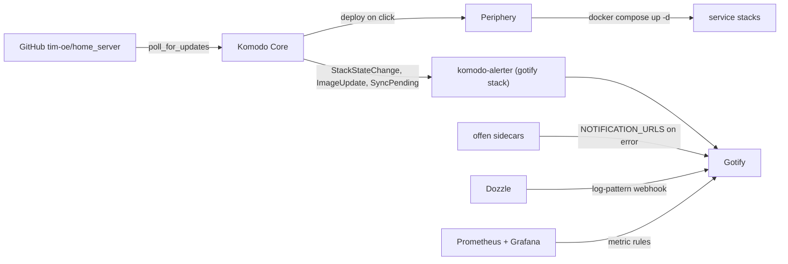

# Komodo Stack Management

> **Status: planned.** Written 2026-10-05; corrected 2026-10-06 against upstream offen, Komodo v2.3.3,
> Dozzle v11.2.0 and FoxxMD sources.
> **This file is the source of truth.** `- [x]` done, `- [ ]` open.
> Follow-on to [`container-management-overhaul.md`](container-management-overhaul.md). Its one open item
> (MariaDB sidecar) stays owned by [`weather-mariadb-migration.md`](weather-mariadb-migration.md).

## Remaining — do in this order

### Phase 1: close the gaps

- [ ] Digest-pin obsidian and velxio; fix the stale velxio comment.
  - [ ] Check: both containers recreate on the pinned digest (`docker inspect --format '{{.Image}}'`) and serve.
- [ ] `NOTIFICATION_URLS` / `NOTIFICATION_LEVEL` on all nine offen sidecars via `map-env.sh --get`.
  - [ ] Check: each sidecar stays up and logs its cron schedule; no archive run starts at container start
    (the wrapper must keep `-foreground`). `NOTIFICATION_URLS` resolves to a real token.
  - [ ] Check: force one failure (e.g. unwritable `/archive` on a test run) and a Gotify message lands.
  - [ ] Check: next nightly run sends nothing on success.
- [ ] Add the `container-restarting` rule to Grafana `rules.yml`.
  - [ ] Check: rule loads in Grafana without provisioning errors.
  - [ ] Check: a throwaway `restart: always` container that exits immediately fires the alert to Gotify.
- [ ] Docker `json-file` log rotation in `src/etc/docker/daemon.json`; apply on the host.
  - [ ] Check: merged with the existing host `daemon.json`; Nexus `insecure-registries` still present.
  - [ ] Check: a new container's `HostConfig.LogConfig` has `max-size`/`max-file` (`docker info` already says
    `json-file` by default, so that alone proves nothing).
- [ ] `src/services/dozzle/` compose, Traefik LAN-only route, `deployDozzle`.
  - [ ] Check: `dozzle.tecronin.uk` loads from LAN and VPN, and is refused from outside the allowlist.
  - [ ] Check: all containers listed; actions and shell absent in the UI.
- [ ] Dozzle Gotify webhook destination and the log-alert rules below.
  - [ ] Check: destination **Test** button lands a message under the "Dozzle" application.
  - [ ] Check: `docker run --rm alpine sh -c 'echo "level=error msg=test"'` fires one Gotify message. Dozzle
    parses the line as logfmt and normalises `level`; a bare `level=error test` is rejected as logfmt and
    falls through to plain-text guessing, which does not match it. `ERROR: test` works as a plain-text probe.
  - [ ] Check: `docker run --rm -m 16m alpine sh -c 'head -c 64m /dev/zero | tail'` (or similar) fires the
    `oom` event rule once.
  - [ ] Check: `*-backup` / `*-gdrive` excluded; no double alert on an offen failure.
  - [ ] Check: after one week, review noise and add container exclusions.
  - [ ] Check: `dozzle-data` survives `docker compose down && up` with rules intact.
- [ ] Point the "Remaining" header of `container-management-overhaul.md` at this file.

### Phase 2: Komodo trial

- [ ] Switch the 14 compose files to `../_common/` and `deployService` to a single `/mnt/raid/services/_common` put.
  - [ ] Check: `/mnt/raid/services/_common` holds every helper; per-service `_common` copies removed.
  - [ ] Check: redeploy stack by stack; each container starts and `map-env.sh`-wrapped entrypoints resolve secrets.
  - [ ] Check: `ensure_backup_services.sh` still finds `gotify-notify.sh`.
- [ ] `src/services/komodo/` compose (mongo, core, periphery, offen + rclone), Traefik labels, `deployKomodo`.
  - [ ] Check: `komodo.tecronin.uk` LAN-only; the `KOMODO_INIT_ADMIN_*` login works; Sign Up is absent.
  - [ ] Check: periphery connects to core (server shows healthy) via the shared `keys` volume.
  - [ ] Check: core's `TZ` matches the host so the maintenance window is local time.
  - [ ] Check: periphery sees `/etc/environment`; a test stack using `env_file` gets its secrets.
  - [ ] Check: first offen run at 02:35 produces an archive and the gdrive copy lands.
- [ ] `komodo-alerter` bridge service in the gotify stack, `KOMODO_GOTIFY_TOKEN` via `map-env.sh`.
  - [ ] Check: `docker inspect` the image entrypoint before wrapping with `map-env.sh`.
  - [ ] Check: Komodo alerter "test" sends a message under the separate Komodo Gotify application.
- [ ] `server.toml`, `alerter.toml`, `stacks.toml` under `src/services/komodo/sync/`; bootstrap ResourceSync.
  - [ ] Check: sync shows no pending diff after first execute; CPU/mem/disk server alerts off.
  - [ ] Check: a TOML edit pushed to git shows as `ResourceSyncPendingUpdates` within one poll.
- [ ] Move gdrive, diun, gotify to Komodo deploy (gotify last). Stack names equal the directory names.
  - [ ] Check: same container names after cutover; `gotify-data` and `diun-data` reattach with data intact.
  - [ ] Check: stopping a trial container fires `StackStateChange` to Gotify.
  - [ ] Check: no alerts during the 01:00–02:45 maintenance window over a nightly backup run.
- [ ] Two-week go/no-go.
  - [ ] Check: a push is flagged as pending within one poll; nothing auto-deploys.
  - [ ] Check: nightly backups produce no Komodo alerts.
  - [ ] Check: `StackImageUpdateAvailable` matches DIUN's notifications.
  - [ ] Check: Komodo exec/logs plus Dozzle replace the `docker` CLI and Portainer for daily use.
  - [ ] Check: s3sync `.env` override and `pre_deploy` dirs decided.

### Phase 3: retire Portainer and DIUN

- [ ] Absolute host paths for the untracked relative mounts: obsidian `./vaults`, rabbitmq `./.sbin`.
  - [ ] Check: both stacks redeployed from gradle first; obsidian still sees its vaults.
- [ ] Add remaining stacks to `stacks.toml`; resolve the `.env` and `pre_deploy` cases.
  - [ ] Check: per stack, `down` then Komodo deploy keeps container names and volumes; services respond.
  - [ ] Check: the non-`_common` stacks (prometheus, jenkins, nexus, openhab, upsmon) now carry the
    `LogConfig` from Phase 1.
  - [ ] Check: `pre_deploy` creates `/mnt/backup/docker/<svc>` on a fresh path.
  - [ ] Check: offen sidecars on migrated stacks still run and sync to gdrive the next night.
- [ ] Remove the portainer stack, gradle task, volume, docs.
  - [ ] Check: `rg -i portainer` returns only historical plan files; `docker volume rm portainer_data` done.
- [ ] Remove the diun stack, `diun.*` labels, docs after image-update parity.
  - [ ] Check: one full update cycle where Komodo matched DIUN before removing.
  - [ ] Check: `rg 'diun\.'` empty in `src/services/`; DIUN Gotify application deleted.
- [ ] README workflow rewrite; gradle documented as the fallback.
  - [ ] Check: `./gradlew deploy<Svc>` still works for one stack with Komodo stopped.

---

Phase 1 is independent and ships first. Phase 2 adds Komodo v2 (`2.3.3`) as the UI and state-alert layer;
Phase 3 retires Portainer and DIUN. Gradle `deploy<Svc>` stays for anything not yet moved to Komodo.
Grafana/Prometheus keep all metric alerts; Komodo owns container/stack *state* only, so nothing fires twice.



## Decisions

- **Komodo is the UI and the state alerter, not CI/CD.** Builds, Procedures, and Actions go unused. What is
  used: Stacks (git-backed compose, drift display, deploy on click), Containers (aggregated list, logs, exec),
  Alerts (state changes, image updates, pending sync).
- **Notify-only is preserved.** `poll_for_updates=true`, `auto_update=false`. A push makes Komodo flag the
  stack as pending; you click Deploy. Nothing pulls or restarts on its own. No GitHub webhook, because Core is
  LAN-only.
- **Alert ownership is split, not duplicated.** Grafana keeps every metric rule (CPU, memory, disk, RAID,
  temperature, host down, container memory). Komodo server thresholds are disabled. Komodo sends
  `StackStateChange`, `StackImageUpdateAvailable`, `ServerUnreachable`, `ResourceSyncPendingUpdates`.
  `ContainerStateChange` is a Deployment/swarm alert and never fires for Stacks, so it is not listed. Komodo
  only watches containers in stacks it deploys: during Phase 2 that is gdrive, diun, gotify; every other
  container has no state alerting until it moves in Phase 3.
- **Gotify stays.** Komodo has no native Gotify endpoint (Custom, Slack, Discord, Ntfy, Pushover). A small
  bridge container in the gotify stack receives the Custom JSON and posts to Gotify under its own application
  token, so Komodo alerts can be muted independently.
- **Nightly backup windows are suppressed on the alerter**, not by turning state alerts off. Every offen
  `BACKUP_CRON_EXPRESSION` falls between 01:05 and 02:25, so one daily `maintenance_windows` entry
  (`hour=1`, `minute=0`, `duration_minutes=105`) covers them. `timezone` is set explicitly; empty means
  Core's timezone, which is UTC unless the container gets `TZ`.
- **Portainer goes.** Komodo covers container state, logs, exec, restarts, stack deploy, and image pruning.
  The only lost habit is a unified volumes/networks browser; that goes back to the CLI or the Komodo server
  terminal.
- **DIUN goes after parity.** `StackImageUpdateAvailable` is the same signal surfaced in the UI. DIUN is
  removed only once a full cycle of Komodo update alerts has matched DIUN's.
- **`/etc/environment` stays the only configuration store; Komodo Variables are not used.** Komodo's store
  redacts rather than encrypts, holds values only in Mongo (so they would ride the offen archive to gdrive),
  and injects them as a deploy-time `.env`. Most consumers here read the file at *runtime* instead:
  `rclone-sync.sh`, `gotify-notify.sh`, `s3-push.sh` under offen hooks or crond, and
  `ensure_backup_services.sh` under host cron. The gradle fallback path would also lose them. Non-secret
  values are not split out either: a second location buys nothing today and adds a place to look.
- **Dozzle is the log viewer and the log-content alerter; Komodo keeps per-container logs as a fallback.**
  Komodo shows one container or stack at a time; Dozzle gives a live merged tail, regex filtering and
  split view across every container. Dozzle owns *log-content* alerts only, so the alert split is: Grafana
  for metrics, Komodo for state, Dozzle for log patterns. No log retention beyond Docker's own files; Loki is
  out of scope.
- **Dozzle is read-only.** Container actions and shell stay off (`DOZZLE_ENABLE_ACTIONS` /
  `DOZZLE_ENABLE_SHELL` unset); start/stop/exec belong to Komodo (Portainer until Phase 3).

## Phase 1: close the gaps (no new services)

- **Pin drift.** [`src/services/obsidian/docker-compose.yml`](../../src/services/obsidian/docker-compose.yml)
  line 6 `:latest` and [`src/services/velxio/docker-compose.yml`](../../src/services/velxio/docker-compose.yml)
  line 3 `:master`: pin both by `@sha256:` digest (upstreams publish no semver), keep `diun.watch_repo=false`,
  fix the stale "digest is the pin" comment on velxio.
- **offen failure notifications.** All nine `offen/docker-volume-backup` sidecars (vaultwarden, unifi-os, wiki,
  gotify, traefik, grafana, forgejo, rustdesk, mariadb) get `NOTIFICATION_LEVEL: error` and
  `NOTIFICATION_URLS=gotify://gotify:80/<token>?disabletls=yes`. The token comes from `/etc/environment`
  `GOTIFY_APP_TOKEN` via the existing `map-env.sh --get`, so the compose file holds no secret:

  ```yaml
  entrypoint:
    - /bin/sh
    - -c
    - 'export NOTIFICATION_URLS="gotify://gotify:80/$(sh /map-env.sh --get GOTIFY_APP_TOKEN)?disabletls=yes"; exec /usr/bin/backup -foreground'
  ```

  with `/etc/environment:/etc/host-environment:ro` and `./_common/map-env.sh:/map-env.sh:ro` mounted (same
  mounts grafana and gotify already use). The image is alpine with `/bin/sh`; its ENTRYPOINT is
  `/usr/bin/backup -foreground`, and `-foreground` must be kept: without it the binary runs one backup and
  exits, and `restart: always` turns that into a loop of archives and service stop/starts.
  Today a failed archive is silent until `ensure_backup_services.sh` notices the stopped containers.
- **Restart-loop rule** in
  [`src/services/grafana/provisioning/alerting/rules.yml`](../../src/services/grafana/provisioning/alerting/rules.yml):
  new `container-restarting`, `changes(container_start_time_seconds{name=~".+"}[15m]) > 2`, `for: 5m`, same
  A/B/C shape as the existing nine. `changes()` counts per series, so a true restart loop (same container ID)
  fires and a one-off recreate does not. No cAdvisor "container down" rule: stopped containers go stale in
  cAdvisor within minutes, so that signal is unreliable. Komodo's `StackStateChange` covers it for each stack
  as it migrates.
- **Docker log rotation.** Nothing caps the `json-file` driver today, and Dozzle reads exactly those files.
  New `src/etc/docker/daemon.json` (next to `src/etc/cron.d/`):

  ```json
  { "log-driver": "json-file", "log-opts": { "max-size": "10m", "max-file": "5" } }
  ```

  Merge with any existing host `/etc/docker/daemon.json` (the Nexus `insecure-registries` entry from
  `docs/nexus-docker-repo,md`), `systemctl restart docker`. Only newly created containers pick it up. The
  Phase 2 `_common` redeploy recreates the 14 `_common` stacks and the pin change recreates obsidian and
  velxio; prometheus, jenkins, nexus, openhab, upsmon, diun, portainer wait for their Phase 3 redeploy (or
  removal). No separate sweep.
- **Dozzle stack** `src/services/dozzle/docker-compose.yml`: `amir20/dozzle` pinned to the current `v11.x`
  semver tag (`v11.2.0` at time of writing; DIUN watches it like the rest), `container_name: dozzle`, on
  `share-net`, no published port.
  Mounts `/var/run/docker.sock:/var/run/docker.sock:ro` and a `dozzle-data:/data` named volume (holds the
  alert rules and webhook destination). Traefik labels `dozzle.tecronin.uk` to port `8080` with its own
  `dozzle-lan` ipallowlist (same shape as vaultwarden lines 55–56); add the row to the Traefik README.
  No `_common` mounts, so it is not part of the 14-file path change. No offen sidecar: `/data` is a handful
  of alert rules, recorded below so they can be recreated. `deployDozzle` gradle task, added to `deployAll`.
- **Gotify destination.** New Gotify application "Dozzle"; token stored in `/etc/environment` as
  `DOZZLE_GOTIFY_TOKEN` as the record. The Dozzle image's final stage is `FROM scratch` (upstream
  Dockerfile), so `map-env.sh` cannot wrap it; the token is pasted into a Dozzle
  "Custom" webhook destination `http://gotify/message?token=<DOZZLE_GOTIFY_TOKEN>` with a Go `text/template`
  body mapping to Gotify's `title` / `message` / `priority`; use `printf "%q"` so the log line is JSON-safe:

  ```json
  { "title": "{{.Subscription.Name}}: {{.Container.Name}}",
    "message": {{printf "%q" .Detail}},
    "priority": 5 }
  ```

  The destination has a **Test** button. This token is the one value that lives outside `/etc/environment`,
  accepted because it is a low-value send-only token.
- **Initial alert rules.** Per the Dozzle alerts guide, each alert is a *container expression* plus one
  trigger expression of type Log, Metric, or Event; rules and destinations persist in `/data`. Operators:
  `contains`, `startsWith`, `endsWith`, `matches` (regex), `in [...]`, `&&`, `||`, `!`. `level` is Dozzle's
  normalised guess (`internal/container/logparse/level_guesser.go`): JSON/logfmt `level`-style keys first,
  then plain-text patterns (`ERROR: …`, `[ERROR]`, `[E]`, klog, Serilog `[… ERR]`, ` error:`); aliases fold
  in, so `error` also catches `err`/`fail` and `fatal` catches `crit`/`severe`. Lines it cannot place are
  `unknown` and never match a level rule, which is why the regex rule below exists.
  - Log, container `!(name endsWith "-backup") && !(name endsWith "-gdrive")`, trigger
    `level == "error" || level == "fatal"` (offen has its own `NOTIFICATION_URLS` path, so those would
    double-fire).
  - Log, container `true`, trigger `message matches "(?i)panic|out of memory"`.
  - Event, container `true`, trigger `name == "oom"`: the Docker OOM event is a cleaner signal than regexing
    "oom-killed" out of log text. Other event names (`die`, `health_status`) stay unused; they overlap Komodo
    `StackStateChange` and the Grafana restart rule.
  - Metric alerts stay off; Grafana owns metrics.
  - Dozzle has no maintenance window; nightly offen stops produce shutdown noise, not error-level lines, so
    watch the first week and add container exclusions rather than broadening the window.
- **Skip** adding `docker compose up -d` to `deployService`. Komodo replaces that path; adding it now is
  throwaway. README already documents the two-step.

## Phase 2: Komodo trial on gdrive, diun, gotify

### `_common` path change (prerequisite)

Komodo clones the repo and runs compose from `src/services/<svc>/` inside the clone, where `./_common/` does
not exist but `../_common/` does. Change the 14 compose files that mount `./_common/...` to `../_common/...`,
and change `deployService` in [`src/gradle/services.gradle`](../../src/gradle/services.gradle) to `put`
`_common` once at `/mnt/raid/services/_common` instead of into every service dir. Both deploy paths then
resolve the same relative path. `ensure_backup_services.sh` finds the helper with
`find /mnt/raid/services -path '*/_common/gotify-notify.sh'`, unaffected. Mount changes recreate containers,
so redeploy stack by stack.

Every other `./` mount is a file tracked in git (grafana provisioning, traefik dynamic, prometheus.yml,
gdrive crontab, …) and comes with the clone. Two are not: obsidian `./vaults:/vaults:rw` (vault data) and
rabbitmq `./.sbin:/root/bin`. Under Komodo those would resolve to an empty dir inside the clone, so obsidian
would start with no vaults. Both switch to absolute `/mnt/raid/services/<svc>/...` paths before their stack
migrates (Phase 3 item).

### New `src/services/komodo/`

- `docker-compose.yml`, following upstream `compose/mongo.compose.yaml`: `mongo` (pinned, `komodo.skip`
  label, `command: --quiet --wiredTigerCacheSizeGB 0.25`), `core` `ghcr.io/moghtech/komodo-core:2.3.3` on
  `share-net` with `init: true` and `KOMODO_DATABASE_ADDRESS=mongo:27017`, `periphery`
  `ghcr.io/moghtech/komodo-periphery:2.3.3` with `init: true`. Periphery mounts: `docker.sock`, `/proc`,
  `/etc/komodo:/etc/komodo` (same path both sides, required), `/etc/environment:/etc/environment:ro`
  (compose `env_file` and s3sync's `include: env_file` are read by the compose CLI inside periphery;
  `required: false` would otherwise silently drop every secret), `/mnt/backup/docker:/mnt/backup/docker` so
  `pre_deploy` can `mkdir -p` the archive dir that gradle `doFirst` blocks do today. Core and periphery share
  the `keys` volume at `/config/keys` (v2 key-pair auth; passkey is legacy). Both get `TZ` from the host so
  the maintenance window is local time.
- Core env via `map-env.sh` (core and periphery are `debian:trixie-slim`, so `/bin/sh` is there):
  `KOMODO_DATABASE_USERNAME` / `KOMODO_DATABASE_PASSWORD`, `KOMODO_INIT_ADMIN_USERNAME` /
  `KOMODO_INIT_ADMIN_PASSWORD`, `KOMODO_HOST=https://komodo.tecronin.uk`, `KOMODO_LOCAL_AUTH=true`,
  `KOMODO_DISABLE_USER_REGISTRATION=true` from the first boot; the init-admin pair means no Sign Up step.
  New `/etc/environment` keys: `KOMODO_DB_USERNAME`, `KOMODO_DB_PASSWORD`, `KOMODO_ADMIN_USERNAME`,
  `KOMODO_ADMIN_PASSWORD`, `KOMODO_GOTIFY_TOKEN`.
- Traefik labels: `komodo.tecronin.uk` to `core:9120`, LAN-only `komodo-lan` ipAllowList (pattern from
  vaultwarden line 55). Add the row to [`src/services/traefik/README.md`](../../src/services/traefik/README.md).
- offen + rclone sidecar pair on `komodo-mongo-data` with `komodo.stop` label on mongo and core only
  (periphery holds no state and stopping it adds nothing); `RCLONE_DEST: gdrive:/backup/services/komodo`;
  cron `35 02`, inside the maintenance window. State is reconcilable from the sync TOML, but users and alert
  history are not. The repo is public, so no GitHub token is stored in Komodo. Alternative if the nightly
  stop proves noisy: Komodo's built-in "Backup Core Database" procedure writing to a `/backups` mount, with
  offen archiving that directory instead of the raw volume.
- `deployKomodo` gradle task with `mkdir -p /mnt/backup/docker/komodo`; add to `deployAll`.

### Bridge container in `src/services/gotify/docker-compose.yml`

New service `komodo-alerter`, image `foxxmd/komodo-gotify-alerter` (source: `FoxxMD/komodo-utilities`
`notifiers/gotify`; deploy recipe at `FoxxMD/deploy-gotify-alerter`) pinned by digest (only `latest` is
published; `diun.watch_repo=false`, `diun.enable=false` once DIUN goes), `container_name: komodo-alerter`, on
`share-net`, listens on 7000, no published port. `GOTIFY_URL=http://gotify`, `GOTIFY_APP_TOKEN` mapped from
`KOMODO_GOTIFY_TOKEN` via `map-env.sh` so Komodo alerts are a separate Gotify application. Check the image
entrypoint with `docker inspect` to wrap it correctly. `UNRESOLVED_TIMEOUT_TYPES` left empty.

### Declarative config in git: `src/services/komodo/sync/`

- `server.toml`: `[[server]] name="tec-desktop"`, address `http://periphery:8120`, `send_cpu_alerts=false`,
  `send_mem_alerts=false`, `send_disk_alerts=false` (Grafana owns metrics), `send_unreachable_alerts=true`.
- `alerter.toml`: `[[alerter]] name="gotify"`, `endpoint.type="Custom"`, `url="http://komodo-alerter:7000"`,
  `alert_types=["StackStateChange","StackImageUpdateAvailable","ServerUnreachable","ResourceSyncPendingUpdates"]`,
  and one `maintenance_windows` entry: `schedule_type="Daily"`, `hour=1`, `minute=0`, `duration_minutes=105`,
  `timezone` set to the host zone, `enabled=true`.
- `stacks.toml`: `[[stack]]` per trial stack, **named exactly as its directory** (`gdrive`, `diun`, `gotify`)
  so the compose project name matches the one the host-side `docker compose` used and the `container_name`s
  are adopted rather than collided with; `server="tec-desktop"`, `repo="tim-oe/home_server"` (public, no
  `git_account`), `run_directory="src/services/<svc>"`, `file_paths=["docker-compose.yml"]`,
  `poll_for_updates=true`, `auto_update=false`, `deploy=false`. Use one `[[repo]]` plus `linked_repo` on each
  stack so the repo is cloned once, not per stack.
- Bootstrap: one UI-created ResourceSync pointing at `src/services/komodo/sync/` on the repo; `managed=false`.
  Everything else flows from TOML.

### Cutover for the three trial stacks

Stop each stack from `/mnt/raid/services/<svc>` (`docker compose down`, volumes kept), deploy from Komodo,
confirm the same container names and volumes attach (`gotify-data`, `diun-data` are named volumes, so
`down`/`up` from a new project dir reuses them). gotify is the alert sink and the bridge's host; deploy it last
and watch for a `StackStateChange` test alert landing in Gotify.

### Go/no-go after two weeks

Judge on: drift flagged within one poll of a push; nightly backups produce no alerts; image-update alerts match
DIUN's; exec/logs in the UI replace `docker` CLI habits. Open questions to settle before Phase 3: s3sync's
optional stack `.env` override (the only in-production `.env`; mariadb's is deferred with its plan, forgejo
has none) needs `env_file_path` or is dropped; stacks with `doFirst` dirs move to `pre_deploy`.

## Phase 3: retire Portainer and DIUN, migrate the rest

- First, obsidian `./vaults` and rabbitmq `./.sbin` become absolute `/mnt/raid/services/<svc>/...` mounts
  and are redeployed from gradle while still host-managed, so the data path does not move with the stack.
- Add every remaining stack to `stacks.toml` (names equal directory names); migrate one at a time with the
  same down/deploy check. This redeploy also brings the non-`_common` stacks onto the Phase 1 log rotation.
  `src/services/mariadb` stays deferred per its own plan.
- Remove `src/services/portainer/`, `deployPortainer`, its `deployAll` entry and Traefik README row,
  `portainer_data` from [`src/bin/volumes.sh`](../../src/bin/volumes.sh), and the Portainer sections in
  [`README.md`](../../README.md), [`docs/service_configuration.md`](../../docs/service_configuration.md),
  [`docs/project_overview.md`](../../docs/project_overview.md). `docker volume rm portainer_data` on the host.
- Remove `src/services/diun/`, `deployDiun`, `DIUN_NOTIF_GOTIFY_TOKEN` docs, and the `diun.*` labels across
  compose files once `StackImageUpdateAvailable` has matched DIUN for a full cycle. Delete the DIUN Gotify
  application.
- Replace the DIUN workflow section in `README.md` with: Komodo alerts to Gotify, bump tag in git, push, click
  Deploy in Komodo. `./gradlew deploy<Svc>` becomes the fallback for Komodo-down situations and is documented
  as such.
- Reduce `deployService` to `_common` and any non-stack host files; keep `deployAll` as the recovery path.
