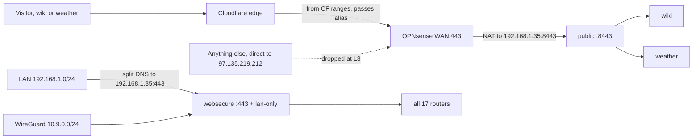

# LAN-Only Default Routing

> **Implementation order: step 3 of 5.**
> **This file is the source of truth.** `- [x]` done, `- [ ]` open. The command or GUI path sits
> under the item. Do remaining `[ ]` items **in order**; do not skip an open item to work a later one.
> Prerequisites: [`security-quick-wins.md`](security-quick-wins.md) items **2** (deprecated `unifi`
> stack gone, 8443 free) and **5** (wiki `6875:80` removed). Step 1 below checks the first; item 5 is
> what makes `APP_PROXIES: "*"` safe.
> Followed by: `security-quick-wins.md` items 6–11, then [`vlan-segmentation.md`](vlan-segmentation.md).
> Written 2026-09-05. Checklist header 2026-09-06.

Invert the exposure model. Today 14 of 17 Traefik routes are open to the internet and only three carry
`lan-only@file`. Make LAN-only the default by splitting internet traffic onto its own entrypoint that
services must explicitly opt into, then drop all WAN:443 traffic that does not come from Cloudflare so
only the proxied `weather` and `wiki` names reach the host at all.

Builds on [`container-management-overhaul.md`](container-management-overhaul.md) Phase 3, which replaced
nginx with Traefik. Assumes the current Traefik v3.7 stack, the `share-net` external network, and the
Cloudflare DNS-01 wildcard cert are all in place.

## Remaining — do in this order

Each phase fails closed. Do not tighten the firewall source before wiki/weather are proxied.

- [ ] **1** Repo edits, deploy Traefik and wiki. Steps 1–4 are one sitting (wiki/weather dark from WAN).
- [ ] **2** Verify all 17 still work on `:443` from the LAN.
- [ ] **3** WireGuard client `DNS = 10.9.0.1`; confirm a private service over cellular **before** pf.
- [ ] **4** OPNsense forward to `192.168.1.35:8443`; delete duplicate 443 rule.
- [ ] **5** Verify from outside.
- [ ] **6** `src/bin/cloudflare-dns.sh` — proxy wiki/weather, pin `vpn` DNS-only, Full (strict).
- [ ] **7** Cloudflare-ranges alias on the port-forward; rate-limit rule.
- [ ] **8** Authenticated Origin Pulls (Cloudflare first, then Traefik `tls.yml`).
- [ ] **9** DNSSEC at Cloudflare + DS at registrar — only after 1–8 work.

Detail, commands, and verification are in **Order of operations** and **Verification** below.

## Decisions

- **Public set**: `weather.tecronin.uk` and `wiki.tecronin.uk`. Nothing else. Gotify's mobile push and
  velxio were considered and deliberately left private; reach them over WireGuard. This has a cost worth
  stating: the Gotify Android client holds a websocket to the server, so push notifications arrive only
  while the phone is on the LAN or the tunnel, and Bitwarden mobile keeps working from its local cache but
  does not sync until it is. Either run the tunnel always-on on the phone, or accept the delay. Accepted.
- **Split DNS becomes mandatory per service, not optional.** Today a name with no Unbound override still
  works from the LAN because it hairpins to the WAN IP and NAT reflection brings it back to `:443`. After
  this plan the same request lands on the `public` entrypoint and 404s. So "add an Unbound host override"
  becomes a required step of adding any route, alongside the entrypoint label. The README change below
  says so.
- **Enforcement point**: a second Traefik entrypoint, not per-router middleware. Router middleware is
  fail-open, because forgetting the label on a new service silently publishes it. An entrypoint the
  router has to name is fail-closed.
- **Second layer**: Cloudflare proxy on the two public names plus a Cloudflare-ranges source alias on the
  WAN port-forward. pf cannot match hostnames, so this is the only way to get hostname-level filtering
  in front of Traefik rather than inside it.
- **Wiki read-only from outside is a convention, not enforced.** A `Method(GET) || Method(HEAD)` router
  on the public entrypoint was considered and rejected: BookStack requires a login for everything and
  its login form is a POST, so a method filter would lock out remote reading entirely.
- **Cloudflare config is scripted, the firewall is documented.** The Cloudflare side is a handful of API
  calls, so it goes in an idempotent bash script matching the existing `src/bin` convention. Terraform would be
  the wrong weight. The OPNsense side stays a GUI walkthrough like every other guide in `docs/`.
- **Public records are proxied CNAMEs to the apex, not A records.** OPNsense already runs Dynamic DNS
  against host and zone `tecronin.uk`, so the apex A record tracks the residential WAN IP automatically
  and the existing `*` wildcard is a CNAME to it. Pointing `wiki` and `weather` at the apex the same way
  means a WAN IP change propagates to them for free, and no address is hardcoded in the repo.
- **`vpn.tecronin.uk` gets an explicit DNS-only record.** WireGuard is UDP 51820 and is untouched by any
  of the TCP 443 work, but it is the remote access path to everything now being made private, so it must
  never be proxied and must never stop resolving. Today it only resolves by falling through the `*`
  wildcard, which makes it an invisible dependency. Making it explicit removes that.
- **CAA and DNSSEC are included, DNSSEC last.** The zone is currently unsigned with no CAA. Both mainly
  harden certificate issuance, which is the one place forged DNS would actually hurt here. DNSSEC goes at
  the very end of the sequence because its failure mode is total and `vpn.tecronin.uk` is now the only
  remote way in.
- **Host-published ports are out of scope** for this pass. See Follow-up.

## Current state

- Traefik serves 17 hostnames on `*.tecronin.uk`. Only `prometheus`, `vaultwarden`, and `unifi` carry
  `lan-only@file`; the other 14 are open to the internet.
- Public DNS: wildcard `*.tecronin.uk` CNAME to apex `tecronin.uk` = `97.135.219.212`, both DNS-only and
  on a 300s TTL, so Traefik currently sees real client IPs. The apex A record is maintained by OPNsense
  Dynamic DNS (host and zone both `tecronin.uk`) against the Cloudflare API.
- LAN DNS: OPNsense already overrides 16 of 17 names to `192.168.1.35`. Only `weather.tecronin.uk` lacks
  an override and hairpins out to the WAN IP.
- OPNsense forwards WAN:443 to tec-desktop:443, plus a duplicate destination-NAT rule for the same thing.
- The zone is unsigned: no DS, no DNSKEY. There is no CAA record, so any public CA may currently issue
  for `tecronin.uk`.
- WireGuard terminates on OPNsense at UDP 51820, tunnel subnet `10.9.0.0/24`, reached via
  `vpn.tecronin.uk`. That name has no record of its own; it resolves only by falling through the `*`
  wildcard to the apex. It is DNS-only, as it must be, since Cloudflare cannot proxy WireGuard.
- **Host port 8443 is claimed on paper by the deprecated `unifi` stack**
  ([`src/services/unifi/docker-compose.yml`](../../src/services/unifi/docker-compose.yml) publishes
  `8443:443/tcp`), and `deployUnifi` is still in `deployAll`. It cannot be running alongside `unifi-os`
  because both publish 8882, but nothing stops it being brought up later and stealing the port from
  Traefik. `ss -ltnp | grep 8443` is a pre-check below, and
  [`security-quick-wins.md`](security-quick-wins.md) removes the stack.
- Traefik has no `accessLog` configured. Nothing that arrives on `:443` today is logged.

## Approach

Two independent layers, either of which alone would contain the exposure.

**Layer 1, Traefik entrypoint split.** Traefik cannot express "deny by default with per-router
exceptions" on a single entrypoint, because `entryPoints.<name>.http.middlewares` applies to every router
with no opt-out. So split the ports:

- `websecure` `:443` stays the internal entrypoint. Every router defaults here. Gets `lan-only@file` at
  the entrypoint level as a second layer.
- `public` `:8443` is new and unrestricted. Only `weather` and `wiki` list it.
- OPNsense forwards WAN:443 to `192.168.1.35:8443` instead of `:443`.

A new service that copies the existing label template lands on `websecure` only and is therefore
invisible from the internet. That is the fail-closed property, achieved by routing rather than by
remembering a label.

**Layer 2, Cloudflare plus an IP allowlist on the firewall.** All 17 names share one IP and one port, so
hostname filtering has to happen where TLS is visible. Proxying only `wiki` and `weather` while leaving
the `*` wildcard DNS-only means legitimate public traffic for those two arrives from Cloudflare's ranges
and everything else arrives straight from the open internet. Sourcing the WAN:443 port-forward from a
Cloudflare-ranges alias then drops probes for every other hostname at layer 3, before a packet reaches
tec-desktop.



## Repo changes

### 1. [`src/services/traefik/traefik.yml`](../../src/services/traefik/traefik.yml)

Add `lan-only@file` to the `websecure` entrypoint and define `public`. TLS is per-entrypoint in this
setup, so `public` needs its own block; both share the one `cloudflare` resolver and `acme.json`, so no
new certificate is issued.

Two additions beyond the split. `public` gets `forwardedHeaders.trustedIPs` set to Cloudflare's ranges,
because once the names are proxied every remote request arrives from a Cloudflare address and the real
client is only in `X-Forwarded-For` / `CF-Connecting-IP`; without this Traefik's logs and BookStack's
login throttle see a handful of Cloudflare IPs standing in for every visitor, so the throttle either locks
everyone out or nobody. And `accessLog` is switched on: an internet-facing port with no request log is a
gap on its own. The log carries `entryPointName`, so `public` traffic can be filtered out of the LAN noise
with `jq`.

```yaml
# top level, alongside log:
accessLog:
  format: json
  fields:
    headers:
      defaultMode: drop
      names:
        User-Agent: keep
        CF-Connecting-IP: keep
```

```yaml
  websecure:
    address: ":443"
    http:
      aliasHeadersStrategy: delete
      middlewares:
        - lan-only@file
      tls:
        certResolver: cloudflare
        domains:
          - main: tecronin.uk
            sans:
              - "*.tecronin.uk"
  # Internet-facing. OPNsense forwards WAN:443 here. Routers must opt in with
  # entrypoints=websecure,public, so a new service is not public by accident.
  public:
    address: ":8443"
    # https://www.cloudflare.com/ips-v4 — the same list the OPNsense alias fetches.
    # Static here because Traefik cannot load it from a URL; it changes rarely.
    forwardedHeaders:
      trustedIPs:
        - 173.245.48.0/20
        - 103.21.244.0/22
        - 103.22.200.0/22
        - 103.31.4.0/22
        - 141.101.64.0/18
        - 108.162.192.0/18
        - 190.93.240.0/20
        - 188.114.96.0/20
        - 197.234.240.0/22
        - 198.41.128.0/17
        - 162.158.0.0/15
        - 104.16.0.0/13
        - 104.24.0.0/14
        - 172.64.0.0/13
        - 131.0.72.0/22
    http:
      aliasHeadersStrategy: delete
      tls:
        certResolver: cloudflare
        domains:
          - main: tecronin.uk
            sans:
              - "*.tecronin.uk"
```

Static config, so the container needs a restart, not just a reload. Step 8 of the sequence later adds
`tls.options: cloudflare-origin-pull@file` under `public.http`; it is left out of this first deploy on
purpose, see Authenticated Origin Pulls.

### 2. [`src/services/traefik/docker-compose.yml`](../../src/services/traefik/docker-compose.yml)

```yaml
    ports:
      - "80:80"
      - "443:443"
      - "8443:8443"
```

### 3. [`src/services/traefik/dynamic/external.yml`](../../src/services/traefik/dynamic/external.yml)

```yaml
      entryPoints:
        - websecure
        - public
```

### 4. [`src/services/wiki/docker-compose.yml`](../../src/services/wiki/docker-compose.yml)

```yaml
      - traefik.http.routers.wiki.entrypoints=websecure,public
```

And in the `bookstack` environment, so Laravel honours the `X-Forwarded-For` that Traefik now carries
through from Cloudflare rather than treating the Traefik container as the client for every request:

```yaml
      APP_PROXIES: "*"
```

`*` is acceptable because the only things that can reach BookStack are Traefik on `share-net` and the
`6875:80` host port, which [`security-quick-wins.md`](security-quick-wins.md) removes. This matters for
BookStack's login throttling and its audit log, both of which key on client IP.

### 5. Leave all 15 other routers untouched

`nexus`, `jenkins`, `grafana`, `prometheus`, `sonarqube`, `portainer`, `obsidian`, `vaultwarden`,
`upsdesktop`, `upspimgr`, `velxio`, `mq`, `openhab`, `gotify`, `unifi` keep `entrypoints=websecure` and
become unreachable from the internet with no edit at all.

Keep the existing `lan-only@file` router labels on `vaultwarden`, `unifi-os`, and `prometheus`. They are
now redundant with the entrypoint middleware, but they mark those three as must-never-be-public.

### 6. [`src/services/traefik/README.md`](../../src/services/traefik/README.md)

- Document the two entrypoints and what each is for.
- Add a Public column to the route table; only `wiki` and `weather` are yes.
- Update "Add a route for a new service" to state that `entrypoints=websecure` is LAN-only and that
  `websecure,public` is the deliberate act of publishing to the internet.
- Add a mandatory step to the same section: **create the Unbound host override** for
  `<svc>.tecronin.uk` → `192.168.1.35` on OPNsense before testing. Without it the LAN resolves the name
  to the WAN IP, NAT reflection delivers it to the `public` entrypoint, and the new service 404s from the
  LAN. That is the fail-closed design working, but it will read as "the new service is broken" to anyone
  who has forgotten this step. Replace the current closing line about adding a DNS A/CNAME, which
  describes the public side and is now only relevant to services that opt into `public`.
- Note that `lan-only@file` is now applied at the entrypoint, not per router, and that host-side `curl`
  against a `*.tecronin.uk` name from tec-desktop itself will be refused with 403, see Risks.
- Note `accessLog` is on and how to filter it to the `public` entrypoint.

### 7. `src/bin/cloudflare-dns.sh` (new)

Idempotent reconcile of the public-facing zone config, so the "which names are public" decision is
declarative and in git rather than remembered from a dashboard click. Re-running it is also drift
detection. Matches the plain-bash style of `clean.sh` and `volumes.sh`.

```bash
#!/usr/bin/env bash
# Reconcile the internet-facing Cloudflare records for tecronin.uk.
# Anything not listed stays on the DNS-only "*" wildcard, resolves to the WAN IP,
# and is dropped by the firewall's Cloudflare-ranges source alias.
set -euo pipefail

ZONE_NAME=tecronin.uk
: "${CF_API_TOKEN:?token needs Zone:DNS:Edit and Zone Settings:Edit}"

# The apex A record is not listed: OPNsense Dynamic DNS owns it. These CNAME to it.
# name     type   content      proxied
MANAGED_RECORDS=(
  "wiki     CNAME  tecronin.uk  true"
  "weather  CNAME  tecronin.uk  true"
  # WireGuard is UDP 51820. Cloudflare cannot proxy it, and this is the way back
  # in to every service being made private, so it stays grey. Explicit rather
  # than inherited from "*" so the wildcard can be dropped later without
  # silently killing remote access.
  "vpn      CNAME  tecronin.uk  false"
)

api() {  # method path [json]
  # An array, not an unquoted ${3:+...} expansion, so a body containing a space
  # is passed as one argument rather than word-split.
  local -a data=()
  [ $# -ge 3 ] && data=(--data "$3")
  curl -fsS -X "$1" "https://api.cloudflare.com/client/v4/$2" \
    -H "Authorization: Bearer $CF_API_TOKEN" \
    -H 'Content-Type: application/json' \
    "${data[@]}"
}

zone=$(api GET "zones?name=$ZONE_NAME" | jq -r '.result[0].id')

for spec in "${MANAGED_RECORDS[@]}"; do
  read -r name type content proxied <<<"$spec"
  fqdn="$name.$ZONE_NAME"
  body=$(jq -nc --arg t "$type" --arg n "$fqdn" --arg c "$content" --argjson p "$proxied" \
    '{type:$t, name:$n, content:$c, proxied:$p, ttl:1}')
  id=$(api GET "zones/$zone/dns_records?name=$fqdn" | jq -r '.result[0].id // empty')
  if [ -n "$id" ]; then
    api PUT "zones/$zone/dns_records/$id" "$body" >/dev/null && echo "updated $fqdn"
  else
    api POST "zones/$zone/dns_records" "$body" >/dev/null && echo "created $fqdn"
  fi
done

# CAA. Matched on tag+value rather than name, since every CAA record shares the
# apex name and a name-only lookup would collide. Cloudflare injects its own
# partner CAs once any CAA record exists, so these are additive, never pruned.
caa=$(api GET "zones/$zone/dns_records?type=CAA&per_page=100")
for tag in issue issuewild; do
  body=$(jq -nc --arg n "$ZONE_NAME" --arg t "$tag" \
    '{type:"CAA", name:$n, data:{flags:0, tag:$t, value:"letsencrypt.org"}, ttl:1}')
  id=$(jq -r --arg t "$tag" \
    '.result[] | select(.data.tag==$t and .data.value=="letsencrypt.org") | .id' <<<"$caa")
  if [ -n "$id" ]; then
    api PUT "zones/$zone/dns_records/$id" "$body" >/dev/null && echo "updated CAA $tag"
  else
    api POST "zones/$zone/dns_records" "$body" >/dev/null && echo "created CAA $tag"
  fi
done

# Zone-wide, not per-record. Required so Cloudflare validates the origin's
# Let's Encrypt wildcard instead of trusting it blindly or downgrading to HTTP.
api PATCH "zones/$zone/settings/ssl" '{"value":"strict"}' >/dev/null
echo "ssl mode: strict"

# Edge hygiene, also zone-wide and also Zone Settings:Edit. Both only affect
# the two proxied names; grey records never touch the edge.
api PATCH "zones/$zone/settings/always_use_https" '{"value":"on"}' >/dev/null
echo "always use https: on"
api PATCH "zones/$zone/settings/min_tls_version" '{"value":"1.2"}' >/dev/null
echo "min tls: 1.2"
```

**Token.** This needs `Zone Settings:Edit` on top of `Zone:DNS:Edit`. The existing `CF_DNS_API_TOKEN`
only has the latter, since that is all DNS-01 requires. Mint a **separate** provisioning token rather
than widening that one, because the DNS-01 token lives in a container's environment on the host and this
one only needs to exist when the script is run.

### 8. [`docs/wireguard-setup.md`](../../docs/wireguard-setup.md)

**This one is not cosmetic. The documented client config breaks under this plan.**

The sample config and two of the three scenarios tell clients to use public DNS:

```ini
DNS = 1.1.1.1, 1.0.0.1
AllowedIPs = 0.0.0.0/0
```

A client with `DNS = 1.1.1.1` resolves `grafana.tecronin.uk` against public DNS and gets the WAN IP,
not the internal `192.168.1.35`, because it never sees the OPNsense host overrides. Its request then
arrives at WAN:443 like any internet visitor: it lands on the `public` entrypoint, where no `grafana`
router exists, and gets a 404. Once the Cloudflare-ranges alias is in place it is dropped outright. The
VPN would stay connected and route traffic fine while every private service became unreachable, which is
a confusing failure to debug.

Scenario 2 has the same problem by a different route: `# Don't set DNS, use local DNS` leaves the client
on its ISP resolver, so it also gets the public answer, and `192.168.1.35` is in `AllowedIPs` but the WAN
IP is not, so the request leaves over the client's own internet connection.

Changes:

- Make `DNS = 10.9.0.1` the documented default in the sample config and in every scenario. Split-horizon
  resolution is what makes VPN access work, so it is mandatory, not a privacy preference.
- Retitle Scenario 3 from "Privacy-Focused" — it is now simply the correct full-tunnel config.
- Delete the troubleshooting line "Slow DNS resolution: use public DNS servers in client config
  (1.1.1.1, 8.8.8.8)". After this change that advice silently breaks access to every private service.
- Fix the stale WAN IP in the Network Topology section: it reads `97.235.59.83`, actual is
  `97.135.219.212`. Better still, replace it with `vpn.tecronin.uk` so it cannot go stale again, which
  the doc's own hardening checklist already recommends.

## Host and OPNsense changes

0. Pre-check on tec-desktop: `ss -ltnp | grep -E ':(8443|443|80)\b'`. Only Traefik should hold 443 and
   80, and nothing should hold 8443. If the deprecated `unifi` container owns 8443, stop and remove it
   (its stack is being deleted by the quick-wins plan anyway). Do this before editing anything, because
   a port collision here makes Traefik fail to start and takes every service down with it.
1. Deploy and restart Traefik: `./gradlew deployTraefik`, then on the host `sudo docker compose up -d` in
   `/mnt/raid/services/traefik`.
2. Redeploy wiki so Traefik sees the new label: `./gradlew deployWiki`, then `sudo docker compose up -d`.
3. Firewall > NAT > Port Forward: change the WAN:443 rule's redirect target port from 443 to **8443** on
   192.168.1.35.
4. Firewall > Rules > WAN: the port-forward auto-creates its own linked pass rule. Delete the separate
   hand-written 443 rule so there is exactly one path in. Confirm no other WAN forward reaches
   tec-desktop, and consider dropping the WAN:80 forward if one exists, since DNS-01 needs no inbound HTTP.
5. Unbound/Dnsmasq overrides: add `weather.tecronin.uk` to `192.168.1.35` so it matches the other 16
   names. This matters more once `weather` is proxied, since without it LAN clients would leave the
   network and come back through Cloudflare to reach a host on their own LAN.

## Cloudflare changes

Applied by `src/bin/cloudflare-dns.sh` above. What it does and why:

1. DNS. Today there is only a wildcard `*` CNAME to the apex. Add two **explicit** records for `wiki`
   and `weather` so each can carry its own proxy setting, as proxied CNAMEs to the apex. The proxy flag
   is per-record, so a proxied CNAME pointing at a grey apex is fine and Cloudflare flattens it.
   - Leave `*` and the apex DNS-only (grey). They keep resolving to the WAN IP, which is exactly what
     makes the firewall alias effective: those requests arrive from non-Cloudflare sources and get dropped.
2. SSL/TLS mode **Full (strict)**, zone-wide. The origin presents a valid Let's Encrypt wildcard, so
   strict validates cleanly. Flexible would make Cloudflare talk plain HTTP to the origin and must never
   be used here.
3. Origin port is not configurable per record. Cloudflare connects to the origin on the same port the
   visitor used, so it hits WAN:443 and the NAT to `:8443` is invisible to it. Nothing to configure.
4. **Leave the OPNsense Dynamic DNS config alone.** It manages the apex only, which is exactly right:
   the apex must stay grey, and `wiki`, `weather`, and `*` all inherit its address by CNAME. Do not add
   the public names to the DDNS host list. Doing so would create A records that shadow the CNAMEs and
   would very likely reset their proxy flag to off on every update, quietly reopening direct access.
5. **One rate-limit rule on the wiki login.** The free plan includes a single rate limiting rule, and
   BookStack's login form is the only thing on the public set that accepts credentials. Dashboard,
   Security > WAF > Rate limiting rules: expression
   `(http.host eq "wiki.tecronin.uk" and http.request.uri.path eq "/login" and http.request.method eq "POST")`,
   10 requests per 10 seconds per IP, action Block for the maximum the plan allows. GUI rather than the
   script: the rulesets API is disproportionate for one rule, and this is set-once. Note it in the
   script's header comment so the zone's config is still fully described in the repo.
6. **Authenticated Origin Pulls** — step 8 of the sequence, own section below.

## Authenticated Origin Pulls

Anyone can create a Cloudflare zone of their own pointing at `97.135.219.212`. Their traffic then arrives
from Cloudflare's ranges, passes the firewall alias, and reaches the `public` entrypoint with whatever
`Host` header they choose. Layer 1 contains it — no router but `wiki` and `weather` exists there — but it
also means the Cloudflare rate limit and any future WAF rule can be bypassed by anyone willing to make a
free account. Origin pulls close it: Cloudflare presents a client certificate to the origin, and Traefik
refuses any connection on `public` that does not carry one. It is a small enough change to belong in this
pass rather than a someday item.

Order matters. Turn it on at Cloudflare **first**: the edge starts presenting the certificate, and Traefik
ignores it until told otherwise. Then require it in Traefik. Doing it the other way round takes wiki and
weather dark for the gap between the two.

```bash
# 1. Cloudflare side. Needs SSL and Certificates:Edit on the provisioning token.
curl -fsS -X PUT "https://api.cloudflare.com/client/v4/zones/$zone/origin_tls_client_auth/settings" \
  -H "Authorization: Bearer $CF_API_TOKEN" -H 'Content-Type: application/json' \
  --data '{"enabled":true}'
# 2. The CA Cloudflare signs its client certs with, into the dynamic dir.
curl -fsS -o src/services/traefik/dynamic/cloudflare-origin-pull-ca.pem \
  https://developers.cloudflare.com/ssl/static/authenticated_origin_pull_ca.pem
```

```yaml
# src/services/traefik/dynamic/tls.yml (new)
tls:
  options:
    cloudflare-origin-pull:
      clientAuth:
        caFiles:
          - /dynamic/cloudflare-origin-pull-ca.pem
        clientAuthType: RequireAndVerifyClientCert
```

```yaml
# src/services/traefik/traefik.yml, under entryPoints.public.http
      tls:
        options: cloudflare-origin-pull@file
        certResolver: cloudflare
        ...
```

Fold the `PUT` into `src/bin/cloudflare-dns.sh` once it has been run by hand and confirmed, so the
reconcile script describes the whole zone. `websecure` is untouched: LAN and tunnel clients present no
client certificate and must not be asked for one.

**API tokens after this change.** Three, each scoped to one job and stored separately:

- `CF_DNS_API_TOKEN`, Zone:DNS:Edit, in `/mnt/raid/services/traefik/.env`, used by Traefik for DNS-01.
- The OPNsense Dynamic DNS token, on the firewall, used only to update the apex A record.
- A new provisioning token, Zone:DNS:Edit plus Zone Settings:Edit plus SSL and Certificates:Edit (for
  origin pulls), not stored on any host, exported only when running `src/bin/cloudflare-dns.sh`.

## DNSSEC and CAA

Both harden certificate issuance, which is the one place forged DNS would genuinely hurt. A spoofed
answer cannot beat TLS for `wiki` or `weather`, and cannot beat WireGuard's static keys for `vpn` — but a
CA fed forged answers for `_acme-challenge.tecronin.uk` could be tricked into issuing a wildcard.

**CAA, done by the script.** Adds `issue` and `issuewild` for `letsencrypt.org` on the apex.

Be clear about what this does *not* buy: Cloudflare automatically injects CAA records for its own partner
CAs (Let's Encrypt, Google Trust Services, SSL.com, Sectigo) as soon as any CAA record exists on a zone
using Universal SSL, so that Universal certs for the proxied names keep renewing. Those injected records
do not appear in the dashboard but are visible to `dig`. So the achievable outcome is "Let's Encrypt plus
Cloudflare's four partners", not "Let's Encrypt only". That still narrows the field from every public CA
on earth, which is the point, but do not expect a hard lock to one CA. Never delete the injected records:
that breaks Universal SSL renewal for `wiki` and `weather`.

**DNSSEC, done last and partly manual.** Enable at Cloudflare, then add the DS record at the registrar:

```bash
# Runs under the provisioning token, not the DNS-01 one. The DNSSEC endpoint is
# a separate permission from DNS records and zone settings; check with
#   api GET "zones/$zone/dnssec"
# first and add the permission to the token if that returns 403.
curl -fsS -X PATCH "https://api.cloudflare.com/client/v4/zones/$zone/dnssec" \
  -H "Authorization: Bearer $CF_API_TOKEN" -H 'Content-Type: application/json' \
  --data '{"status":"active"}' | jq -r '.result | "add this DS at the registrar: \(.ds)"'
```

Deliberately the last step in the sequence, and deliberately separate from the reconcile script, because
it is one-time, needs a registrar action the API cannot perform, and has the failure mode described in
Risks. Verify with `dig +dnssec tecronin.uk` returning `ad` set, and confirm the tunnel still comes up.

## Certificates

Nothing here touches certificate issuance, which is worth stating because it looks like it should.

- Traefik gets `tecronin.uk` + `*.tecronin.uk` over **DNS-01**, which works by writing `_acme-challenge`
  TXT records through the API. It needs no inbound connectivity and no public A record, so renewal
  behaves identically whether the names are proxied, the port is moved to `:8443`, or WAN:443 is closed
  altogether. TXT records are never proxied, so the orange cloud does not interfere.
- The new `public` entrypoint reuses the same cert from the same `acme.json`. No second issuance, no
  extra exposure to Let's Encrypt rate limits.
- The wildcard is also why Certificate Transparency logs do not leak the service inventory. CT publishes
  the SANs of every trusted cert, and here that is only `tecronin.uk` and `*.tecronin.uk`. Per-name certs
  would have put `grafana`, `vaultwarden`, `jenkins`, and the rest into public logs permanently.

## WAN assumptions, and why 5G Home needs checking

The WAN is **Verizon 5G Home Internet**. Inbound WireGuard works from cellular, which proves a routable
public IPv4 address today — most of this plan depends on that, so it is worth writing down what could
change it.

- **Inbound TCP 443 is verified.** Wiki and weather both load from a phone on a mobile hotspot with local
  WiFi off, which is the right way to test it — it rules out the NAT reflection false positive that makes
  hairpinned requests from the LAN look like they came from outside. Verizon is not filtering inbound 443.
  Note that this plan changes the source that matters: once wiki and weather are proxied and the WAN:443
  forward is restricted to the Cloudflare alias, the permitted source becomes Cloudflare's ranges rather
  than arbitrary clients, and the same hotspot test should then **fail** to reach the origin directly.
- **Check for double NAT.** If OPNsense's WAN interface holds an RFC1918 address rather than the public
  one, the Verizon gateway is doing NAT too and needs its own forward, giving two places to maintain. Also
  confirm Dynamic DNS publishes the real public address rather than the private WAN address — it should,
  since it uses an external IP check, but a mismatch here fails silently.
- **The public IP is not contractual.** Verizon 5G Home uses CGNAT in many markets and can move a
  subscriber onto it. If the WAN address ever appears in **100.64.0.0/10**, inbound stops working and no
  firewall change will fix it. The fallback is a Cloudflare Tunnel for wiki and weather, and a rendezvous
  service such as Tailscale for remote access, since WireGuard cannot traverse CGNAT inbound either.
- **IPv6 bypasses every IPv4 assumption here.** 5G Home hands out IPv6. If it is enabled on the WAN with a
  delegated prefix, internal hosts hold globally routable addresses and the NAT-based model above simply
  does not apply to them — the host-published ports catalogued in
  [`security-quick-wins.md`](security-quick-wins.md) would be directly reachable if the WAN firewall does
  not block inbound IPv6. Verify the default deny is in place on the WAN interface for IPv6, not just
  IPv4. Two things work in your favour: `lan-only@file` lists only IPv4 ranges, so an IPv6 source fails
  the allowlist and is denied rather than permitted, and the Cloudflare records are A only with no AAAA,
  so nothing resolves over IPv6 by name. Neither helps against a direct address literal.

## Remote access while travelling

Nothing in this plan reduces remote reach. Spelling it out, because the firewall change sounds more
restrictive than it is:

- **Wiki and weather keep working from anywhere** — hotspot, hotel, England. Once proxied, the name
  resolves to Cloudflare's anycast addresses, the client connects to Cloudflare, and Cloudflare connects
  to the origin. The Cloudflare-only source restriction applies to the **origin**, not to you. What stops
  working is connecting to the raw WAN address on 443 and bypassing Cloudflare, which is the entire point.
- **The VPN is untouched.** `vpn.tecronin.uk` stays DNS-only and resolves to the WAN address, and the UDP
  51820 rule accepts **any** source, because a roaming client can come from any IP. It must never be
  restricted to the Cloudflare alias.
- **Everything else is reached over the tunnel**, from any country, with `DNS = 10.9.0.1` making the
  split-horizon names resolve.

Two gaps matter specifically because of international travel:

- **UDP 51820 is blocked on some networks.** Hotel WiFi, airport captive portals, and corporate guest
  networks frequently permit only 80 and 443. Add a second way in: Firewall > NAT > Port Forward, WAN,
  UDP, destination WAN address port **443**, redirect to `127.0.0.1:51820`. UDP 443 reads as QUIC and
  passes almost everywhere. Keep a second client profile pointing at port 443 and test it before flying,
  not after. One conflict to remember: if Traefik ever enables HTTP/3, that also wants UDP 443.
- **A dynamic IP plus DDNS is a lockout risk when you are 3,000 miles away.** Verizon 5G Home addresses
  change, and if Dynamic DNS fails silently while you are abroad, WireGuard is unreachable and there is no
  way to fix it remotely — physical access is the documented fallback, which is useless in England. Two
  mitigations, worth having both: alert on it, since Prometheus already scrapes `fort-apache` and can
  compare the published A record against the actual WAN address; and keep a **second, outbound-initiated
  path** such as Tailscale on tec-desktop. Outbound-initiated matters because it survives an IP change,
  a move to CGNAT, and most firewall mistakes — the failure modes that kill WireGuard. The honest cost is
  a dependency on a third-party coordination service, which is a real trade against having no way home.
- **The DDNS alert must not travel over the thing it is reporting on.** Alerts here go to Gotify, and
  this plan makes Gotify VPN-only. If DDNS breaks while you are abroad, the Gotify message saying
  "WireGuard is unreachable" is delivered over WireGuard, so it never arrives. That one alert needs an
  out-of-band channel: email via the SMTP relay the wiki stack already has credentials for is the
  cheapest, since [`mail-notification-overhaul.md`](mail-notification-overhaul.md) is already wiring it
  up. Any alert whose subject is "remote access is down" should go by email, everything else can stay on
  Gotify.

## OPNsense firewall allowlist

1. Firewall > Aliases > Add: type **URL Table (IPs)**, content `https://www.cloudflare.com/ips-v4`,
   refresh frequency 1 day. Add a second alias for `https://www.cloudflare.com/ips-v6` if the WAN has
   IPv6, and include both in the rule.
2. Firewall > NAT > Port Forward, the WAN:443 rule: set **Source** from `any` to that alias. The
   auto-generated linked pass rule inherits it.
3. Result: a request for `grafana.tecronin.uk` from outside no longer gets a 404 from Traefik, it gets no
   answer at all, because the SYN is dropped on the WAN interface.

## Cost and plan limits

No charge. Proxying, Universal SSL, Full (strict), unlimited proxied bandwidth, and the DNS records are
all Cloudflare free tier, and the URL Table alias is a stock OPNsense feature. Two non-monetary limits
come with the free plan:

- **100 MB request body cap** on Free and Pro. Not a practical problem: wiki editing is done from the LAN
  and external use is read-only. The existing host override sends `wiki.tecronin.uk` to `192.168.1.35`,
  so LAN and WireGuard clients never touch Cloudflare and keep the full `upload_max_filesize = 256M` from
  [`src/services/wiki/custom-php.ini`](../../src/services/wiki/custom-php.ini). The cap only applies to
  writes attempted from outside, which fail with a 413 at the edge rather than reaching BookStack. Worth
  remembering as the explanation if a remote upload ever errors oddly.
- **CDN content terms.** The old Section 2.8 now lives in Cloudflare's Service-Specific Terms: on Free,
  Pro, and Business the CDN is for web pages, and serving video or a disproportionate share of large
  files from a non-Cloudflare origin requires Stream, Images, or R2. `ALLOWED_ATTACHMENT_TYPES` in the
  wiki stack includes `mp4,mov,avi,mkv`, so keep it in mind if large media is ever read heavily from
  outside. Occasional attachments on a personal wiki are nowhere near the line.

## Order of operations

Tick the matching item in **Remaining** above as well. Each phase fails closed, so a stall between phases
costs availability on wiki and weather, never exposure. Do not tighten the firewall source before the two
records are proxied, or those two go dark.

- [ ] **1** Repo edits, deploy Traefik and wiki. At this point everything is cut off from the internet,
      because `lan-only@file` on `websecure` rejects WAN traffic still arriving on `:443`. Steps 1
      through 4 are one sitting, not separate evenings: wiki and weather are dark from the internet for
      the whole gap, so have the OPNsense tab open before running the deploy.
- [ ] **2** Verify from the LAN that all 17 still work on `:443`.
- [ ] **3** Update the WireGuard client config to `DNS = 10.9.0.1` and confirm from cellular that a
      private service is reachable over the tunnel. Do this **before** touching the firewall: after
      step 4 the VPN is the only remote route to 15 of the 17 services, so it needs to be known-good
      first.
- [ ] **4** Flip the OPNsense forward to `192.168.1.35:8443` and delete the duplicate 443 rule. wiki
      and weather are public again; the other 15 now 404 from outside.
- [ ] **5** Verify from outside.
- [ ] **6** Run `src/bin/cloudflare-dns.sh`: proxies `wiki` and `weather`, pins `vpn` to DNS-only, sets
      Full (strict). Verify from outside again, and re-check that the tunnel still establishes.
- [ ] **7** Create the alias and set the port-forward source to it. Verify from outside a third time.
      Add the rate-limit rule while in the dashboard.
- [ ] **8** Authenticated Origin Pulls: enable at Cloudflare, confirm wiki still loads, then add
      `tls.yml` and the `options` line to `traefik.yml`, redeploy and restart Traefik, and confirm wiki
      still loads. The direct-to-origin `curl --resolve` probe from Verification should now fail with a
      TLS handshake error even if the firewall alias were ever removed.
- [ ] **9** Only once all of the above is confirmed working: enable DNSSEC at Cloudflare and add the DS
      record at the registrar. Verify `dig +dnssec tecronin.uk` sets `ad`, that both public names still
      load, and that the tunnel still establishes.

## Verification

- From the LAN: every `https://<svc>.tecronin.uk` still loads, unchanged, bypassing Cloudflare entirely
  because of the existing host overrides.
- After step 4, from cellular: `wiki` and `weather` load; the other 15 return 404, meaning no router
  exists on the `public` entrypoint, rather than reaching the app.
- After step 6, from cellular: `curl -sI https://wiki.tecronin.uk` returns a `server: cloudflare` header.
- After step 7, from cellular, the direct-to-origin probe must hang rather than answer:

```bash
# should time out — dropped at L3
curl -m 10 --resolve wiki.tecronin.uk:443:97.135.219.212 https://wiki.tecronin.uk
# should still work — arrives via Cloudflare
curl -sI https://wiki.tecronin.uk
```

- On WireGuard, after setting `DNS = 10.9.0.1` in the client config, from cellular with WiFi off:

```bash
# must return 192.168.1.35, not 97.135.219.212 — proves split DNS is reaching the client
dig +short grafana.tecronin.uk
curl -sI https://grafana.tecronin.uk    # 200, confirming 10.9.0.0/24 passes lan-only
```

  A client still on `DNS = 1.1.1.1` will get the WAN IP here and fail. That is the expected symptom of
  the old config, not a fault in the routing.
- `vpn.tecronin.uk` still resolves to `97.135.219.212` and the tunnel still establishes, confirming the
  UDP 51820 path was untouched and the record stayed DNS-only.
- `docker logs traefik` after the restart. A bad label or entrypoint name does not fail loudly, it
  silently drops the route.
- After step 6, `docker logs traefik | jq -R 'fromjson? | select(.entryPointName=="public")'` shows the
  real visitor address in `ClientHost`, not a Cloudflare one. (`-R`/`fromjson?` because the application
  log on the same stdout is plain text, not JSON.) If it shows Cloudflare addresses, `trustedIPs` is
  wrong.

## Risks

- **Host-side and container-side requests to `websecure` will be refused.** `lan-only@file` on the
  `websecure` entrypoint now applies to all 17 routers, and anything that reaches a published port from
  tec-desktop itself or from another container arrives with the Docker bridge gateway as its source, not
  a `192.168.1.x` address. So `curl https://vaultwarden.tecronin.uk` run on tec-desktop **will** return
  403 after this change; that is expected, not a fault. Nothing in the compose files calls a sibling by
  public hostname — `GRAFANA_DOMAIN`, vaultwarden's `DOMAIN`, BookStack's `APP_URL`, and velxio's
  `FRONTEND_URL` are all browser-facing, and the rclone sidecars use `http://gotify` internally — so no
  container should break. If host-side testing by hostname is wanted, add the **single** `share-net`
  gateway address as a `/32` (`docker network inspect share-net -f '{{(index .IPAM.Config 0).Gateway}}'`)
  to `sourceRange` in
  [`src/services/traefik/dynamic/middlewares.yml`](../../src/services/traefik/dynamic/middlewares.yml).
  Do **not** add `172.16.0.0/12`: that would trust every container on `share-net`, so a compromised
  container could reach vaultwarden, prometheus, and unifi through Traefik, which is precisely what
  `lan-only` exists to stop.
- **Forged origin through Cloudflare.** Anyone can create their own Cloudflare zone pointing at
  `97.135.219.212`; their traffic then arrives from Cloudflare ranges and passes the alias with any `Host`
  header they like. Layer 1 contains this — a forged `Host: grafana.tecronin.uk` hits the `public`
  entrypoint where no such router exists and gets a 404 — but it also lets anyone route around the
  rate-limit rule. Step 8, Authenticated Origin Pulls, closes it: without Cloudflare's client
  certificate the TLS handshake on `public` fails before any HTTP is spoken.
- **Cloudflare's IP ranges drift.** The OPNsense alias refreshes itself daily; the `trustedIPs` list in
  `traefik.yml` is static. If Cloudflare adds a range, the firewall admits it but Traefik treats its
  forwarded headers as untrusted, so the symptom is Cloudflare addresses reappearing in the access log
  and BookStack throttling, not an outage. Compare `trustedIPs` against `https://www.cloudflare.com/ips-v4`
  whenever the log shows that.
- **Dynamic DNS resetting the proxy flag.** The apex is DDNS-managed and must stay grey, so a normal
  update is harmless. The trap is ever adding `wiki` or `weather` to the DDNS host list: the client would
  write A records that shadow the proxied CNAMEs and turn the orange cloud off on every update. Recorded
  here mainly as a troubleshooting entry, since the symptom is confusing. It fails open at Cloudflare but
  closed at the firewall, so what you would actually see is "wiki works on the LAN but is unreachable
  from outside", not an exposure. Layer 1 holds throughout, because the `public` entrypoint still carries
  only two routers. Fix is re-running `src/bin/cloudflare-dns.sh`, which is why it reconciles rather than
  creating once.
- **Locking yourself out remotely.** WireGuard becomes the only way to reach 15 of the 17 services from
  outside, so it is now a single point of failure for remote administration. Confirm a VPN client with
  `DNS = 10.9.0.1` can reach a private service *before* step 4 flips the firewall, not after. Physical
  or LAN access to OPNsense is the documented fallback, which is worth nothing while you are abroad — see
  Remote access while travelling for the second path that covers that case. Do not make these changes in
  the days before a trip.
- **Never proxy `vpn.tecronin.uk`.** Cloudflare's proxy handles HTTP/HTTPS only; turning the orange cloud
  on for that name would resolve it to Cloudflare IPs and WireGuard would stop connecting entirely, with
  no way back in remotely. The script pins it to `proxied: false` for this reason.
- **DNSSEC fails absolutely, not gracefully.** If the registrar's DS record ever stops matching the
  zone's keys — most likely during a DNS provider migration — the whole domain returns SERVFAIL to every
  validating resolver on the internet, including `vpn.tecronin.uk`. Combined with WireGuard now being the
  only remote route in, that is a total remote lockout. Cloudflare handles signing and key rollover
  automatically so steady-state risk is low, but keep `97.135.219.212` written down offline so the tunnel
  can be brought up by raw IP. This is why DNSSEC is the last step, after everything else is verified.
- **Rollback** is reverting the OPNsense target port to 443 and reverting `traefik.yml`. If origin pulls
  are on, also disable them at Cloudflare (`{"enabled":false}` to the same endpoint) **before** reverting
  Traefik, for the same ordering reason as enabling them.

## Follow-up, handled in `security-quick-wins.md`

Fifteen services also publish host ports directly on 192.168.1.35, bypassing Traefik entirely:
grafana 3000, jenkins 8088 and 50000, nexus 8081 and 8082, sonarqube 9000 and its postgres 5432, portainer
8050, mq 5672/15672/1883, openhab 8881, obsidian 8954, ups 8010 and 8020, velxio 3080, vaultwarden 8860,
wiki 6875, unifi-os 11443/8080/8882, plus the standalone mariadb 3306, redis 6379, and timescaledb 5432.
None are covered by Traefik middleware. [`security-quick-wins.md`](security-quick-wins.md) item **6** binds
them to loopback, with a named list of exceptions (1883, 8080/3478, 3306, possibly 8082) that stay on the
LAN address because another host consumes them.
