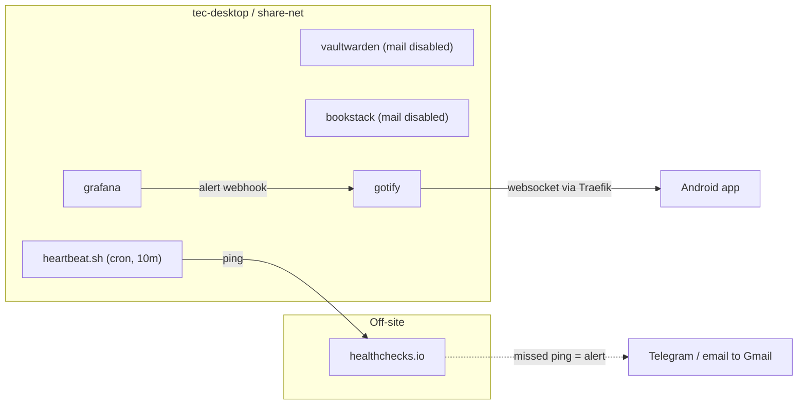

# Mail and Notification Overhaul

Stop sending mail from the estate entirely, and fix notification reliability where it actually matters: an
external dead-man's-switch so host and ISP outages reach a phone that is off the LAN, and Gotify hardened
against Android Doze.

The trigger was Gmail SMTP credentials expiring and breaking notifications. The conclusion after working the
problem is that the mail path should be deleted rather than rebuilt — nothing in the estate needs to send
email once users are created from admin panels.

Follows on from [`container-management-overhaul.md`](container-management-overhaul.md) and
[`prometheus-monitoring-stack.md`](prometheus-monitoring-stack.md). It assumes Traefik is routing, Gotify is
the alert sink, and Grafana unified alerting is provisioned — all three are already true.

## Decisions

- **No mail sent from the estate.** No mail server, no SMTP relay container, no transactional provider
  account. Vaultwarden and BookStack are the only two services that ever sent mail, and neither needs to.
- **Users are created from admin panels.** Both services support it, and the household onboards a new user
  roughly never.
- **TOTP, not email 2FA, on Vaultwarden.** This is what makes dropping mail safe rather than reckless.
- **Outage alerting comes from outside the house.** A healthchecks.io dead-man's-switch, because nothing
  running on `tec-desktop` can report that `tec-desktop` is down.
- **Gotify stays the single in-band sink** for backup failures, DIUN, and Grafana alerts.
- The relay design is kept as an appendix, ready to deploy if a future service genuinely needs to send mail.

### Why not a self-hosted mail server

`mail.tecronin.uk` with real MX records was the original idea, and it fails on four counts:

- **Outbound 25 is almost certainly blocked.** Most consumer ISPs block it outright, so Postfix cannot reach
  recipient MX servers at all.
- **Residential IPs are pre-blocklisted.** The range is on the Spamhaus PBL by design. Gmail and Outlook
  reject or spam-folder anything originating there regardless of how the mail is signed.
- **PTR cannot be set.** Large receivers want forward-confirmed reverse DNS, and only the ISP can set a PTR
  record. A dynamic address makes it moot anyway.
- **Cloudflare cannot help.** The orange-cloud proxy only covers HTTP/HTTPS, so publishing an MX or an A
  record for `mail.tecronin.uk` exposes the home IP directly and gets no protection in front of it.

The decisive objection is not deliverability though. **A mail server on `tec-desktop` cannot tell you that
`tec-desktop` is down**, that the array is degraded, or that the ISP dropped. Email also fails silently — a
message sitting in a spam folder is indistinguishable from one that was never sent. For an alerting channel
that is the worst possible failure mode.

### Why not an SMTP relay either

The obvious middle ground is a null-client Postfix on `share-net` relaying through a transactional provider,
which fixes the credential expiry. It was the plan of record for a while. It was dropped because it is
fragile in a way that config hardening cannot fix:

- **Four things break independently and all of them fail silently.** The relay container, the provider's SMTP
  key, the provider account itself, and the DKIM CNAMEs staying unproxied in Cloudflare. When the key is
  revoked, Postfix queues for ~5 days, retries, then bounces to nowhere.
- **Free tiers are a dependency, not a feature.** Brevo and the rest are marketing-email businesses, and an
  account sending five messages a month is exactly the profile that gets pruned or forced through
  reverification.
- **The path is almost never exercised.** This is the root cause of the other two. A code path used a handful
  of times a year is broken far more often than anyone expects, because nothing tests it in between.

The way to make a rarely-used path reliable is to delete it, not to monitor it. Deleting it removes the
container, the provider account, three DNS records, and a class of silent failures, and replaces them with
nothing.

### Why dropping mail is safe here

- **Nobody is onboarded regularly.** A handful of family accounts, created once.
- **No email 2FA.** This is the load-bearing condition. With email 2FA enabled, breaking the mail path locks
  you out of your own password manager. With TOTP it is irrelevant. Keep it that way.
- **A forgotten Vaultwarden master password is not recoverable by email regardless.** Bitwarden's model is
  zero-knowledge; the vault is encrypted client-side. Mail was never the recovery path, so removing it loses
  nothing.

What is actually given up: Vaultwarden's "new device logged in" notifications, its email-change verification
flow, and self-service password reset in BookStack. All three are admin-panel operations instead.

## Target state



Two notification channels, split by what they can survive. Gotify handles in-band alerts, where the host is up
and something is wrong. healthchecks.io handles out-of-band, where the host or the ISP is gone — and it has to
live outside the house for that to work.

## Disabling mail on vaultwarden

[`src/services/vaultwarden/docker-compose.yml`](../../src/services/vaultwarden/docker-compose.yml) currently
interpolates five Gmail SMTP variables from its host `.env`. Delete all of them:

```yaml
      - SMTP_HOST=${SMTP_HOST}
      - SMTP_FROM=${SMTP_FROM}
      - SMTP_PORT=${SMTP_PORT}
      - SMTP_SECURITY=${SMTP_SECURITY}
      - SMTP_USERNAME=${SMTP_USERNAME}
      - SMTP_PASSWORD=${SMTP_PASSWORD}
```

Vaultwarden treats an absent `SMTP_HOST` as mail disabled; there is no separate toggle. Also drop the
`SMTP-Configuration#googlegmail` wiki link from the header comment block, since it no longer applies.

Onboarding without mail, confirmed working on the pinned `1.37.2`:

1. Admin panel > Users > enter the address > Invite. The user shows as "Invited".
2. The user goes to `https://vaultwarden.tecronin.uk/#/signup` and registers with **that exact address**.
3. This works with `SIGNUPS_ALLOWED=false` — invited addresses bypass the check.

The signup link is hidden from the login page when signups are disabled, so the `/#/signup` fragment has to be
handed over directly. Worth writing into the service docs, because it is not discoverable. The registration
bug that used to block this was fixed upstream in 1.34.3.

## Disabling mail on bookstack

[`src/services/wiki/docker-compose.yml`](../../src/services/wiki/docker-compose.yml) lines 53-61 collapse to a
single line:

```yaml
      MAIL_DRIVER: log
```

`log` routes any attempted send to the container log instead of erroring, which is safer than removing the
mail config outright — BookStack will still try to send on some flows, and a logged message is easier to
diagnose than a stack trace. Verify the driver name against the pinned `26.05.4` image before relying on it.

Admins create users under Settings > Users with a password set directly, and can change any user's password
the same way. Self-service password reset is what goes away.

## Removing the credentials

Once both stacks are redeployed and confirmed working, delete the `SMTP_HOST`, `SMTP_PORT`, `SMTP_FROM`,
`SMTP_SECURITY`, `SMTP_USERNAME`, and `SMTP_PASSWORD` lines from `/mnt/raid/services/vaultwarden/.env` and
`/mnt/raid/services/wiki/.env`, then revoke the Gmail app password in the Google account. Revoking it is the
point of the exercise — a credential that still exists is a credential that can be abused.

## Dead-man's-switch

This is the piece that addresses the original complaint. Nothing today can report that `tec-desktop`, the
array, or the ISP is down, because every notification path runs on the box being reported on.

New `src/bin/cron/heartbeat.sh`, deployed by the existing `deployScripts` task to `/mnt/raid/bin/cron/`. It
checks array state in `/proc/mdstat`, headroom on `/` and `/mnt/raid`, and that the docker daemon responds.
On success it curls the ping URL; on failure it curls `<url>/fail`, so a degraded array alerts within minutes
instead of waiting out the grace period. `HC_PING_URL` comes from `/etc/environment`, the same way
`GOTIFY_APP_TOKEN` already does for [`rclone-sync.sh`](../../src/services/_common/rclone-sync.sh).

New `src/etc/cron.d/heartbeat_cron`, mirroring the header block and `MAILTO=""` of
[`service_backup_cron`](../../src/etc/cron.d/service_backup_cron):

```
*/10 * * * * root /mnt/raid/bin/cron/heartbeat.sh > /var/log/heartbeat.cron.log 2>&1
```

healthchecks.io free tier covers 20 checks with email, webhook, Slack, and Telegram alerting. Configure period
10m and grace 20m. Route its alerts to the Gmail address and to Telegram — deliberately **not** to Gotify,
since a webhook into the host that just died is useless.

Optional follow-on: an UptimeRobot or Better Stack free monitor hitting `https://gotify.tecronin.uk` from
outside. That is the correct reading of the `uptime-kuma` TODO in [`README.md`](../../README.md) — self-hosting
Kuma on `tec-desktop` would recreate exactly the blind spot this section exists to close.

## Gotify on Android

`gotify.tecronin.uk` is routed on `websecure` with no `lan-only@file` middleware, unlike vaultwarden,
prometheus, and unifi-os, so it is already reachable off-network. Late or missing notifications are Android
Doze suspending the app's persistent websocket, not a routing problem. Config only, no repo changes:

- Exclude Gotify from battery optimisation.
- Enable the foreground service in the app so the socket survives Doze.
- Confirm a Grafana alert and an `rclone-sync.sh` failure both land while off the LAN.

If Doze still wins, the escalation is ntfy with UnifiedPush alongside Gotify, which survives Doze properly on
Android. Not worth a second notification service unless the simple fixes fail.

## Appendix: the relay, if something ever needs it

Not part of this plan. Recorded so that adding it later is a short job rather than a fresh investigation.

The shape is a null-client Postfix on `share-net`, no published ports and no Traefik labels, relaying to a
transactional provider. `boky/postfix:v5.1.0-alpine` is the image to use — actively maintained, first-class
`RELAYHOST_USERNAME` / `RELAYHOST_PASSWORD` env vars, and it defaults `mynetworks` to private ranges so an
accidental exposure does not become an open relay. `mwader/postfix-relay`, the image linked in the README
TODO, defaults to an open relay with hand-built SASL config; `maddy` and `stalwart` are full mail servers;
`namshi/smtp` and `bytemark/smtp` are unmaintained.

```yaml
services:
  smtp:
    image: boky/postfix:v5.1.0-alpine
    container_name: smtp
    hostname: smtp
    restart: unless-stopped
    environment:
      POSTFIX_myhostname: mail.tecronin.uk
      ALLOWED_SENDER_DOMAINS: tecronin.uk
      RELAYHOST: ${RELAYHOST:?set RELAYHOST in .env}
      RELAYHOST_USERNAME: ${RELAYHOST_USERNAME:?set RELAYHOST_USERNAME in .env}
      RELAYHOST_PASSWORD: ${RELAYHOST_PASSWORD:?set RELAYHOST_PASSWORD in .env}
      POSTFIX_smtp_tls_security_level: encrypt
    volumes:
      - /etc/timezone:/etc/timezone:ro
      - /etc/localtime:/etc/localtime:ro
    healthcheck:
      test: ["CMD", "nc", "-z", "127.0.0.1", "587"]
      interval: 30s
      timeout: 5s
      retries: 3
networks:
  default:
    external: true
    name: share-net
```

Gotchas worth not rediscovering:

- **The image listens on 587, not 25.** Port 25 is deliberately not exposed. Clients use `smtp:587`.
- **`ALLOWED_SENDER_DOMAINS` is mandatory** or Postfix refuses to start.
- **Prefer a paid provider over a free tier.** Migadu (~£19/yr) or Purelymail (~£10/yr) also give real
  mailboxes at `tecronin.uk` and would replace Cloudflare Email Routing; Amazon SES is pennies at this volume.
  A paid account will not be pruned for inactivity.
- **On Brevo's shared pool, SPF cannot align** — its envelope sender is Brevo's own bounce domain, so DMARC
  passes on DKIM alignment alone and `include:spf.brevo.com` buys nothing. Both DKIM CNAMEs
  (`brevo1._domainkey`, `brevo2._domainkey`) must be **DNS-only, not proxied**, or DKIM breaks outright.
- **Only one SPF TXT record is permitted on the apex.** A second is a hard permerror that breaks inbound and
  outbound at once.

**Monitor it end-to-end or do not build it.** healthchecks.io can be pinged by *email* — each check has its
own address, and their docs describe this exact use case. A weekly cron sending a message through the relay to
that address tests the entire chain from outside the house, and alerts over Telegram, which cannot be taken
out by the thing it is monitoring. Pair it with a `postqueue -p` depth check in `heartbeat.sh` to catch stuck
mail as well as dead mail.

## Task list

- [ ] Confirm no Vaultwarden account uses email 2FA; move any that do to TOTP first. This gates everything
  else.
- [ ] Remove the six `SMTP_*` environment lines and the Gmail wiki link comment from the vaultwarden stack.
- [ ] Collapse the wiki stack's mail block to `MAIL_DRIVER: log`, verifying the driver name against the pinned
  `26.05.4` image.
- [ ] Redeploy both stacks and confirm they start clean with no mail configuration.
- [ ] Verify admin-panel onboarding end to end on Vaultwarden: invite, then register at `/#/signup` with the
  same address while `SIGNUPS_ALLOWED=false`.
- [ ] Verify admin-created users and an admin password change on BookStack.
- [ ] Delete the `SMTP_*` lines from both host `.env` files and revoke the Gmail app password.
- [ ] Add `src/bin/cron/heartbeat.sh` with array, disk, and docker checks, pinging `/fail` on a failed check.
- [ ] Add `src/etc/cron.d/heartbeat_cron` at `*/10`, with `MAILTO=""`, and set `HC_PING_URL` in
  `/etc/environment`.
- [ ] Create the healthchecks.io check at 10m period / 20m grace, alerting to Gmail and Telegram, not Gotify.
- [ ] Confirm the switch fires: stop the cron and wait out the grace period.
- [ ] Fix Gotify battery optimisation and foreground service on the phone, and verify alerts arrive off-LAN.
- [ ] Update `README.md` — drop the `postfix-relay` TODO entirely, and retarget the `uptime-kuma` TODO at
  external monitoring.
- [ ] Update `docs/service_configuration.md` — remove the Vaultwarden "SMTP configuration" step and the
  `SMTP_*` keys, and document the `/#/signup` onboarding flow.
- [ ] Optional follow-on: external HTTP monitor on `gotify.tecronin.uk` from UptimeRobot or Better Stack.
- [ ] Optional follow-on: ntfy with UnifiedPush if Doze still delays Gotify notifications.
