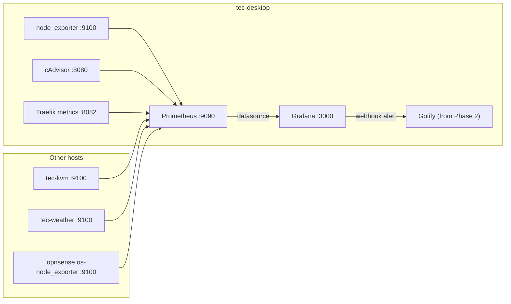

# Prometheus Monitoring Stack

Replace the never-initialized InfluxDB with Prometheus + node_exporter + cAdvisor feeding the existing Grafana,
with dashboards and resource-spike alert rules provisioned from git and routed to Gotify.

Sequenced as a follow-on to [`container-management-overhaul.md`](container-management-overhaul.md), effectively
its Phase 5. It assumes that plan's Phase 2 (Gotify exists) and Phase 3 (Traefik replaces nginx) are both
complete, so all routing here is Traefik labels and Gotify is already running as an alert sink.

## Decisions

- **Backend**: Prometheus, not InfluxDB and not TimescaleDB. Pull-based, so adding a host is a line in
  `prometheus.yml` rather than an agent config deployed to that host.
- **Agents**: `node_exporter` for hosts, `cAdvisor` for containers. No Telegraf.
- **Alerting**: Grafana unified alerting, provisioned as YAML in this repo. Not Prometheus rule files plus
  Alertmanager.
- **Notifications**: Gotify, reusing the service the overhaul introduces in its Phase 2.
- **Retention**: 90 days, 15 GB cap, 30s scrape interval.

### Why not the existing InfluxDB

[`src/services/grafana/docker-compose.yml`](../../src/services/grafana/docker-compose.yml) runs
`influxdb:2.7.11` but configures it with InfluxDB 1.x environment variables:

```yaml
    environment:
      - INFLUXDB_DB=pimonitor
      - INFLUXDB_ADMIN_USER=${INFLUXDB_USERNAME}
      - INFLUXDB_ADMIN_PASSWORD=${INFLUXDB_PASSWORD}
```

2.x ignores all three; it wants `DOCKER_INFLUXDB_INIT_MODE=setup` plus `DOCKER_INFLUXDB_INIT_*`. That container
has therefore been sitting at its unconfigured setup screen with no org, no bucket, and no token since it was
deployed, which is almost certainly why the Telegraf attempt went nowhere. There is no data in it and nothing
to migrate.

Separately, InfluxData deprecated Flux and 3.x is a different product with a different migration path, so
investing in InfluxQL or Flux now is building on a dead end.

### Why not TimescaleDB

Timescale discontinued Promscale, their Prometheus long-term store, in 2023, so the integrated path no longer
exists. Reaching TimescaleDB would mean Telegraf's postgres output, which leaves every dashboard panel and
every alert rule as hand-written SQL, with no `rate()` and no `predict_linear()`. TimescaleDB stays as the
weather store, which is a relational, long-retention, SQL-queried workload it genuinely suits.

### Why not Telegraf

Telegraf was never actually in this repo. It is listed in [`README.md`](../../README.md) and
[`docs/project_overview.md`](../../docs/project_overview.md) as part of the monitoring stack, but there is no
compose service, no `telegraf.conf`, and no gradle deploy task. Nothing is being torn out by dropping it.

## Do these two things during the overhaul

Deferring monitoring until after Traefik means the overhaul will otherwise build two things this plan
immediately deletes:

- **Phase 3**: do not create a Traefik router for `influxdb.tecronin.uk`. The route inventory lists
  `influxdb 8086` among the 14 container-backed routes, but this plan deletes that container, so migrating the
  route means writing labels that get removed again.
- **Phase 4**: do not add backup sidecars for `influxdb-data`, `influxdb-data2`, or `influxdb-conf`. Phase 4
  lists "grafana/influxdb (5 volumes)" as unprotected. Only `grafana-data` is worth protecting; the other three
  are empty and about to be deleted.

## Target state



## Grafana stack changes

Delete the `influxdb` service and its three volumes. Swap the `grafana-provisioning` named volume for a
git-tracked bind mount, so dashboards, datasources, and alert rules become repo state rather than runtime
state — the same reasoning that picked Traefik over NPM in the overhaul:

```yaml
    volumes:
      - grafana-data:/var/lib/grafana
      - ./provisioning:/etc/grafana/provisioning:ro
      - ./dashboards:/var/lib/grafana/dashboards:ro
```

`deployGrafana` already copies `src/services/grafana` into `/mnt/raid/services`, so `./provisioning` resolves
on the host with no gradle change.

The datasource needs a fixed UID so committed dashboard JSON can reference it:

```yaml
# src/services/grafana/provisioning/datasources/prometheus.yml
apiVersion: 1
datasources:
  - name: Prometheus
    uid: prometheus
    type: prometheus
    access: proxy
    url: http://prometheus:9090
    isDefault: true
```

## New prometheus stack

`src/services/prometheus/`, three containers on `share-net`, all tags pinned so DIUN tracks them:

- `prom/prometheus:v3.6.0`, `--storage.tsdb.retention.time=90d --storage.tsdb.retention.size=15GB`, config
  bind-mounted from `./prometheus.yml`.
- `prom/node-exporter:v1.9.1` with `network_mode: host`, `pid: host`, `/:/host:ro,rslave`, and
  `--path.rootfs=/host`. Host networking is what makes network and filesystem metrics correct, and it means
  every machine in the estate is scraped uniformly at `<hostname>:9100`.
- `gcr.io/cadvisor/cadvisor:v0.53.0` with `--docker_only=true --housekeeping_interval=30s`, unpublished,
  scraped internally at `cadvisor:8080`.

30s scrape rather than 15s. cAdvisor across ~25 containers plus Node Exporter Full is most of the cardinality,
and 30s roughly halves the ~24 GB/year footprint without hurting spike detection, since the alert rules all
use a `for:` duration anyway.

```yaml
scrape_configs:
  - job_name: node
    static_configs:
      - targets: ['tec-desktop.localdomain:9100']
        labels: {host: tec-desktop}
      - targets: ['tec-kvm.localdomain:9100']
        labels: {host: tec-kvm}
      - targets: ['tec-weather.localdomain:9100']
        labels: {host: tec-weather}
      - targets: ['opnsense.localdomain:9100']
        labels: {host: opnsense}
  - job_name: cadvisor
    static_configs:
      - targets: ['cadvisor:8080']
  - job_name: traefik
    static_configs:
      - targets: ['traefik:8082']
```

**Routing.** Prometheus has no authentication of its own, so its router reuses the `lan-only` ipAllowList
middleware Phase 3 defines in `dynamic/middlewares.yml`:

```yaml
    labels:
      - traefik.enable=true
      - traefik.http.routers.prometheus.rule=Host(`prometheus.tecronin.uk`)
      - traefik.http.routers.prometheus.entrypoints=websecure
      - traefik.http.routers.prometheus.middlewares=lan-only@file
      - traefik.http.services.prometheus.loadbalancer.server.port=9090
```

cAdvisor gets no router, since only Prometheus needs to reach it. node_exporter listens on host port 9100 on
every machine and should be firewalled to the LAN.

## Traefik metrics

A benefit of running after Phase 3 rather than before it: Traefik exposes Prometheus metrics natively, giving
per-router request rates, latencies, and status codes for free. Add to the static `traefik.yml`:

```yaml
metrics:
  prometheus:
    entryPoint: metrics
    addEntryPointsLabels: true
    addRoutersLabels: true
    addServicesLabels: true
entryPoints:
  metrics:
    address: ":8082"
```

Leave the `metrics` entrypoint unpublished so it is reachable only from `share-net`.

## Alert rules

Provisioned in `src/services/grafana/provisioning/alerting/rules.yml`, each with a `for:` duration so a brief
spike from a Jenkins build or a backup window does not fire:

| Alert | Expression | For |
|---|---|---|
| CPU high | `100 - (avg by(host) (rate(node_cpu_seconds_total{mode="idle"}[5m])) * 100) > 85` | 10m |
| Memory high | `(1 - node_memory_MemAvailable_bytes / node_memory_MemTotal_bytes) * 100 > 90` | 10m |
| Filesystem high | `> 85`, excluding `tmpfs` and overlay mounts | 15m |
| Disk filling | `predict_linear(node_filesystem_avail_bytes[6h], 4*24*3600) < 0` | 30m |
| Load per core | `node_load5 / count by(host)(node_cpu_seconds_total{mode="idle"}) > 2` | 15m |
| Temperature | `node_hwmon_temp_celsius > 80` | 5m |
| Host down | `up{job="node"} == 0` | 5m |
| RAID degraded | `node_md_disks{state!="active"} > 0` | 0m |
| Container near memory limit | `container_memory_working_set_bytes / container_spec_memory_limit_bytes > 0.9` | 15m |

The RAID rule matters more here than in a typical setup, because `/mnt/raid` holds every service's config and
bind mounts.

Two things to watch. Phase 4 stops most stacks nightly for backups, so the container rules and `up` need either
a `for:` longer than the stop window or an explicit exclusion, otherwise every backup run alerts. And
provisioned Grafana alert YAML is verbose, roughly 35 lines per rule for the query, reduce, and threshold
chain. If that becomes unmanageable the fallback is Prometheus rule files plus Alertmanager and
`alertmanager_gotify_bridge`, trading two more containers for much more concise rules.

## Gotify wiring

Gotify already exists from Phase 2, so only the Grafana side is new. Create a second Gotify application,
separate from DIUN's, so update notifications and alert notifications can be muted independently. Put its token
in `/mnt/raid/services/grafana/.env`, following the `.env` convention from
[`src/services/unifi-os/README.md`](../../src/services/unifi-os/README.md).

Grafana's webhook payload carries top-level `title` and `message` fields, which is exactly what Gotify's
`/message` endpoint consumes, so no bridge is needed:

```yaml
# src/services/grafana/provisioning/alerting/contactpoints.yml
apiVersion: 1
contactPoints:
  - orgId: 1
    name: gotify
    receivers:
      - uid: gotify-webhook
        type: webhook
        settings:
          url: http://gotify/message?token=$__env{GOTIFY_TOKEN}
          httpMethod: POST
```

## Dashboards

Commit dashboard JSON to `src/services/grafana/dashboards/` with a file provider pointing at it: Node Exporter
Full (grafana.com ID 1860), a cAdvisor dashboard (ID 14282), and a Traefik v3 dashboard. Verify the IDs at
import time, since community dashboard numbering drifts. All of them ship with a `${DS_PROMETHEUS}` input
variable that must be rewritten to the fixed `prometheus` UID, otherwise every panel loads empty.

## Agents on the other hosts

- **tec-kvm, tec-weather**: `apt install prometheus-node-exporter` sets up the systemd unit on 9100
  automatically. The gradle `remotes` block only defines `desktop`, so unless these hosts already have the
  `ansible` user and key this is a documented manual step rather than a new deploy task.
- **opnsense**: install the `os-node_exporter` plugin from System, Firmware, Plugins, then add a firewall rule
  allowing 9100 from the LAN. No shell access needed.
- **tec-pi-mgr (PiKVM)**: optional. Requires `rw`, then `pacman -S prometheus-node-exporter`, then `ro`.
- **UPS**: optional `ghcr.io/druggeri/nut_exporter` against the two `upsd` instances at
  `tec-desktop.localdomain:3493` and `tec-pi-mgr.localdomain:3493` that
  [`src/services/upsmon/docker-compose.yml`](../../src/services/upsmon/docker-compose.yml) already talks to.
  Power events are a common root cause of the spikes worth alerting on.
- **UniFi**: optional `ghcr.io/unpoller/unpoller` for AP, switch, and client metrics.

## Task list

- [x] During overhaul Phase 3, skip the `influxdb.tecronin.uk` Traefik router. During Phase 4, skip backup
  sidecars for `influxdb-data`, `influxdb-data2`, and `influxdb-conf`.
- [ ] Remove the `influxdb` service and its three volumes from the grafana stack, and drop any leftover
  influxdb Traefik labels.
- [ ] Switch `grafana-provisioning` from a named volume to a git-tracked `./provisioning` bind mount, and add
  `./dashboards`.
- [ ] Provision the Prometheus datasource with fixed uid `prometheus`.
- [ ] Add `src/services/prometheus` with pinned prometheus, node-exporter, and cAdvisor, `prometheus.yml` with
  the node, cadvisor, and traefik jobs at 30s, 90d/15GB retention, Traefik labels using `lan-only@file`, and a
  `deployPrometheus` gradle task added to `deployAll`.
- [ ] Enable the Prometheus metrics endpoint in the Traefik static config on an unpublished `metrics`
  entrypoint.
- [ ] Provision the Gotify contact point and notification policy, reading the token from the host `.env` via
  `$__env{GOTIFY_TOKEN}`.
- [ ] Provision the nine alert rules, with `for:` durations chosen so the Phase 4 backup stop windows do not
  trigger them.
- [ ] Commit Node Exporter Full, cAdvisor, and Traefik dashboard JSON with `${DS_PROMETHEUS}` rewritten to the
  fixed datasource uid, plus the file-based dashboard provider.
- [ ] Install node_exporter on tec-kvm and tec-weather, enable `os-node_exporter` on opnsense with a LAN
  firewall rule, and document the whole inventory in `src/services/prometheus/README.md`.
- [ ] Optional: `nut_exporter` for the two upsd instances, `unpoller` for UniFi.
- [ ] Confirm `grafana-data` has an offen sidecar from Phase 4; leave the Prometheus TSDB unbacked, since it is
  regenerable and large.
- [ ] Update `README.md`, `docs/project_overview.md`, and `docs/service_configuration.md` to drop the
  Telegraf/InfluxDB pipeline description. Note that `service_configuration.md` also documents paths like
  `src/services/monitoring/grafana/` that do not exist.
