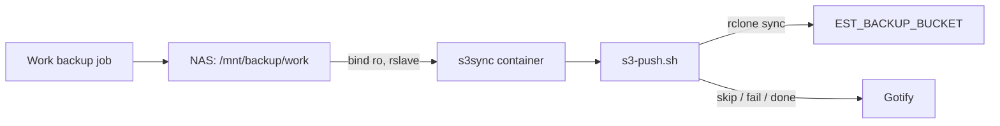

# S3 work backup sync (s3sync)

> **Implemented** in [`src/services/s3sync/`](../../src/services/s3sync/). Written 2026-10-04.
> **This file is the design record.** Operational steps live in
> [`src/services/s3sync/README.md`](../../src/services/s3sync/README.md).

Work backups (including powered-off VirtualBox VM folders) land on the NAS at `/mnt/backup/work`.
The **s3sync** stack pushes that tree one way to a private AWS S3 bucket created with
[`src/bin/s3-bucket.sh`](../../src/bin/s3-bucket.sh), on a nightly schedule after the local job
finishes.

## Architecture



- **Image:** `rclone/rclone:1.75.0`, busybox **crond** (same pattern as [`gdrive`](../../src/services/gdrive/)).
- **Schedule:** `30 1 * * *` in [`crontab`](../../src/services/s3sync/crontab).
- **Deploy:** `./gradlew deployS3sync` → `/mnt/raid/services/s3sync` (copies [`_common/`](../../src/services/_common/) beside compose).

## Host configuration (`/etc/environment`)

| Variable | Purpose |
|----------|---------|
| `EST_BACKUP_SRC` | Host path (default `/mnt/backup/work`) bind-mounted at `/data` |
| `EST_BACKUP_BUCKET` | Full bucket name, e.g. `tec-backup-744686699669-us-west-2-an` |
| `EST_BACKUP_AWS_REGION` | S3 region for rclone |
| `EST_BACKUP_ID` | IAM user `aws_access_key_id` (user tied in `s3-bucket.sh`) |
| `EST_BACKUP_KEY` | IAM user `aws_secret_access_key` |

Crond does **not** pass Docker `env_file` into jobs. The container bind-mounts
`/etc/environment` as `/etc/host-environment`; **`s3-push.sh`** reads `EST_BACKUP_*` (and Gotify
vars) from that file on every run.

## Safety and concurrency

- [x] **Mount sentinel:** `/data/.s3sync-sentinel` must exist on the backup tree (create once on
  the NAS path). Prevents `rclone sync` from treating an empty mountpoint as “delete everything in
  S3”.
- [x] **`--max-delete`** (default 50) as a second guard.
- [x] **`flock`** on `/tmp/s3sync.lock` — skip overlapping runs (multi-hour VM uploads).
- [x] **Quiet period:** `.backup-complete` marker (not a full-tree `find`). Work job should
  `rm -f .backup-complete` at start and `touch .backup-complete` when finished. Skip if marker
  missing or touched within `QUIET_MINUTES` (30). Manual runs: `SKIP_QUIET=1`.

## Rclone tuning (large `.vdi` files)

- `--transfers 2`, `--s3-upload-concurrency 4`, `--s3-chunk-size 64M`
- `--s3-disable-checksum` (avoid full-disk read before upload; compare size/mtime)
- `--s3-storage-class STANDARD_IA`, `--s3-no-check-bucket`
- `-v --stats 5m --stats-one-line` for long runs in `docker logs`

[`filters.txt`](../../src/services/s3sync/filters.txt) excludes VirtualBox `Logs/`, `*.lck`,
`*.tmp`, `*.part`.

## Shared scripts

- [`_common/rclone-sync.sh`](../../src/services/_common/rclone-sync.sh) — optional `RCLONE_FLAGS`;
  failure notify prefers `GOTIFY_APP_TOKEN`.
- [`_common/gotify-notify.sh`](../../src/services/_common/gotify-notify.sh) — `X-Gotify-Key`
  header (not `?token=`); loads Gotify vars from `/etc/host-environment` when sourced.

## Checklist (implementation)

- [x] `src/services/s3sync/docker-compose.yml`, `crontab`, `s3-push.sh`, `filters.txt`, `README.md`
- [x] `deployS3sync` in [`src/gradle/services.gradle`](../../src/gradle/services.gradle)
- [x] Root [`README.md`](../../README.md) services table row
- [ ] Bucket versioning + lifecycle (admin; commands in service README)
- [ ] Work backup job wired to `.backup-complete` markers

## Verification

```bash
docker compose config   # under deployed s3sync dir
docker exec s3sync ls /data/.s3sync-sentinel
docker exec -e SKIP_QUIET=1 -e RCLONE_EXTRA=--dry-run s3sync /bin/sh /s3-push.sh
docker exec s3sync sh -c '. /gotify-notify.sh; gotify_notify 5 "s3sync test" "ping" && echo gotify OK || echo gotify FAIL'
docker logs -f s3sync
```
