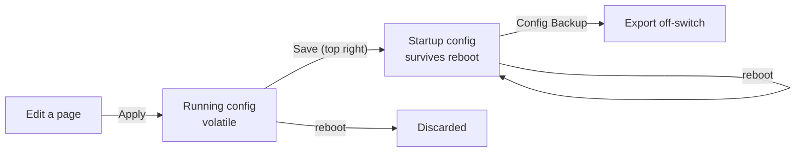

# Switch Hardening

> **Implementation order: step 1 of 5 (Phases 1–2). Phase 3 lands inside
> [`vlan-segmentation.md`](vlan-segmentation.md), step 5 of 5.**
> **This file is the source of truth.** `- [x]` done, `- [ ]` open. The command or GUI path sits
> under the item. Do remaining `[ ]` items **in order**; do not skip an open item to work a later one.
> Menu-path walkthrough (not the checklist): [`../../docs/omada-switch-hardening.md`](../../docs/omada-switch-hardening.md).
> Prerequisites: Internal CA from [`../../docs/opnsense-cert-guide.md`](../../docs/opnsense-cert-guide.md)
> — exists. Written 2026-09-05.
> **Gates step 5.** Followed by: [`security-quick-wins.md`](security-quick-wins.md) items 1–5 (step 2).

The two `SG2210XMP-M2` switches arrived, and the Site A unit is already carrying live traffic and powering
`tec-pi-mgr` over PoE. That makes them the two newest admin surfaces on the network, and the least locked
down: default credentials, a factory self-signed certificate, plaintext management protocols enabled, and —
demonstrated in practice — a configuration that does not survive a reboot.

This is the plan [`vlan-segmentation.md`](vlan-segmentation.md) assumed would happen on a bench in its
Phase 0 step 3, before either switch went in the rack. Site A overtook that, so the work is split by what
can be done on the flat network today (Phases 1–2) and what has to wait for VLANs to exist (Phase 3).

Companion to [`security-quick-wins.md`](security-quick-wins.md), whose items 7–8 cover SSH and MFA on
admin surfaces that live outside the repo. The switch UIs are two more of those, and this plan is where
they get a home.

## Remaining — do in this order

Finish open `[ ]` items here before starting a later item in this plan. Phase 3 is blocked on VLANs.

- [ ] **3.1** Management VLAN 50 for switch IPs when segmentation exists — so they are not on IoT.
      Do **not** lock the UI to a single admin host (3.2 skipped). Blocked on
      [`vlan-segmentation.md`](vlan-segmentation.md).

SSH as `cursor` (password `CURSOR_SW_PWD`). Needs old algorithms:
`KexAlgorithms=+diffie-hellman-group14-sha1,diffie-hellman-group1-sha1`,
`HostKeyAlgorithms=+ssh-rsa`, `Ciphers=+aes128-cbc,3des-cbc,aes256-cbc`. Prompt `tec-sw-a>` then
`enable`. Save: `copy running-config startup-config`. Copper `two-gigabitEthernet 1/0/N`; SFP+
`ten-gigabitEthernet 1/0/9` and `1/0/10`.

## Decisions

- **Save discipline before anything else.** Every other item here is worthless until the running config
  reliably reaches the startup config. It is listed first because it has already failed once: firmware was
  updated, the switch was rebooted, and the configuration came back at defaults.
- **The switches stay standalone, and are never adopted into an Omada controller.** This was already
  decided on the grounds of not running a third management plane alongside UniFi, but there is a sharper
  reason now: TP-Link documents that adoption pushes a default configuration over standalone
  pre-configuration, including the VLAN interface. On a switch whose management address lives in a
  non-default VLAN, that is a lockout, not an inconvenience. Cloud access gets disabled rather than merely
  left unused.
- **The web UI certificate comes from the OPNsense Internal CA**, not a public CA and not the factory
  self-signed cert. The switches are `.localdomain` names, so no public CA can issue for them, and the CA
  in [`../../docs/opnsense-cert-guide.md`](../../docs/opnsense-cert-guide.md) is already trusted by the
  hosts that administer OPNsense — which are the same hosts that will administer these. Reusing the
  `*.tecronin.uk` wildcard from Traefik's ACME store was considered and rejected: it would put the private
  key that fronts every public service onto a layer 2 device, and it would need re-uploading every 90 days.
- **The certificate is accepted as manual, expiring toil.** Upload requires a reboot, the switch caps at
  TLS 1.2, and renewal is a hand operation on an 825-day clock with nothing in this repo to remind you.
  That is the price of a trusted name on the switch UI, and the expiry date therefore gets written down in
  `docs/network-layout.md` rather than living only in the certificate.
- **Home network, not a fortress.** Front door (WAN / Traefik) and obvious back doors (services sitting
  on the LAN that should not be) get locked. Per-device switch paperwork — MAC limits, IP-MAC bindings,
  ARP Inspection, Source Guard, Access Control down to one admin PC — does not. New phones and laptops
  stay DHCP on the trusted SSID or a Clients port; no registration step. Reach your own systems from a
  house laptop without VPN. WireGuard is the key for *away*, not for sitting in the living room.
- **Neither switch routes.** Restated from [`vlan-segmentation.md`](vlan-segmentation.md) because it is a
  hardening decision as much as a topology one: traffic routed by a switch never reaches OPNsense, so no
  firewall policy applies to it. Static routing and inter-VLAN routing stay off on both.
- **SNMP stays off for now.** It is the hook for switch metrics in Prometheus via `snmp_exporter` later,
  and if that happens it is v3 only. Note that this is a separate path from the `unpoller` job in
  [`unifi-os-monitoring.md`](unifi-os-monitoring.md), which covers UniFi devices and will never see these.

## Current state

- **Both switches shipped with the same device name**, `SG2210XMP-M2`, which collided in Dnsmasq: it keys
  the DNS record off the DHCP-supplied hostname, so the second lease overwrote the first. Resolved by
  naming them `tec-sw-a` (Site A) and `tec-sw-b` (Site B) and giving each a static reservation by MAC in
  the `192.168.1.2`–`.120` pool, per the Hosts convention in
  [`../../docs/dmsaqdns.md`](../../docs/dmsaqdns.md). Both remain DHCP clients; neither carries a
  switch-side static address.
- **Site A is live and load-bearing.** It carries the LAN and powers `tec-pi-mgr` over PoE. The Pi
  initially failed to power on; the 160W budget was never the constraint — an AP plus a Pi 5 with an SSD is
  roughly 40W — and it came up once PoE was enabled and prioritised on its port. **Class 4 / high** on
  Tw1/0/1 and Tw1/0/8 was GUI-verified 2026-09-06.
- **Configuration resets on reboot, and the cause is confirmed.** First seen after a firmware update, but
  it also reproduces on a **plain reboot after entering static IP assignments**, with no firmware involved.
  That rules out the firmware-version-skip theory as the explanation and leaves the running config /
  startup config split: **Apply** writes only the running config, and **Save** is the only thing that
  commits it to the startup config. Consequence for sequencing — **everything entered on either switch so
  far must be treated as unsaved** and re-entered, which is why this plan is step 1 rather than a
  follow-on.
- **The UI was HTTPS with the factory self-signed certificate.** Protocol Version defaulted to **All**
  (SSL 3.0, TLS 1.0, TLS 1.1) with RC4/DES/3DES on. Protocol, ciphers, and Internal CA certs are Phase 2
  items 4 and 11 below.
- **Both switches are now installed**, so `vlan-segmentation.md`'s Phase 0 bench window has closed for
  both — including its step 4 side-by-side test of the 10m inter-site AOC. Whatever was not verified on a
  bench now has to be verified in place.

## How configuration persists



The CLI equivalent of Save is `copy running-config startup-config`. This model also has **Dual Image and
Dual Configuration**, so a firmware upgrade can leave the switch booting the backup image — confirm the
running version is the one you installed before re-entering configuration you do not want to type twice.

## Phase 1 — make configuration survive a reboot

Do this first, on both switches, before entering anything else worth keeping.

- [x] **1. Save, reboot, verify.** Enter one harmless change, Save, reboot, confirm it survived.
  **Did (2026-09-06):** hostname + hardening saved, then reboot both. Config survived (~4 min uptime
  after). `copy running-config startup-config` then `copy running-config backup-config` (`config2.cfg`).
- [x] **2. Confirm running firmware and next-boot image.**
  **Did:** both on `image2.bin`, 1.0.27 Build 20260804 Rel.4241; next-boot matches. Backup image is
  factory `image1.bin` 1.0.0.
- [x] **3. Device name and Site A PoE.** `tec-pi-mgr` and AP 1: enabled, 802.3at Class 4, high priority.
  **Did:**
  ```
  hostname tec-sw-a          # tec-sw-b on Site B
  interface two-gigabitEthernet 1/0/1
   power inline supply enable
   power inline priority high
   power inline consumption class4
   description tec-pi-mgr
  interface two-gigabitEthernet 1/0/8
   power inline supply enable
   power inline priority high
   power inline consumption class4
   description ap-1
  copy running-config startup-config
  ```
  GUI-verified Class 4 / high 2026-09-06. Dnsmasq Hosts renamed to `tec-sw-a` / `tec-sw-b`.
- [x] **4. Perpetual PoE.** Needed so later reboots do not cut `tec-pi-mgr`.
  **Did:** firmware **1.0.27 has no Perpetual PoE** (GUI or CLI). Do not confuse **SYSTEM → PoE → PoE
  Auto Recovery** (ping-then-power-cycle PD) with perpetual power. Site A reboot **cuts PoE**. Shut the
  Pi down cleanly first. Marked done as *confirmed absent*, not enabled.
- [x] **5. Export config off-switch**, per switch, firmware in the filename. Repeat after every change
  set. This is what makes either switch a cold spare for the other.
  **Did (2026-09-06):** GUI **SYSTEM → System Tools → Config Backup** on both (browser download of
  `data/sysConfigBackup.cfg`). On-switch `config2.cfg` is not an off-switch copy.
  **No onboard scheduler.** Automation is [`appliance-config-backups.md`](appliance-config-backups.md)
  Phase 1, not this plan. Until that runs: SSH `copy startup-config tftp …` or HTTPS GET
  `data/sysConfigBackup.cfg?operation=write&unit_id=1` from a LAN host (not this NAT VM).

## Dependencies — there are almost none

Worth stating plainly, because the phase ordering above implies more coupling than exists:

- [`lan-only-default-routing.md`](lan-only-default-routing.md) — **no intersection whatsoever.** It is
  about Traefik entrypoints and Cloudflare. The switch UIs are not behind Traefik and never should be.
- [`security-quick-wins.md`](security-quick-wins.md) — **only Vaultwarden**, to hold the two passwords, and
  it is already running.
- [`vlan-segmentation.md`](vlan-segmentation.md) — the only real dependency, and it gates Phase 3
  items 1–3, not the rest of this job.
- The certificate needs the Internal CA from
  [`../../docs/opnsense-cert-guide.md`](../../docs/opnsense-cert-guide.md). That CA exists and the OPNsense
  GUI already serves a certificate from it, so this is satisfied.

Everything in Phases 1 and 2 can be done today on the flat network.

## Phase 2 — baseline lockdown, HTTPS, and the traffic defences

Safe on the flat network as it stands today. No VLAN dependency. Applied 2026-09-06 over SSH as `cursor`
except item 7.

- [x] **1. Credentials.** Distinct `admin` password per switch in Vaultwarden. Automation account
  `cursor` (Admin), password `CURSOR_SW_PWD` in `~/.profile`. Factory `admin`/`admin` already rejected.
- [x] **2. Cloud access and controller enrolment off.** Standalone; never adopt. GUI/CLI vanish while a
  controller manages the switch.
  **Did:** already off on both; left off.
- [x] **3. Management protocols.** HTTPS only, HTTP off, Telnet off, SSH v2 on for `cursor`.
  **Did:**
  ```
  no ip http server
  ip http secure-server
  ```
  Telnet/SNMP already off. Port 80 still serves an HTTPS redirect stub on this firmware.
- [x] **4. HTTPS protocol and ciphers.** TLS 1.2 only; RC4/DES/3DES off.
  **Did:**
  ```
  ip http secure-protocol tls12
  ip http secure-ciphersuite ecdhe-a128-g-s256 ecdhe-a256-g-s384
  ```
  TLS 1.1 rejected (alert 70). Live ciphers `ECDHE-AES128-GCM-SHA256` / `ECDHE-AES256-GCM-SHA384`.
- [x] **5. DHCP Filter.** Legal server OPNsense `192.168.1.1` on the port toward it. Test one client.
  **Did:**
  ```
  ip dhcp filter
  ip dhcp filter server permit-entry server-ip 192.168.1.1 client-mac all interface ten-gigabitEthernet 1/0/10
  interface range two-gigabitEthernet 1/0/1-8
   ip dhcp filter
  ```
  Te1/0/10 on both (Site A = OPNsense `ixl1`; Site B = inter-site toward OPNsense). Survived reboot.
- [x] **6. DoS Defend, then storm control, then loopback detection.** Not on 10G / inter-site.
  **Did:** one `ip dos-prevent type …` per type (cannot pack types). Storm control must set `rate-mode
  kbps` first (`… kbps 1024` is invalid):
  ```
  ip dos-prevent
  ip dos-prevent type land
  ip dos-prevent type scan-synfin
  ip dos-prevent type xma-scan
  ip dos-prevent type null-scan
  ip dos-prevent type port-less-1024
  ip dos-prevent type blat
  ip dos-prevent type ping-flood
  ip dos-prevent type syn-flood
  ip dos-prevent type win-nuke
  ip dos-prevent type ping-of-death
  ip dos-prevent type smurf
  loopback-detection
  interface range two-gigabitEthernet 1/0/1-8
   loopback-detection
   storm-control rate-mode kbps
   storm-control broadcast 1024
   storm-control multicast 1024
  ```
- [x] **7. Port Security MAC limits and Site B Port Isolation — skipped 2026-09-06.** These are
  local L2 controls (extra MAC on a jack; two Site B desks talking to each other). They do **not**
  reduce internet exposure. Unused ports are already admin-down (item 8). Revisit only if a live
  jack in a public part of the house becomes a real concern, or as part of VLAN segmentation.
- [x] **8. Admin-down unused ports; PoE only on chosen PDs.**
  **Did Site A:** Tw1/0/2–6 `shutdown` + PoE off; Tw1/0/7 PoE off (wired client stays up); PoE on 1 and 8
  only.
  **Did Site B:** all copper PoE off; Tw1/0/1–4 and 7–8 `shutdown`; Tw1/0/5–6 stay up (desk).
- [x] **9. SNMP off.** Revisit only with `snmp_exporter`, and then v3.
  **Did:** already off; left off.
- [x] **10. NTP.** DHCP option 42 → OPNsense.
  **Did:** time correct on both.
- [x] **11. Internal CA server cert per switch.** RSA 2048, SHA-256, SAN FQDN + short name, ≤825 days.
  **Did (2026-09-06):**
  1. OPNsense **System → Trust → Certificates** — server certs; first export had no SAN (discarded).
     SAN `tec-sw-a.localdomain` + `tec-sw-a` (and Site B pair). notAfter **2027-10-08**. Subject has no
     CN; browsers use SAN.
  2. Exported PEM to `/media/sf_shared/switch/`. PKCS#12 is not a valid upload (two slots, not one bag).
  3. OPNsense key is PKCS#8 (`BEGIN PRIVATE KEY`) — switch returns **Invalid SSL key**. Convert:
     ```
     openssl rsa -in tec-sw-a-cert_prv.pem -traditional -out tec-sw-a-cert_prv_pkcs1.pem
     openssl rsa -in tec-sw-b-cert_prv.pem -traditional -out tec-sw-b-cert_prv_pkcs1.pem
     ```
     First line must be `BEGIN RSA PRIVATE KEY`.
  4. GUI **SECURITY → Access Security → HTTPS Config** → Load Certificate then Load Key. Success both.
  5. Firmware 1.0.27 presented the cert before reboot. Browser: `https://tec-sw-a` and `https://tec-sw-b`
     load secured. Both switches rebooted; fingerprints unchanged. `tec-pi-mgr` pinged after Site A PoE cut.
- [x] **12. Record fingerprint and expiry** here (source of truth) and in `docs/network-layout.md`.

  | | Site A `tec-sw-a` | Site B `tec-sw-b` |
  |---|---|---|
  | notAfter | 2027-10-08 03:17:26 GMT | 2027-10-08 03:18:22 GMT |
  | SHA-256 | `B6:1F:CB:30:0D:0F:75:A1:C8:4A:66:24:82:35:0B:44:98:2B:95:4A:E8:60:DE:C2:27:43:D7:D7:C6:75:54:26` | `1F:B9:FD:08:F6:8E:67:C7:1B:12:73:16:50:AC:7E:5A:DC:F7:C9:D1:F6:97:64:25:44:21:E2:C2:46:46:82:AD` |

  Renewal is manual. Nothing in this repo will remind you.

## Phase 3 — the three items that wait for VLANs

Only three things genuinely need the segments to exist. They belong in
[`vlan-segmentation.md`](vlan-segmentation.md)'s phases, and the first two happen on the physical console
with the `igc1` rescue port already proven. Checkboxes live **here** so this plan stays the switch
checklist; do not run them until that plan's console session.

- [ ] **1. Move management onto VLAN 50** and remove the VLAN 1 interface when segmentation exists, so
  the switch UI is not on IoT/Guest. Console + `igc1` rescue first. **GUI:** SYSTEM → System Info →
  System IP. House laptops on Clients should still reach it via pf (443/22), not via a one-host ACL.
- [x] **2. Switch Access Control to one admin host — skipped.** That is a lockout waiting to happen
  and a hoop to use your own laptop. pf policy in [`vlan-segmentation.md`](vlan-segmentation.md) is
  enough: Clients and VPN may reach management UIs; IoT and Guest may not.
- [x] **3. IP-MAC binding, ARP Detection, IPv4 Source Guard — skipped.** Every new DHCP client would
  need a binding or go silent. Incompatible with "plug it in / join WiFi." DHCP Filter (Phase 2) stays.

## Knock-on repo changes

- [`../../docs/omada-switch-hardening.md`](../../docs/omada-switch-hardening.md) — **written.** Menu paths,
  factory defaults, troubleshooting. **This plan is the checklist and the record of what ran.**
- [`../../docs/opnsense-cert-guide.md`](../../docs/opnsense-cert-guide.md): note that the same Internal CA
  now signs the two switch UIs, and link the new guide.
- [`security-quick-wins.md`](security-quick-wins.md) items 7–8: the switch UIs are two more admin surfaces
  outside the repo, now with a plan of their own to point at.
- [`vlan-segmentation.md`](vlan-segmentation.md): Phase 0 step 3 gains the save-and-verify test and a
  reference here; Phase 3 above folds into its phases; its Current state needs to say the Site A switch is
  live rather than bench-pending; and its "PoE swap for `tec-pi-mgr`" risk needs the Perpetual PoE point.
- `docs/network-layout.md` is the inventory (name, MAC, port map). **Expiry and fingerprints are on
  Phase 2 item 12 in this file**; copy them there when they change.

Nothing here touches a compose file, a Gradle task, or Traefik. The switch configuration exists only in the
switches and in their exported backups, which is exactly why the documentation is the deliverable.

## Risks

- **Unsaved configuration is lost silently.** No warning, no diff, and the loss only shows up at the next
  reboot — possibly weeks later, when a power event reboots the switch and takes the VLAN config with it.
  Phase 1's deliberate reboot test is the mitigation.
- **A switch reboot drops PoE and therefore `tec-pi-mgr`.** Firmware 1.0.27 has no Perpetual PoE. The
  cert reboot on 2026-09-06 cut Site A as expected; the Pi came back. Any future firmware upgrade or cert
  renewal does the same. Shut the Pi down cleanly first rather than pulling power from under a running SSD.
- **Controller adoption overwrites standalone configuration.** A stray adoption — or someone trying the
  Omada app to be helpful — reverts the VLAN interface and strands a switch whose management address is not
  in the default VLAN. Cloud access off, and the reason recorded here.
- **Certificate expiry is a self-inflicted outage of your own admin path.** In 825 days the UI starts
  refusing modern browsers with no warning beforehand. Written down in `docs/network-layout.md` because
  nothing automated will catch it.
- **TLS 1.2 is the ceiling** and there is no way around it in hardware. Acceptable for a LAN management
  interface reachable only from Management, and a reason not to widen who can reach it.
- **Management-VLAN lockout.** Phase 3 step 1 severs your own session by design. Console access and the
  `igc1` rescue port are the backstop, and a current config export is what turns a lockout into a
  ten-minute restore.
- **ARP Inspection and IP Source Guard break static hosts.** Staged last for exactly this reason. Anything
  not obtaining its address by DHCP needs a binding entry first, and the NAS IPMI is the one to check.
- **No syslog collector exists.** Both switches will log locally, which means their logs are lost on
  reboot — the event you most want to investigate. Sending syslog to OPNsense is the obvious fix and is
  noted as a gap rather than solved here.

## Verification

```bash
for sw in tec-sw-a tec-sw-b; do
  openssl s_client -connect $sw.localdomain:443 -showcerts </dev/null 2>/dev/null \
    | openssl x509 -noout -issuer -subject -dates -ext subjectAltName -fingerprint -sha256
done
dig +short tec-sw-a.localdomain tec-sw-b.localdomain
```

- [x] Save + reboot: hostname and hardening still there (both switches, 2026-09-06, twice including cert).
- [x] Running firmware 1.0.27 `image2.bin`; next-boot matches.
- [x] `https://tec-sw-a` and `https://tec-sw-b` load with no browser warning (Internal CA, 2026-09-06);
      fingerprints still match after reboot.
- [x] HTTP is a redirect stub; Telnet off; SNMP off; SSH v2 on.
- [x] `tec-pi-mgr` Tw1/0/1 reports Class 4 / high; Pi returned after cert reboot (no Perpetual PoE).
- [x] Off-switch config export exists for both (item 1.5, GUI 2026-09-06).
- [ ] After Phase 3: UIs unreachable from Clients and IoT, reachable from admin host and VPN; rogue DHCP
      on an access port hands out nothing; neither switch routes.
