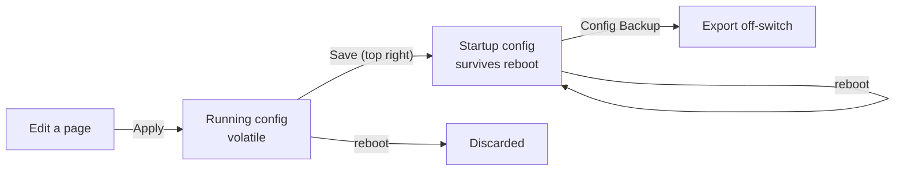

# Switch Hardening

> **Implementation order: step 1 of 5 (Phases 1–2). Phase 3 lands inside
> [`vlan-segmentation.md`](vlan-segmentation.md), step 5 of 5.**
> Status: not started, written 2026-09-05.
> Prerequisites: the Internal CA from [`../../docs/opnsense-cert-guide.md`](../../docs/opnsense-cert-guide.md)
> exists and is trusted on at least one admin host — it does. Nothing else: Phases 1–2 are switch-local and
> touch no service in this repo.
> **Gates step 5.** VLAN configuration entered on a switch that does not persist its config is lost at the
> next reboot, and the config-reset fault below is confirmed rather than suspected.
> Followed by: [`security-quick-wins.md`](security-quick-wins.md) items 1–5 (step 2).
> Walkthrough: [`../../docs/omada-switch-hardening.md`](../../docs/omada-switch-hardening.md).

The two `SG2210XMP-M2` switches arrived, and the Site A unit is already carrying live traffic and powering
`tec-pi-mgr` over PoE. That makes them the two newest admin surfaces on the network, and the least locked
down: default credentials, a factory self-signed certificate, plaintext management protocols enabled, and —
demonstrated in practice — a configuration that does not survive a reboot.

This is the plan [`vlan-segmentation.md`](vlan-segmentation.md) assumed would happen on a bench in its
Phase 0 step 3, before either switch went in the rack. Site A overtook that, so the work is split by what
can be done on the flat network today (Phases 1–2) and what has to wait for VLANs to exist (Phase 3).

Companion to [`security-quick-wins.md`](security-quick-wins.md), whose item 10 lists admin surfaces that
live outside the repo. The switch UIs are two more of those, and this plan is where they get a home.

## Decisions

- **Save discipline before anything else.** Every other item here is worthless until the running config
  reliably reaches the startup config. It is listed first because it has already failed once: firmware was
  updated, the switch was rebooted, and the configuration came back at defaults.
- **The switches stay standalone, and are never adopted into an Omada controller.** This was already
  decided on the grounds of not running a third management plane alongside UniFi, but there is a sharper
  reason now: TP-Link documents that adoption pushes a default configuration over standalone
  pre-configuration, including the VLAN interface. On a switch whose management address lives in a
  non-default VLAN, that is a lockout, not an inconvenience. Cloud access gets disabled rather than merely
  left unused.
- **The web UI certificate comes from the OPNsense Internal CA**, not a public CA and not the factory
  self-signed cert. The switches are `.localdomain` names, so no public CA can issue for them, and the CA
  in [`../../docs/opnsense-cert-guide.md`](../../docs/opnsense-cert-guide.md) is already trusted by the
  hosts that administer OPNsense — which are the same hosts that will administer these. Reusing the
  `*.tecronin.uk` wildcard from Traefik's ACME store was considered and rejected: it would put the private
  key that fronts every public service onto a layer 2 device, and it would need re-uploading every 90 days.
- **The certificate is accepted as manual, expiring toil.** Upload requires a reboot, the switch caps at
  TLS 1.2, and renewal is a hand operation on an 825-day clock with nothing in this repo to remind you.
  That is the price of a trusted name on the switch UI, and the expiry date therefore gets written down in
  `docs/network-layout.md` rather than living only in the certificate.
- **Layer 2 filtering is staged, not switched on in one pass.** DHCP snooping is close to free and blocks
  the attack the flat network is most open to. ARP Inspection and IP Source Guard build on it but break
  statically addressed hosts, so they come later and separately. **802.1X is out of scope**: it needs a
  RADIUS server that does not exist here, and stating that is better than leaving it as a permanent
  someday item on a feature list.
- **Neither switch routes.** Restated from [`vlan-segmentation.md`](vlan-segmentation.md) because it is a
  hardening decision as much as a topology one: traffic routed by a switch never reaches OPNsense, so no
  firewall policy applies to it. Static routing and inter-VLAN routing stay off on both.
- **SNMP stays off for now.** It is the hook for switch metrics in Prometheus via `snmp_exporter` later,
  and if that happens it is v3 only. Note that this is a separate path from the `unpoller` job in
  [`unifi-os-monitoring.md`](unifi-os-monitoring.md), which covers UniFi devices and will never see these.

## Current state

- **Both switches shipped with the same device name**, `SG2210XMP-M2`, which collided in Dnsmasq: it keys
  the DNS record off the DHCP-supplied hostname, so the second lease overwrote the first. Resolved by
  naming them `tec-sw-a` (Site A) and `tec-sw-b` (Site B) and giving each a static reservation by MAC in
  the `192.168.1.2`–`.120` pool, per the Hosts convention in
  [`../../docs/dmsaqdns.md`](../../docs/dmsaqdns.md). Both remain DHCP clients; neither carries a
  switch-side static address.
- **Site A is live and load-bearing.** It carries the LAN and powers `tec-pi-mgr` over PoE. The Pi
  initially failed to power on; the 160W budget was never the constraint — an AP plus a Pi 5 with an SSD is
  roughly 40W — and it came up once PoE was enabled and prioritised on its port. Whether the port
  negotiated **Class 4 (802.3at)** rather than Class 3 is still worth confirming, because Class 3 boots the
  Pi and then browns it out under SSD load.
- **Configuration resets on reboot, and the cause is confirmed.** First seen after a firmware update, but
  it also reproduces on a **plain reboot after entering static IP assignments**, with no firmware involved.
  That rules out the firmware-version-skip theory as the explanation and leaves the running config /
  startup config split: **Apply** writes only the running config, and **Save** is the only thing that
  commits it to the startup config. Consequence for sequencing — **everything entered on either switch so
  far must be treated as unsaved** and re-entered, which is why this plan is step 1 rather than a
  follow-on.
- **The UI is HTTPS with the factory self-signed certificate**, and the factory HTTPS settings are worse
  than that alone suggests: Protocol Version defaults to **All**, which includes SSL 3.0, TLS 1.0 and
  TLS 1.1, and the **RC4-MD5, RC4-SHA, DES-CBC-SHA and 3DES** cipher suites are all enabled by default.
  Fixing that is one page and needs no certificate work.
- **Both switches are now installed**, so `vlan-segmentation.md`'s Phase 0 bench window has closed for
  both — including its step 4 side-by-side test of the 10m inter-site AOC. Whatever was not verified on a
  bench now has to be verified in place.

## How configuration persists



The CLI equivalent of Save is `copy running-config startup-config`. This model also has **Dual Image and
Dual Configuration**, so a firmware upgrade can leave the switch booting the backup image — confirm the
running version is the one you installed before re-entering configuration you do not want to type twice.

## Phase 1 — make configuration survive a reboot

Do this first, on both switches, before entering anything else worth keeping.

1. **Save, reboot, verify.** Enter one harmless change, Save, reboot, and confirm it survived. This is a
   deliberate test rather than an assumption, and it is the only way to know the switch is worth
   configuring.
2. **Confirm the running firmware image** and which image is set to boot next. If the upgrade landed on the
   backup image, fix that before continuing.
3. **Re-enter what was lost**: device name, and confirm the PoE port configuration for `tec-pi-mgr` and
   AP 1 — enabled, 802.3at, high priority — then Save.
4. **Confirm Perpetual PoE is enabled and saved.** This matters more than it looks: several steps below end
   in a reboot, and a reboot without Perpetual PoE cuts power to `tec-pi-mgr` mid-plan.
5. **Export a config backup off-switch**, per switch, with the firmware version in the filename. Repeat
   after every change set from here on. This is also what makes either switch a cold spare for the other,
   which [`vlan-segmentation.md`](vlan-segmentation.md) counts on.

## Dependencies — there are almost none

Worth stating plainly, because the phase ordering above implies more coupling than exists:

- [`lan-only-default-routing.md`](lan-only-default-routing.md) — **no intersection whatsoever.** It is
  about Traefik entrypoints and Cloudflare. The switch UIs are not behind Traefik and never should be.
- [`security-quick-wins.md`](security-quick-wins.md) — **only Vaultwarden**, to hold the two passwords, and
  it is already running.
- [`vlan-segmentation.md`](vlan-segmentation.md) — the only real dependency, and it gates **three items**
  (Phase 3 steps 1, 2 and 7), not the job.
- The certificate needs the Internal CA from
  [`../../docs/opnsense-cert-guide.md`](../../docs/opnsense-cert-guide.md). That CA exists and the OPNsense
  GUI already serves a certificate from it, so this is satisfied.

Everything in Phases 1 and 2 can be done today on the flat network.

## Phase 2 — baseline lockdown, HTTPS, and the traffic defences

Safe on the flat network as it stands today. No VLAN dependency for anything here. Walkthrough:
[`../../docs/omada-switch-hardening.md`](../../docs/omada-switch-hardening.md).

1. **Credentials.** Replace the default `admin`/`admin` with a distinct password per switch, stored in
   Vaultwarden. Different passwords per switch is the part that buys something, since identical firmware
   means one credential pattern otherwise reaches both sites.
2. **Disable cloud access and controller enrolment.** Adoption is the risk, not the cloud service: it
   pushes a default config over yours, and **the GUI and CLI are inaccessible entirely while a controller
   manages the switch**. Recovery means forgetting the device on the controller, which resets it.
3. **Management protocols.** HTTPS only, HTTP off. Telnet off — it is plaintext CLI on the device that
   controls your layer 2. SSH only if you will use it, and then v2 only.
4. **HTTPS protocol and cipher hardening.** Protocol Version to **TLS 1.2**, and disable the RC4 and
   DES/3DES suites left on by default. One page, no dependencies, and arguably worth more than the
   certificate.
5. **DHCP Filter**, naming OPNsense as the only legal DHCPv4 server and the port it sits on. This works on
   the flat network with no VLANs and no snooping trust-port design, and it closes rogue DHCP — the thing
   this network is least able to resist today. Getting the interface wrong blocks legitimate DHCP
   downstream, so test with one client before walking away.
6. **DoS Defend on. Storm control, then loopback detection** — that order, because the vendor guidance is
   to have storm control in place first. Not on the trunk or the inter-site link.
7. **Port Security** MAC limits on ports serving devices that do not move, and **Port Isolation** at
   Site B. Note the switch will not run 802.1X and Port Security together, which is free here because
   802.1X is ruled out.
8. **Admin-down unused ports, and disable PoE on any port not serving a chosen PD.**
9. **SNMP off.** Revisit only alongside an `snmp_exporter` job, and then v3.
10. **Confirm NTP.** DHCP option 42 already points at OPNsense per
    [`../../docs/dmsaqdns.md`](../../docs/dmsaqdns.md); without working time, switch logs are not evidence
    of anything.
11. **Issue and install the certificate.** One server certificate per switch from the Internal CA:

    | Field | Value |
    |---|---|
    | Common Name | `tec-sw-a.localdomain` / `tec-sw-b.localdomain` |
    | SAN, DNS names | FQDN plus the short name |
    | Key type | RSA 2048, SHA-256 — **not ECDSA**, the switch caps at TLS 1.2 |
    | Lifetime | 825 days or less, as browsers require |

    Export the certificate and its private key as PEM/BASE64 from `System → Trust → Certificates`, then
    upload both in the **Load Certificate** and **Load Key** sections at the bottom of
    `SECURITY → Access Security → HTTPS Config` — the same page as step 4, not a separate `SSL Config`
    page, which is the older JetStream layout.

    **The certificate does not take effect until the switch reboots, and Save must happen before that
    reboot** or the upload goes with everything else. Site A's reboot drops PoE unless Phase 1 step 4 is
    done.

12. **Record the fingerprint and the expiry date** in `docs/network-layout.md`, alongside the reserved
    address and the config-backup location for each switch.

## Phase 3 — the three items that wait for VLANs

Only three things genuinely need the segments to exist. All belong in
[`vlan-segmentation.md`](vlan-segmentation.md)'s phases rather than being done separately, and the first
two happen on the physical console with the `igc1` rescue port already proven.

1. **Move management onto the Management VLAN interface** (VLAN 50) and remove the VLAN 1 interface. The
   highest-value item here and the most likely to lock you out — it severs your own session by design.
2. **Scope management access control** to the VPN range plus **one designated admin host**, the same
   treatment the NAS IPMI gets. Note this is deliberately narrower than
   [`vlan-segmentation.md`](vlan-segmentation.md)'s firewall policy, which permits Clients → Management on
   443 and 22 so a laptop can reach the Pi fleet: pf opens the segment, and the switch's own access control
   then narrows it to the single admin address. Two layers, and the switch is the fail-closed one. The
   admin host needs a DHCP reservation for its address to be nameable. The page filters by IP, MAC, or
   port, so it works today against individual addresses, but a typo here is a lockout.
3. **IP-MAC binding, then ARP Detection, then IPv4 Source Guard** — last, separately, and only once the
   binding table is populated from DHCP snooping or manual entries. Both of the latter two break
   statically addressed hosts that have no binding entry, the NAS IPMI most obviously.

Note what is *not* in this list: DHCP Filter, DoS Defend, storm control, loopback detection, port
security, port isolation, and closing unused ports all moved up to Phase 2, because none of them need
VLANs.

## Knock-on repo changes

- [`../../docs/omada-switch-hardening.md`](../../docs/omada-switch-hardening.md) — **written.** The
  click-by-click walkthrough for all three phases, in the style of the other OPNsense guides in `docs/`.
  This plan holds the decisions; that document holds the menu paths, the factory defaults worth changing,
  and the troubleshooting.
- [`../../docs/opnsense-cert-guide.md`](../../docs/opnsense-cert-guide.md): note that the same Internal CA
  now signs the two switch UIs, and link the new guide.
- [`security-quick-wins.md`](security-quick-wins.md) item 10: the switch UIs are two more admin surfaces
  outside the repo, now with a plan of their own to point at.
- [`vlan-segmentation.md`](vlan-segmentation.md): Phase 0 step 3 gains the save-and-verify test and a
  reference here; Phase 3 above folds into its phases; its Current state needs to say the Site A switch is
  live rather than bench-pending; and its "PoE swap for `tec-pi-mgr`" risk needs the Perpetual PoE point.
- `docs/network-layout.md`, which [`vlan-segmentation.md`](vlan-segmentation.md) already plans to create,
  becomes the record of per-switch management name, reserved address, certificate expiry, and where the
  config backups live.

Nothing here touches a compose file, a Gradle task, or Traefik. The switch configuration exists only in the
switches and in their exported backups, which is exactly why the documentation is the deliverable.

## Risks

- **Unsaved configuration is lost silently.** No warning, no diff, and the loss only shows up at the next
  reboot — possibly weeks later, when a power event reboots the switch and takes the VLAN config with it.
  Phase 1's deliberate reboot test is the mitigation.
- **A switch reboot drops PoE and therefore `tec-pi-mgr`.** The certificate install requires a reboot, and
  so does any future firmware upgrade. Confirm Perpetual PoE is enabled *and saved*, or shut the Pi down
  cleanly first rather than pulling power from under a running SSD.
- **Controller adoption overwrites standalone configuration.** A stray adoption — or someone trying the
  Omada app to be helpful — reverts the VLAN interface and strands a switch whose management address is not
  in the default VLAN. Cloud access off, and the reason recorded here.
- **Certificate expiry is a self-inflicted outage of your own admin path.** In 825 days the UI starts
  refusing modern browsers with no warning beforehand. Written down in `docs/network-layout.md` because
  nothing automated will catch it.
- **TLS 1.2 is the ceiling** and there is no way around it in hardware. Acceptable for a LAN management
  interface reachable only from Management, and a reason not to widen who can reach it.
- **Management-VLAN lockout.** Phase 3 step 1 severs your own session by design. Console access and the
  `igc1` rescue port are the backstop, and a current config export is what turns a lockout into a
  ten-minute restore.
- **ARP Inspection and IP Source Guard break static hosts.** Staged last for exactly this reason. Anything
  not obtaining its address by DHCP needs a binding entry first, and the NAS IPMI is the one to check.
- **No syslog collector exists.** Both switches will log locally, which means their logs are lost on
  reboot — the event you most want to investigate. Sending syslog to OPNsense is the obvious fix and is
  noted as a gap rather than solved here.

## Verification

```bash
# issuer must be the Internal CA, SAN must contain the FQDN, and notAfter must match
# what is recorded in docs/network-layout.md
for sw in tec-sw-a tec-sw-b; do
  openssl s_client -connect $sw.localdomain:443 -showcerts </dev/null 2>/dev/null \
    | openssl x509 -noout -issuer -subject -dates -ext subjectAltName
done

# both reservations resolve, and no lease named SG2210XMP-M2 remains
dig +short tec-sw-a.localdomain tec-sw-b.localdomain
```

- Enter a change, Save, reboot: the change is still there. Do this per switch before trusting either.
- Running firmware version matches what was installed, and the next-boot image is the same one.
- `https://tec-sw-a.localdomain` and `https://tec-sw-b.localdomain` load with **no browser warning** from a
  host that trusts the Internal CA.
- HTTP and Telnet refuse connections on both switches; SNMP does not answer.
- `tec-pi-mgr`'s port reports **Class 4** and stays up through an SSD-heavy load, and the Pi survives a
  switch reboot with Perpetual PoE on.
- After Phase 3: the switch UIs are unreachable from a Clients and an IoT host, reachable from the admin
  host and the VPN; a second DHCP server plugged into an access port hands out nothing; neither switch has
  static routing or inter-VLAN routing enabled.
- A current config export exists off-switch for both, and restoring Site A's onto Site B produces a working
  Site B with only the port map and management address to change.
