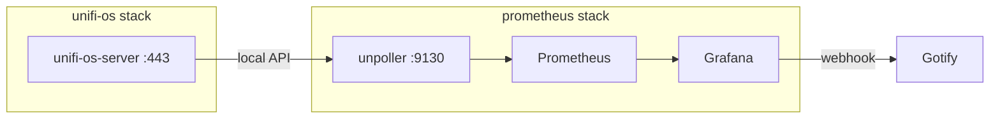

# UniFi OS Monitoring

Follow-on to [`prometheus-monitoring-stack.md`](prometheus-monitoring-stack.md). Assumes UniFi OS Server is
the live controller ([`unifi-os-server-migration.md`](unifi-os-server-migration.md)), not the EOL
`jacobalberty/unifi` stack. Prometheus and Grafana unified alerting already exist; this adds AP, switch, and
client metrics via unpoller.

Gateway metrics are **not** the goal. WAN/firewall is OPNsense on fort-apache (already on node_exporter). Skip
the USG dashboard.

## Decisions

- **Exporter**: `ghcr.io/unpoller/unpoller:v5.2.2` (verify the tag at implement time). Prometheus mode, Influx
  disabled. Do not stand up a second metrics store.
- **Where it runs**: one unpublished container in the **prometheus** stack, on `share-net`, same pattern as
  cAdvisor. Talks to the controller over the compose alias `unifi.localdomain:443`, not
  `unifi.tecronin.uk` and not host-published `11443`. That stays on the docker network and ignores Traefik
  LAN middleware.
- **No Traefik router.** Only Prometheus scrapes `:9130`.
- **Auth**: a dedicated **local** UniFi OS user, Limited Admin, Network **View Only**. Cloud/SSO accounts fail
  against the local API. Put username/password in `/mnt/raid/services/prometheus/.env`, not in git. A local
  API key is an acceptable substitute if the OS Server UI offers one; still keep it in that `.env`.
- **TLS**: controller cert is self-signed inside the container. `UP_UNIFI_CONTROLLER_0_VERIFY_SSL=false`.
- **Cardinality**: leave DPI off (`SAVE_DPI=false`). DPI is a separate dashboard and a large series set.
- **Backup windows**: unifi-os still uses `stop-during-backup=true`, so the controller is SIGTERM'd during its
  own (and any other `true`) backup. unpoller must **not** carry that label. Device-down `for:` must be longer
  than the backup stop, same reasoning as the host/container rules.

## Target state



## Host-side UniFi user

In `https://unifi.tecronin.uk`:

1. Admins & Users → create a **local** user (not UI.com).
2. Role: Limited Admin.
3. UniFi Network: View Only. No other apps.
4. Confirm login once in the UI, then use those credentials only from unpoller.

## Prometheus stack changes

Add next to `cadvisor` in [`src/services/prometheus/docker-compose.yml`](../../src/services/prometheus/docker-compose.yml).
No published ports. `env_file: .env` on this service (shared with nut_exporter if that plan lands too).

```yaml
  unpoller:
    image: ghcr.io/unpoller/unpoller:v5.2.2
    container_name: unpoller
    hostname: unpoller
    restart: unless-stopped
    env_file: .env
    environment:
      UP_INFLUXDB_DISABLE: "true"
      UP_POLLER_PROMETHEUS_HTTP_LISTEN: "0.0.0.0:9130"
      UP_UNIFI_CONTROLLER_0_URL: https://unifi.localdomain
      UP_UNIFI_CONTROLLER_0_USER: ${UP_UNIFI_CONTROLLER_0_USER}
      UP_UNIFI_CONTROLLER_0_PASS: ${UP_UNIFI_CONTROLLER_0_PASS}
      UP_UNIFI_CONTROLLER_0_VERIFY_SSL: "false"
      UP_UNIFI_CONTROLLER_0_SAVE_DPI: "false"
      UP_UNIFI_CONTROLLER_0_SAVE_SITES: "true"
```

Host `.env`:

```bash
UP_UNIFI_CONTROLLER_0_USER=unpoller
UP_UNIFI_CONTROLLER_0_PASS=<not-in-git>
```

`prometheus.yml`:

```yaml
  - job_name: unpoller
    static_configs:
      - targets: ["unpoller:9130"]
```

Confirm on first scrape that `up{job="unpoller"}` is 1 and that device series exist (names drift;
`unifi_device_*` / `unifipoller_device_*` — use whatever the live `/metrics` shows).

If unpoller logs TLS or 401, the URL is wrong (`https://unifi.localdomain` on 443) or the user is a cloud
account. Do not point it at `https://unifi.tecronin.uk`.

## Alert rules

New group `unifi` in Grafana alerting YAML. Same Gotify policy. Confirm metric names from a live scrape
before writing expressions.

| Alert | Expression | For |
|---|---|---|
| UniFi device offline | adopted device state not connected | 15m |
| unpoller down | `up{job="unpoller"} == 0` | 5m |

15m on device-offline covers the unifi-os backup stop. Do not alert on client count or radio retries in
v1 — those belong on the dashboards.

A controller-down signal is already approximated by `host-down` on tec-desktop plus unpoller-down. Do not
duplicate a third rule unless the first scrape shows a clean `unifi_controller_up` style metric.

## Dashboards

Official unpoller **Prometheus** dashboards (not the Influx IDs). Rewrite `${DS_PROMETHEUS}` to uid
`prometheus`. Verify IDs at import.

| Dashboard | grafana.com ID | Use |
|---|---|---|
| Sites | 11311 | yes |
| USW | 11312 | if there are UniFi switches |
| UAP | 11314 | APs |
| Clients | 11315 | yes |
| USG | 11313 | no — gateway is OPNsense |
| Client DPI | 11310 | no — DPI left off |

Commit the JSON under `src/services/grafana/dashboards/` next to the node/cAdvisor/Traefik files. The
existing file provider already loads that directory.

## Docs

- [`src/services/prometheus/README.md`](../../src/services/prometheus/README.md): move UniFi out of Optional;
  document the local user, `unifi.localdomain`, and `.env` keys.
- [`src/services/unifi-os/README.md`](../../src/services/unifi-os/README.md): one paragraph pointing at
  unpoller and the read-only local user.
- [`docs/service_configuration.md`](../../docs/service_configuration.md): one line under Prometheus.

## Task list

- [ ] Create the local Limited Admin / Network View Only user on UniFi OS Server.
- [ ] Pin unpoller v5.2.2 (or current tag) in the prometheus compose file, unpublished, Influx disabled,
      `https://unifi.localdomain`, `VERIFY_SSL=false`.
- [ ] Put credentials in `/mnt/raid/services/prometheus/.env` on the host.
- [ ] Add `job_name: unpoller` targeting `unpoller:9130`.
- [ ] Provision device-offline (15m) and unpoller-down (5m) rules to the existing Gotify contact point.
- [ ] Commit Sites / USW / UAP / Clients dashboard JSON with datasource uid rewrite; skip USG and DPI.
- [ ] Update prometheus README, unifi-os README, and `docs/service_configuration.md`.
- [ ] Deploy (`./gradlew deployPrometheus` then `docker compose up -d`) and confirm `unpoller` UP at
      `https://prometheus.tecronin.uk/targets`.
