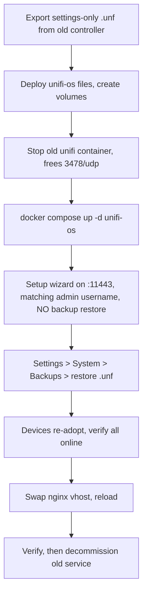

# UniFi OS Server Migration Plan

Replace the EOL `jacobalberty/unifi` controller with [lemker/unifi-os-server](https://github.com/lemker/unifi-os-server),
deployed side-by-side as a new service so the existing stack and its volume stay intact for rollback.

- **Old**: `src/services/unifi/` running `jacobalberty/unifi:v10.0.162`
- **New**: `src/services/unifi-os/` running `ghcr.io/lemker/unifi-os-server:v1.4.0`
- **Migration path**: export a settings-only `.unf` backup from the old controller, restore it into the new one.
  The old `unifi` Docker volume is *not* reusable — UniFi OS Server has a completely different on-disk layout.

## Decisions

- Side-by-side: new service directory, old one untouched until cutover is verified.
- Named Docker volumes (repo convention), registered in `src/bin/volumes.sh`.
- `share-net` bridge networking with a `unifi.localdomain` alias, so the existing nginx vhost keeps working.
- Offen sidecar with `stop-during-backup=true`, same as the current unifi backup.
- APs are moved to the new inform port by the `8882:8080` shim at cutover, not pre-staged on the old controller.

## Phases

The Jenkins port change is broken out and rolled out on its own, ahead of everything else. It is the one
prerequisite that touches an unrelated, in-use service, and it is far easier to debug on its own than in the middle
of a controller cutover.

| Phase | Scope | Risk | Can ship independently |
|---|---|---|---|
| 1 | Free host port 8080 by remapping Jenkins to 8088 | low, reversible | yes — ship and verify first |
| 2 | Build out `src/services/unifi-os/` and supporting repo changes | none, no runtime effect | yes — files only, nothing started |
| 3 | Cutover: stop old controller, restore `.unf`, swap nginx vhost | high, scheduled window | no — depends on 1 and 2 |
| 4 | Decommission `src/services/unifi/` | low | no — after a week of clean backups |

---

# Phase 1 — free host port 8080 (Jenkins)

Roll this out and verify it on its own, days before the cutover. Nothing about UniFi changes here.

## Why

UniFi OS Server requires TCP **8080** for device communication/inform. It is not optional and cannot be remapped,
because the port is embedded in the inform URL the controller hands out to devices.
[`src/services/jenkins/docker-compose.yml`](src/services/jenkins/docker-compose.yml) already publishes it:

```14:18:src/services/jenkins/docker-compose.yml
    ports:
      - target: 8080
        published: 8080
        protocol: tcp
        mode: host    
```

nginx reaches Jenkins over `share-net` at `http://jenkins:8080`
([`src/services/jenkins/jenkins.conf`](src/services/jenkins/jenkins.conf) line 9), so the *published* host port is
only used for direct host access and is safe to move.

## Change

In [`src/services/jenkins/docker-compose.yml`](src/services/jenkins/docker-compose.yml), only the published side moves:

```yaml
    ports:
      - target: 8080
        published: 8088
        protocol: tcp
        mode: host
```

Leave `target: 8080` and `JENKINS_OPTS=--httpPort=8080` alone — Jenkins keeps listening on 8080 inside the
container, so the nginx vhost and any inbound agent config need no changes. 8088 is unused across the repo
(host ports in play: 80, 443, 1883, 3000, 3080, 3306, 3478, 5432, 5672, 6379, 6875, 8010, 8020, 8050, 8081, 8082,
8086, 8443, 8860, 8881, 8882, 8954, 9000, 10001, 15672, 50000).

Also update the Jenkins row in [`docs/service_configuration.md`](docs/service_configuration.md) line 211.

## Rollout

1. `./gradlew deployJenkins`
2. On the host, recreate the container so the port mapping takes effect — a restart is not enough:
   `cd /mnt/raid/services/jenkins && docker compose up -d`
3. Verify:
   - `https://jenkins.tecronin.uk` still loads and can run a build (proves the nginx path is unaffected).
   - `curl -sI http://tec-desktop:8088` returns a Jenkins response.
   - `ss -tulpn | grep :8080` shows nothing bound on the host.

## Rollback

Revert `published:` to 8080 and `docker compose up -d`. No data is involved.

## Watch for

- Anything outside this repo hardcoding `tec-desktop:8080` — bookmarks, JCasC/agent config, webhooks from
  Gitea/GitHub, or scripts under `src/bin/`. Grep the repo and check Jenkins' own "Jenkins URL" system setting,
  which should already be the `jenkins.tecronin.uk` HTTPS URL.
- Inbound agents connect on 50000, which is untouched.

---

# Phase 2 — build out the UniFi OS Server service

Files only. Nothing is started and no running service is affected, so this can land whenever.

## Port map

| Port | Proto | Purpose | Notes |
|---|---|---|---|
| 11443 → 443 | tcp | GUI / API | replaces old `8443:443` |
| 8080 → 8080 | tcp | device communication / inform | freed by Phase 1 |
| 3478 → 3478 | udp | STUN | conflicts with the old container; only one can run |
| 10003 → 10003 | udp | device discovery | replaces old `10001/udp` |
| 8882 → 8080 | tcp | transitional inform shim | present at cutover, removed once APs move |

Deliberately **not** published: 5005, 9543, 6789, 8444, 5514, 28082, 5671, 8880, 8881, 11084 — all optional
(hotspot, Identity Hub, RTP, speedtest, syslog). Note 8881 is already taken by openhab, so it must stay unpublished.

Because 3478/udp is needed by both containers, "side-by-side" means side-by-side *on disk*, not running
simultaneously. The old container gets stopped at cutover. The devices themselves can also only be managed by one
controller at a time.

---

## File changes

### 1. New: `src/services/unifi-os/docker-compose.yml`

```yaml
# https://github.com/lemker/unifi-os-server
# https://github.com/lemker/unifi-os-server/blob/main/docker-compose.yaml
# replaces the EOL jacobalberty/unifi image, see ../unifi/
---
services:
  unifi-os-server:
    image: ghcr.io/lemker/unifi-os-server:v1.4.0
    container_name: unifi-os-server
    hostname: unifi.localdomain
    restart: unless-stopped
    # every UniFi OS component runs as a systemd service, which needs the host cgroup
    cgroup: host
    cap_add:
      - NET_RAW
      - NET_ADMIN
    extra_hosts:
      host.docker.internal: host-gateway
    tmpfs:
      - /run:exec
      - /run/lock
      - /tmp:exec
      - /var/lib/journal
      - /var/opt/unifi/tmp:size=64m
    environment:
      # inform address handed to adopted devices, must be reachable from the 192.168.1.0/24 LAN
      - UOS_SYSTEM_IP=${UOS_SYSTEM_IP}
      - TZ=America/Chicago
    volumes:
      - /sys/fs/cgroup:/sys/fs/cgroup:rw
      - unifi-os-persistent:/persistent
      - unifi-os-data:/data
      - unifi-os-srv:/srv
      - unifi-os-var-log:/var/log
      - unifi-os-unifi:/var/lib/unifi
      - unifi-os-mongodb:/var/lib/mongodb
      - unifi-os-rabbitmq-ssl:/etc/rabbitmq/ssl
      # force local TZ to avoid chron math
      - /etc/timezone:/etc/timezone:ro
      - /etc/localtime:/etc/localtime:ro
    ports:
      - "11443:443/tcp"
      - "8080:8080/tcp"
      - "3478:3478/udp"
      - "10003:10003/udp"
      # transitional: APs still inform on the old controller's 8882, remove once they move to 8080
      - "8882:8080/tcp"
    networks:
      default:
        aliases:
          # nginx unifi.conf proxies to this name
          - unifi.localdomain
    labels:
      # for offen backup, mongodb cannot be safely hot copied
      - docker-volume-backup.stop-during-backup=true
  backup:
    # https://github.com/offen/docker-volume-backup/
    image: offen/docker-volume-backup:latest
    container_name: unifi-os-backup
    restart: always
    environment:
      BACKUP_CRON_EXPRESSION: "15 01 * * *"
      BACKUP_FILENAME: backup-%Y-%m-%dT%H-%M-%S.tar.gz
      BACKUP_PRUNING_PREFIX: backup-
      BACKUP_RETENTION_DAYS: 7
    volumes:
      # force local TZ to avoid chron math
      - /etc/timezone:/etc/timezone:ro
      - /etc/localtime:/etc/localtime:ro
      - unifi-os-persistent:/backup/persistent:ro
      - unifi-os-data:/backup/data:ro
      - unifi-os-srv:/backup/srv:ro
      - unifi-os-unifi:/backup/var-lib-unifi:ro
      - unifi-os-mongodb:/backup/var-lib-mongodb:ro
      - unifi-os-rabbitmq-ssl:/backup/rabbitmq-ssl:ro
      - /var/run/docker.sock:/var/run/docker.sock:ro
      - /mnt/backup/docker/unifi-os:/archive
volumes:
  unifi-os-persistent:
    name: unifi-os-persistent
  unifi-os-data:
    name: unifi-os-data
  unifi-os-srv:
    name: unifi-os-srv
  unifi-os-var-log:
    name: unifi-os-var-log
  unifi-os-unifi:
    name: unifi-os-unifi
  unifi-os-mongodb:
    name: unifi-os-mongodb
  unifi-os-rabbitmq-ssl:
    name: unifi-os-rabbitmq-ssl
networks:
  default:
    external: true
    name: "share-net"
```

`unifi-os-var-log` is intentionally excluded from the backup mounts — logs only.

There is deliberately no `./cert` mount and no `UNIFI_HTTP_PORT` / `UNIFI_HTTPS_PORT` equivalent; see
[Certificates](#certificates--no-cert-mount-is-needed) below.

The backup cron keeps the old `15 01` slot because the old container is stopped by then; the two never overlap.

### 2. New: `src/services/unifi-os/unifi-os.conf`

Copy of [`src/services/unifi/unifi.conf`](src/services/unifi/unifi.conf) with three required fixes. The current
vhost sets `proxy_set_header Connection "";`, which kills the WebSocket upgrade the UniFi OS UI depends on, and has
no `client_max_body_size`, which will reject the `.unf` restore upload.

- Keep `server_name unifi.tecronin.uk`, the `allow 192.168.1.0/24` / `allow 10.9.0.0/24` / `deny all` block, and
  `set $upstream unifi.localdomain; proxy_pass https://$upstream;`.
- Replace the `Connection ""` line with WebSocket upgrade headers, reusing the `$connection_upgrade` map already
  defined in [`src/services/nginx/nginx.conf`](src/services/nginx/nginx.conf) line 15:

```nginx
        proxy_http_version 1.1;
        proxy_set_header Upgrade $http_upgrade;
        proxy_set_header Connection $connection_upgrade;
```

- Allow large backup uploads and slow restores, and turn off buffering so the UI streams:

```nginx
        client_max_body_size 1G;
        proxy_request_buffering off;
        proxy_buffering off;
        proxy_read_timeout 600s;
        proxy_send_timeout 600s;
```

Naming the file `unifi-os.conf` means it lands in nginx's `.conf.d/` next to the old `unifi.conf`. Two server blocks
claiming `unifi.tecronin.uk` will make nginx refuse to reload, so the old one must be removed at cutover
(Phase 3 step 7), not before.

### 3. `src/bin/volumes.sh`

Add the seven new volumes alongside the existing unifi block (lines 30-31), following the same
`--label com.docker.compose.project=unifi-os` pattern. Leave the old `unifi` / `unifi-run` lines until decommission.

### 4. `src/bin/cron/docker_gdrive_backup.sh`

Add next to the existing unifi line:

```bash
rclone sync --progress /mnt/backup/docker/unifi-os gdrive:/backup/services/unifi-os
```

### 5. `src/gradle/services.gradle`

`deployService` now `mkdir -p /mnt/raid/services/${svc}` before the SFTP put, so a first-time service deploy
creates the remote folder instead of relying on SFTP MKDIR (which logged `Failed SFTP MKDIR` on Jenkins).

`deployUnifiOs` is a `GradleBuild` wrapper (`buildName = 'unifi-os'`, `svc: unifi-os`) that, in `doFirst`, also
creates `/mnt/raid/services/unifi-os` and `/mnt/backup/docker/unifi-os`, then runs `deployService` to copy
`docker-compose.yml`, `unifi-os.conf`, and `README.md`. It is registered in `deployAll`. The duplicate
`deployVault` entry was dropped.

### 6. Docs

- [`README.md`](README.md) lines 13-14: swap the jacobalberty link for `https://github.com/lemker/unifi-os-server`.
- [`docs/service_configuration.md`](docs/service_configuration.md) lines 68-71: port `8443` → `11443`, and fix the
  stale path `src/services/network/unifi/` → `src/services/unifi-os/`.
- [`docs/service_configuration.md`](docs/service_configuration.md) line 216: same port change in the table.
  (The Jenkins row on line 211 is handled in Phase 1.)
- [`docs/project_overview.md`](docs/project_overview.md) line 20 and
  [`docs/setup_guide.md`](docs/setup_guide.md) line 74: rename to UniFi OS Server.

### 7. New: `src/services/unifi-os/README.md`

Follow the [`src/services/obsidian/README.md`](src/services/obsidian/README.md) pattern — deploy command, `.env`
contents, vhost copy, `docker compose up -d`, nginx reload. Should also record the cutover runbook below and the
`.unf` restore gotchas, since those are the parts nobody remembers a year later.

---

# Phase 3 — cutover

Scheduled window. Requires Phases 1 and 2 already deployed and verified.

## Run the cutover from a wired connection

Do not run Phase 3 over WiFi. Every step is executed against the same APs being migrated, so a wireless
workstation is sawing off the branch it is sitting on.

- The post-restore re-provision restarts every AP radio at roughly the same time, so there is no "hop to another
  AP" fallback — they all drop together.
- Losing the link mid-upload aborts the `.unf` POST and forces a retry. The restore itself continues server-side
  once accepted, but a dropped connection costs visibility at the worst moment.
- The real risk is the recovery path. If the restore leaves an SSID misconfigured or an AP unprovisioned, a
  wireless operator has no route back to the controller to fix it.

Before starting: plug into the LAN, confirm `https://<lan-ip>:11443` and SSH to `tec-desktop` both work over the
wire, then disable the WiFi adapter so nothing silently fails back onto it. Keep an SSH session to `tec-desktop`
open for the duration as a second access path.

## Pre-flight checks on tec-desktop

1. cgroup v2 is required: `stat -fc %T /sys/fs/cgroup` must print `cgroup2fs`.
2. Confirm Phase 1 stuck and nothing else holds the needed ports:
   `ss -tulpn | grep -E '11443|10003|8080'` should come back empty.
3. Decide `UOS_SYSTEM_IP`. It is the inform address baked into every adopted device, so it must resolve from the
   192.168.1.0/24 LAN. Use the server's **LAN IP** (or a local-DNS name pointing at it), not `unifi.tecronin.uk`,
   unless that name already resolves internally — a public Cloudflare record would send device inform traffic out
   and back through the WAN.
4. Image is published for both `amd64` and `arm64`, so architecture is not a constraint.

## Cutover runbook



1. **Export the backup.** Old UI at `https://unifi.tecronin.uk`, Settings > System > Backups > Download,
   **settings only**, server-wide. Optionally grab a 7-day backup as a second file for historical data; longer
   windows frequently fail to complete. Copy it off the server.
2. **Deploy the new files**: `./gradlew deployUnifiOs`, then run the new `volumes.sh` lines on the host and create
   `/mnt/backup/docker/unifi-os`.
3. **Stop the old controller** — required, since 3478/udp is shared and devices can only be managed by one
   controller: `cd /mnt/raid/services/unifi && docker compose stop`. Do not `down -v`. The network keeps working
   while the controller is off.
4. **Start the new stack**: `cd /mnt/raid/services/unifi-os && docker compose up -d`. First boot provisions all the
   internal systemd services and takes several minutes; watch `docker logs -f unifi-os-server`.
5. **Run the setup wizard** at `https://<lan-ip>:11443` — tec-desktop's LAN address, hitting the new container's
   published GUI port directly and bypassing nginx.
   - Why not `https://unifi.tecronin.uk` yet: the vhost still active at this point is the old `unifi.conf`, which
     sets `proxy_set_header Connection "";` (killing the WebSocket upgrade the UI needs) and no
     `client_max_body_size`, so nginx's 1 MB default would reject the `.unf` upload in step 6. The fixed
     `unifi-os.conf` does not go in until step 7.
   - Expect a browser certificate warning — the container's cert is self-signed, as covered under Certificates.
   - If reaching the port from the laptop is awkward, either browse from tec-desktop itself at
     `https://localhost:11443`, or tunnel: `ssh -L 11443:localhost:11443 tec-desktop`.
   - Choose **Continue Without Backup**. Restoring during the wizard is a known failure path.
   - Create the local admin with **the exact same username as the old controller**. A mismatch produces
     *"The owner in the backup file must be the same as the owner of this console"* on restore, and the only clean
     fix is to tear down and redo the wizard.
6. **Restore** the `.unf` via Settings > System > Backups > Restore. Takes 4-8 minutes and self-restarts.
   Devices should re-adopt within a few minutes.
   - The APs still inform on port **8882** (the old `UNIFI_HTTP_PORT`) while UniFi OS Server listens on **8080**.
     The `"8882:8080/tcp"` shim already in the compose catches them: they reach the new inform endpoint on their
     old port, and the controller pushes the corrected URL back. No per-device action needed.
   - Once every AP shows `http://<UOS_SYSTEM_IP>:8080/inform`, remove the shim line and `docker compose up -d`.
     Do not leave it in place permanently — 8882 is UniFi OS Server's hotspot redirect port.
   - Manual fallback for a stubborn device: SSH in with `ubnt`/`ubnt` and
     `set-inform http://<UOS_SYSTEM_IP>:8080/inform`.
7. **Swap the nginx vhost**: remove `unifi.conf` from `/mnt/raid/services/nginx/.conf.d/`, copy in `unifi-os.conf`,
   then `docker exec nginx nginx -t && docker exec nginx nginx -s reload`. Both files present at once will fail the
   config test on duplicate `server_name`.
8. **Verify**: UI loads over `https://unifi.tecronin.uk` with working live stats (proves WebSockets), all devices
   online and provisioned, then update the Network application under Control Plane > Updates and take a fresh
   backup.
9. **Verify the backup path**: trigger the offen sidecar manually and confirm a tarball lands in
   `/mnt/backup/docker/unifi-os`.

## Rollback

Any time before Phase 4, rollback is: `docker compose down` in `unifi-os`, restore `unifi.conf` to nginx's `.conf.d`,
reload nginx, and `docker compose up -d` in `unifi`. The old `unifi` volume is untouched. Devices informing on 8882
find the old controller again. Devices whose inform URL already moved to 8080 need `set-inform` back to 8882.

---

# Phase 4 — decommission (after a week of clean backups)

Separate change once the new stack is proven: delete `src/services/unifi/`, drop `deployUnifi` from
`services.gradle`, remove the `unifi` / `unifi-run` lines from `volumes.sh`, drop the old rclone line, remove the
`unifi` and `unifi-run` Docker volumes, and archive `/mnt/backup/docker/unifi`.

---

# Wireless impact

Minimal. UniFi APs are autonomous: SSIDs, PSKs, VLAN tags and radio settings are stored locally on each AP, and the
controller is a management plane, not a data plane. An AP with no controller keeps broadcasting and keeps passing
client traffic indefinitely.

Routing and DHCP are handled by the OPNsense router (confirmed), not UniFi. There is no UniFi gateway in the
network, so the controller manages access points only. That bounds the migration in two useful ways:

- Controller downtime has no effect on addressing, DNS, routing or internet access.
- The `.unf` backup carries WLAN and AP configuration only. No firewall rules, DHCP scopes or routing state are
  in play, so there is nothing in the restore that can disrupt the wired network.

## By phase

- **Phase 1 (Jenkins port)** — none. Does not touch the network.
- **Phase 2 (build out files)** — none. Nothing is started.
- **Phase 3 (cutover)** — one brief interruption, see below.
- **Phase 4 (decommission)** — none.

## During the Phase 3 controller-down window

From stopping the old controller (step 3) to the restore completing (step 6), budget 30-60 minutes. Throughout
that window WiFi keeps working: clients stay associated, existing sessions survive, new clients can still join.

What is actually unavailable is management, not connectivity: the admin UI, config changes, and device stats. The
telemetry timeline will show a gap for the duration, which is cosmetic.

## The one real interruption

After the `.unf` restore, the APs re-provision and restart their radios. Clients drop and reconnect automatically,
typically within a few seconds to about half a minute per AP. This is the only point where wireless genuinely
breaks, and it is short. Schedule the cutover off-hours anyway, mostly to keep the reconnect churn away from
anything latency-sensitive.

Note that APs sitting "offline" in the UI between the restore and the shim picking them up are still serving
wireless normally — offline there means unmanaged, not down.

## Worth confirming before cutover

Two features would be genuinely unavailable while the controller is stopped, rather than merely unmanaged:

- **Guest portal / hotspot.** Guest authentication is served by the controller. The port plan deliberately skips
  8880, 8881 and 8444, which implies no portal is in use — confirm that.
- **Controller-hosted RADIUS** (WPA-Enterprise SSIDs). If any SSID authenticates against the controller's built-in
  RADIUS, those clients cannot associate while it is down. PSK SSIDs are unaffected.

If either is in use, the cutover window becomes a real wireless outage for those SSIDs and needs scheduling
accordingly.

The only change that would cause a meaningful per-AP outage is *Forget* + re-adopt, which factory resets the
device. That is the last-resort path in the section below, not part of the normal flow.

---

# Device adoption — the APs stay adopted

No factory reset, no re-adoption, no per-device reconfiguration. The `.unf` restore carries the device inventory
and each device's management credentials, so the new controller inherits them as already-adopted. The migration is
also staying on the same host, so the usual "controller moved to a new IP forces re-adoption" problem does not
apply here.

## The one thing that does change: the inform port

The APs have an inform URL baked into their local config, and today that is port **8882**:

```24:26:src/services/unifi/docker-compose.yml
    environment:
      - "UNIFI_HTTP_PORT=8882"
      - "UNIFI_HTTPS_PORT=443"
```

UniFi OS Server's inform listener is fixed at **8080** and cannot be reconfigured — the port is part of the
appliance's internal service layout. So after cutover the APs keep contacting `:8882`, find nothing, and sit
offline. They are still adopted and still passing client traffic; they just cannot be managed until they are
pointed at the new port.

**Chosen approach: the cutover-time shim.** The new compose publishes `"8882:8080/tcp"` from the start, so APs
informing on their old port land on the new controller's inform endpoint. The controller answers and provisions
them with the corrected URL (`http://<UOS_SYSTEM_IP>:8080/inform`), and they migrate themselves within a few
minutes. The shim comes out once every AP reports the new URL — it must not stay, because 8882 is UniFi OS
Server's hotspot redirect port.

Manual fallback for a device that will not move: SSH in with `ubnt`/`ubnt` and
`set-inform http://<UOS_SYSTEM_IP>:8080/inform`.

## Considered and not chosen: pre-staging the port move

Recorded for context in case the cutover shim misbehaves. Phase 1 frees host port 8080, which would make it
possible to move the APs onto 8080 *while the old controller is still running*, by setting `UNIFI_HTTP_PORT=8080`
on the old service and publishing both `"8080:8080/tcp"` and `"8882:8080/tcp"` at the same container port. The old
controller would advertise `:8080` while the 8882 mapping caught APs not yet told, and cutover would need no shim.

Not doing this: it costs an extra restart of the EOL controller and a provisioning cycle on a working network, and
the cutover shim achieves the same result without touching the old stack.

## What to expect either way

- APs re-provision after the restore and drop clients for a few seconds. Wired uplinks stay up.
- Devices showing *"Managed by Another Console"* means the old controller is still reachable — confirm it is
  stopped (Phase 3 step 3).
- Only if a device refuses to come back is *Forget* + re-adopt the answer, and that loses its per-device config.

---

# Certificates — no cert mount is needed

The `./cert:/unifi/cert` mount and the `UNIFI_HTTP_PORT` / `UNIFI_HTTPS_PORT` variables do not carry over, and
nothing replaces them. The new compose intentionally has no cert mount.

## Why the old mount existed

That directory was a jacobalberty-specific feature: its entrypoint scanned `/unifi/cert` for `cert.pem`, `priv.pem`
and `chain.pem` and imported them into the controller's Java keystore on every start. `chain.pem` was the tec house
intermediate CA (the same internal CA documented in
[`docs/opnsense-cert-guide.md`](docs/opnsense-cert-guide.md)), which made browsers on the LAN trust the controller
at `https://<host>:8443`.

UniFi OS Server has no equivalent import directory. It is a systemd appliance that manages its own TLS material at
`/data/unifi-core/config/unifi-core.crt` and `.key`, generating a self-signed pair on first boot inside the
`unifi-os-data` volume. It starts and serves HTTPS with no intervention.

## Why the self-signed cert is fine

- The normal access path is `https://unifi.tecronin.uk`, where nginx terminates TLS with the Let's Encrypt wildcard.
  That is unchanged.
- nginx does not validate the upstream certificate. `proxy_ssl_verify` defaults to `off` and is not set anywhere in
  this repo, so `proxy_pass https://$upstream` to a self-signed backend works exactly as it does today — the old
  controller's keystore cert was never validated by nginx either.
- Device communication does not use the web cert. Devices inform over HTTP on 8080 with their own AES-encrypted
  payloads, and adoption uses STUN on 3478.

The only place the self-signed cert is visible is direct access to `https://<lan-ip>:11443`, which shows a browser
warning. That URL is needed for the Phase 3 setup wizard and restore, because the vhost active at that moment is
still the old one; after the swap in step 7 it is just a troubleshooting path for when nginx is down.

## If a trusted cert is wanted on :11443 later

Optional, not part of this migration. Two constraints make it more involved than the old bind mount:

- UniFi OS Server only accepts **RSA** certificates; ECC certs are rejected.
- The files live inside the `unifi-os-data` volume at a path that does not exist until first boot, so a bind mount
  is not viable. The install is a post-provision copy of `fullchain.pem` and `privkey.pem` from the existing
  `certbot_etc` volume onto `unifi-core.crt` / `unifi-core.key`, then `systemctl reload unifi-core` inside the
  container — and it has to be re-run after each renewal and after image upgrades.

Given nginx already fronts the service with a valid public cert, the recommendation is to skip this and accept the
warning on direct access. The house CA is no longer needed for UniFi at all.

---

# Open items

- **Adoption of brand-new devices** may need L2 discovery that bridge networking does not carry. Already-adopted
  devices are unaffected because they use unicast inform. If new-device adoption misbehaves, the fallback is
  `set-inform` over SSH, or reconsidering `network_mode: host` (which would require pointing the nginx upstream at
  `host.docker.internal:11443`).
- **`privileged: true` is required on tec-desktop.** `cgroup: host` alone left `unifi-core` in `inactive (dead) (Result: timeout)` during `ExecStartPre`. Added to the compose file.
- **`TimeoutStartSec=15min`** via bind-mounted [`src/services/unifi-os/unifi-core-timeout.conf`](src/services/unifi-os/unifi-core-timeout.conf) onto `/lib/systemd/system/unifi-core.service.d/timeout.conf`. First-boot `chown -R` of `node_modules/@ubnt` exceeds the unit default; a `docker exec` drop-in does not survive recreate.
