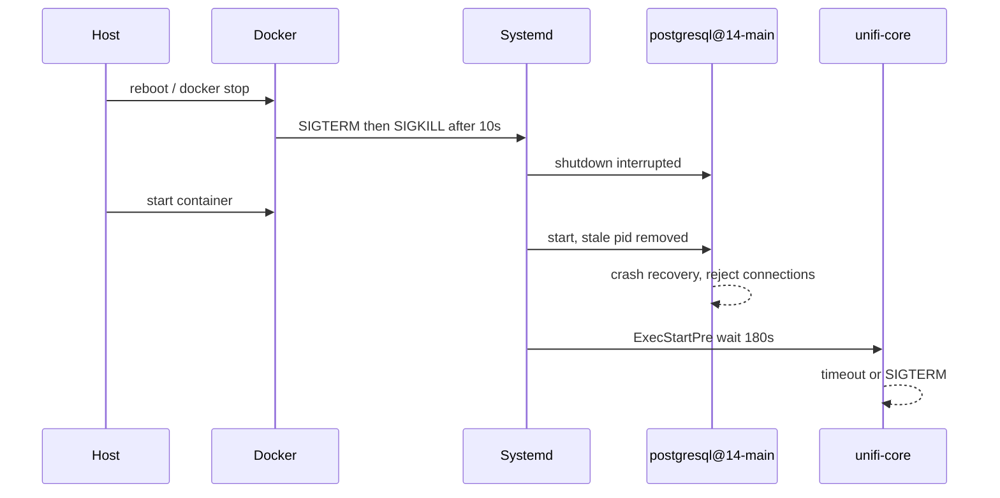

# Unblock UniFi OS after interrupted Postgres shutdown

PostgreSQL is running crash recovery after Docker SIGKILL’d the container on host reboot. unifi-core fails because it only waits 180s for connections. Unblock recovery on the host, then lengthen the wait and the container stop grace so this survives the next reboot.

## What the logs show

`unifi-core` is not the broken service. The custom wait in [`src/services/unifi-os/unifi-core-wait-postgres`](../../src/services/unifi-os/unifi-core-wait-postgres) is doing its job: Postgres is **up but not accepting connections**.

```
pg_isready: /var/run/postgresql:5432 - rejecting connections
postgres: 14/main: startup
database system shutdown was interrupted; last known up at 2026-08-24 03:19:39 UTC
Removed stale pid file.
pg_ctl: server did not start in time
```

That is crash recovery after an unclean shutdown. Host updates + reboot → Docker’s default **10s** stop timeout → SIGKILL → leftover PID + interrupted shutdown. `pg_ctlcluster` then gives up after ~60s, systemd still marks `postgresql@14-main` active, and the postmaster stays in `startup` (WAL replay). The wait script’s **180s** default expires (or the start job is SIGTERM’d after restart-limit), so Core stays `inactive (dead)`.



Do **not** `pg_resetwal` and do **not** recreate the container while recovery is in progress. Data is already on `unifi-os-data` at `/data/postgresql/14/main/data`.

The compose image line is currently `v1.5.1` in the working tree. Leave the pin alone for this fix; an image bump is not what unblocked (or blocked) recovery.

## 1. Unblock on tec-desktop (no repo change)

On the running container:

```bash
docker exec unifi-os-server tail -n 80 /var/log/postgresql/postgresql-14-main.log
docker exec unifi-os-server pg_isready -p 5432
```

- If the log is still replaying WAL (`redo`, `recovery`, `consistent recovery state`), wait and re-check `pg_isready` until it says **accepting connections**. Recovery can take several minutes on RAID after a crash.
- Then:

```bash
docker exec unifi-os-server systemctl reset-failed unifi-core
docker exec unifi-os-server systemctl start unifi-core
```

- Confirm `:11443` / `https://unifi.tecronin.uk` and that APs re-inform.

If the log is **stuck** (same redo position, panic, checksum / permission errors) stop and inspect before doing anything destructive. Do not wipe `/data/postgresql`.

## 2. Harden so the next reboot does not repeat this

Two small changes in [`src/services/unifi-os/`](../../src/services/unifi-os/):

**A. Wait long enough for crash recovery** in [`unifi-core-wait-postgres`](../../src/services/unifi-os/unifi-core-wait-postgres): raise the default from `180` to `900` so it matches `TimeoutStartSec=15min` already in [`unifi-core-timeout.conf`](../../src/services/unifi-os/unifi-core-timeout.conf). Keep the env override `UNIFI_CORE_PG_WAIT_TIMEOUT`.

**B. Give systemd time to stop Postgres cleanly** in [`docker-compose.yml`](../../src/services/unifi-os/docker-compose.yml) on `unifi-os-server`:

```yaml
stop_grace_period: 2m
```

That is the actual root-cause fix: host reboot / `docker compose stop` currently kills PID 1 after 10s, which is what produced the stale pid and interrupted shutdown.

Update the existing paragraph in [`src/services/unifi-os/README.md`](../../src/services/unifi-os/README.md) that documents the wait script (do not add a new doc file).

No new postgres systemd drop-in. `pg_ctl`’s 60s “did not start in time” is cosmetic here; the postmaster keeps recovering, and Core’s wait is what gates the UI.

## 3. Deploy after Core is healthy

1. `./gradlew deployUnifiOs` (copies the whole service dir via `put`).
2. Recreate **only after** `pg_isready` is accepting connections:

```bash
cd /mnt/raid/services/unifi-os && docker compose up -d
```

A recreate mid-recovery would interrupt WAL replay again. The wait-script bind mount updates in place; `stop_grace_period` needs the recreate.

3. Sanity-check: `pg_isready` accepting, `systemctl is-active unifi-core`, UI up.

## Out of scope

- Image upgrade to `v1.5.1` as a recovery mechanism.
- Changing nginx / inform ports.
- `pg_resetwal` or volume wipe.
