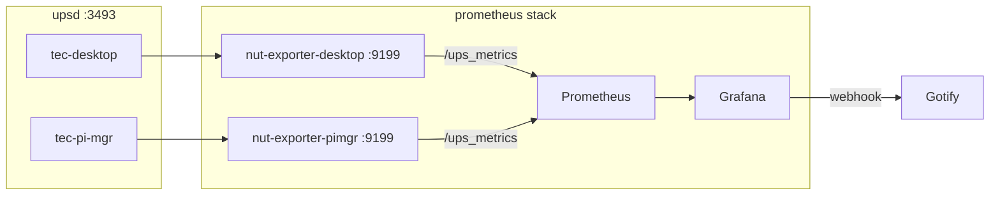

# UPS Monitoring

Follow-on to [`prometheus-monitoring-stack.md`](prometheus-monitoring-stack.md). Prometheus and Grafana
unified alerting already exist; this adds NUT metrics for the two UPS daemons that
[`src/services/upsmon`](../../src/services/upsmon/docker-compose.yml) already polls.

`nut_webgui` stays. It is the live UPS UI (`upsdesktop.tecronin.uk`, `upspimgr.tecronin.uk`). This plan is
history, dashboards, and Gotify when a unit goes on battery or the daemon disappears.

## Decisions

- **Exporter**: `ghcr.io/druggeri/nut_exporter:v3.3.0` (verify the tag at implement time). Not HON95's
  exporter; DRuggeri is what the parent plan named, and dashboard 19308 is written for its
  `network_ups_tools_*` metrics.
- **Where it runs**: two unpublished containers in the **prometheus** stack, on `share-net`, same pattern as
  cAdvisor. One exporter per `upsd`. Do not put them in the upsmon stack: Prometheus already has LAN DNS
  (`192.168.1.1`) and the scrape file.
- **No Traefik router.** Only Prometheus scrapes `:9199`.
- **Credentials**: NUT username/password in `/mnt/raid/services/prometheus/.env`, not in git. `upsmon`
  currently has `UPSD_USER` / `UPSD_PASS` in compose; do not copy those into this repo. Same values can live
  in the prometheus host `.env` if that NUT user is allowed to `LIST`/`GET`. Prefer a dedicated `monuser`
  with no `SET`/`FSD` if one already exists on each `upsd`.
- **Metrics path**: `/ups_metrics` (not `/metrics`). `/metrics` is the exporter's own process stats.

## Target state



## Prometheus stack changes

Add two services next to `cadvisor` in [`src/services/prometheus/docker-compose.yml`](../../src/services/prometheus/docker-compose.yml).
No published ports. `env_file: .env` on these two only.

```yaml
  nut-exporter-desktop:
    image: ghcr.io/druggeri/nut_exporter:v3.3.0
    container_name: nut-exporter-desktop
    hostname: nut-exporter-desktop
    restart: unless-stopped
    env_file: .env
    environment:
      NUT_EXPORTER_SERVER: tec-desktop.localdomain
      NUT_EXPORTER_SERVERPORT: "3493"
      NUT_EXPORTER_USERNAME: ${NUT_EXPORTER_USERNAME}
      NUT_EXPORTER_PASSWORD: ${NUT_EXPORTER_PASSWORD}
    dns:
      - 192.168.1.1
  nut-exporter-pimgr:
    image: ghcr.io/druggeri/nut_exporter:v3.3.0
    container_name: nut-exporter-pimgr
    hostname: nut-exporter-pimgr
    restart: unless-stopped
    env_file: .env
    environment:
      NUT_EXPORTER_SERVER: tec-pi-mgr.localdomain
      NUT_EXPORTER_SERVERPORT: "3493"
      NUT_EXPORTER_USERNAME: ${NUT_EXPORTER_USERNAME}
      NUT_EXPORTER_PASSWORD: ${NUT_EXPORTER_PASSWORD}
    dns:
      - 192.168.1.1
```

If the two `upsd` instances do not share a user, use `NUT_EXPORTER_USERNAME_DESKTOP` /
`NUT_EXPORTER_PASSWORD_PIMGR` (and the matching pair) instead of one shared pair.

Host `.env` (create if missing; compose currently has none):

```bash
NUT_EXPORTER_USERNAME=monuser
NUT_EXPORTER_PASSWORD=<not-in-git>
```

`prometheus.yml` scrape job. `metrics_path` is required:

```yaml
  - job_name: nut
    metrics_path: /ups_metrics
    static_configs:
      - targets: ["nut-exporter-desktop:9199"]
        labels:
          host: tec-desktop
      - targets: ["nut-exporter-pimgr:9199"]
        labels:
          host: tec-pi-mgr
```

Confirm on first scrape that `up{job="nut"}` is 1 and that `network_ups_tools_ups_status` and
`network_ups_tools_battery_charge` exist. If `NUT_EXPORTER_VARIABLES` is set, `ups.status` must be in the
list or status metrics vanish.

## Alert rules

New group `ups` in `src/services/grafana/provisioning/alerting/rules.yml` (or a sibling `ups.yml` if Grafana
file provisioning will load the whole directory — today only `rules.yml` is present). Same Gotify policy;
no new contact point. Confirm metric names from a live `/ups_metrics` before writing the YAML.

| Alert | Expression | For |
|---|---|---|
| UPS on battery | `network_ups_tools_ups_status{flag="OL"} == 0` | 1m |
| Battery low | `network_ups_tools_battery_charge < 50` | 5m |
| Runtime low | `network_ups_tools_battery_runtime < 600` | 5m |
| UPS exporter down | `up{job="nut"} == 0` | 5m |

On-battery is short so a real outage pages quickly. Exporter-down uses the same 5m `for:` as `host-down`, so
a backup stop window does not fire if these containers ever pick up a stop label (they should not:
`stop-during-backup` stays off).

## Dashboard

Commit Grafana dashboard **19308** (Prometheus NUT Exporter for DRuggeri) into
`src/services/grafana/dashboards/`, rewrite `${DS_PROMETHEUS}` to uid `prometheus`, same rewrite as Node
Exporter Full. Verify the ID at import; community numbering drifts. Do not use 14371 (HON95).

## Docs

- [`src/services/prometheus/README.md`](../../src/services/prometheus/README.md): move the UPS bullet out of
  Optional, document the two scrape targets and the host `.env` keys.
- [`docs/service_configuration.md`](../../docs/service_configuration.md): one line under Prometheus.
- Leave `src/services/upsmon/` alone except if a NUT ACL change is required for `monuser`.

## Task list

- [ ] Pin `nut_exporter` v3.3.0 (or current tag) in the prometheus compose file, two unpublished services,
      `env_file` for NUT user/pass, DNS 192.168.1.1.
- [ ] Add `job_name: nut` with `metrics_path: /ups_metrics` and `host` labels.
- [ ] Put NUT credentials in `/mnt/raid/services/prometheus/.env` on the host; confirm each `upsd` accepts
      that user from share-net.
- [ ] Provision four UPS alert rules to the existing Gotify contact point.
- [ ] Commit dashboard 19308 with datasource uid rewrite.
- [ ] Update prometheus README and `docs/service_configuration.md`.
- [ ] Deploy (`./gradlew deployPrometheus` then `docker compose up -d`) and confirm both nut targets UP at
      `https://prometheus.tecronin.uk/targets`.
