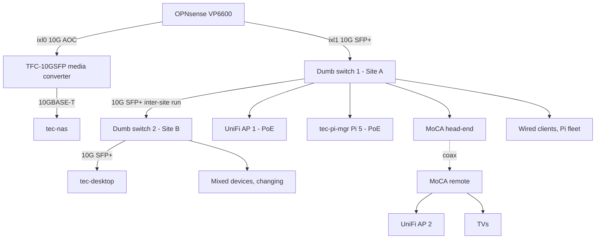

# Network Segmentation

> **Implementation order: step 4 of 4.**
> Status: reviewed 2026-09-05, design ready; implementation gated on hardware.
> Prerequisites: [`lan-only-default-routing.md`](lan-only-default-routing.md) complete and
> [`security-quick-wins.md`](security-quick-wins.md) items 1–11 complete, so the exception list in its
> item 5 and the cross-segment rules here already agree. Before the first console session: both
> `SG2210XMP-M2` switches on hand and bench-tested (Phase 0), and the openHAB bindings list confirmed
> (see Cross-segment dependencies).
> Followed by: nothing planned; `docs/network-layout.md` becomes the record of the result.

Break the flat `192.168.1.0/24` into security zones so a compromised IoT device, TV, phone, or guest
laptop can no longer reach the Docker host, the NAS, or the firewall.

Follow-on to [`lan-only-default-routing.md`](lan-only-default-routing.md), which closes the
internet-facing surface, and [`security-quick-wins.md`](security-quick-wins.md), which closes the worst
individual holes. This one fixes the trust model both of those lean on: `lan-only@file` trusts all of
`192.168.1.0/24`, and that subnet currently contains everything you own.

## Physical topology today

Everything below `ixl1` is one broadcast domain, and `bridge0` extends it to the NAS as well. Three
consequences worth stating plainly:

- **The TVs are peers of the Docker host.** MoCA is a transparent layer 2 bridge, so every TV sits in the
  same segment as tec-desktop with nothing filtering between them.
- **Site B is a rotating cast.** The devices sharing switch 2 with tec-desktop change over time, and any
  of them can reach it unfiltered on every port.
- **Unmanaged switches cannot do wired VLANs.** They have no concept of an access port, so they cannot
  strip a tag toward a device or add one on the way back. They forward tagged frames transparently, which
  means a VLAN-aware endpoint can participate — but so can any device that decides to tag its own frames.
  That is not a security boundary and must not be treated as one.

## Hardware

OPNsense (`fort-apache`) is a **Protectli Vault Pro VP6600**: two 10GbE SFP+ on an Intel X710-BM2
(`ixl0`, `ixl1`) and four 2.5GbE RJ45 on Intel i226-V (`igc0`–`igc3`).

The two dumb switches are in different rooms joined by a 10G SFP+ run, so one switch cannot replace both.
Each site needs the same thing: 2 x 10G SFP+ and a handful of VLAN-capable access ports.

**Two identical `TP-Link Omada SG2210XMP-M2`, ~$250 each.** 8 x 2.5G PoE+ (160W budget, 30W per port),
2 x 10G SFP+, fanless, 5-year warranty. Each runs **standalone via its own web UI** — no Omada controller
needed alongside UniFi, and adding one would be a third management plane for no gain on two 8-port
switches.

About $500 total. A non-PoE switch at Site B would have saved roughly $50, and matching the two is worth
more than that for three reasons that have nothing to do with the extra PoE ports.

**The inter-site AOC stops being an asymmetric risk.** The 10m run is the cable most likely to be
rejected, and because an AOC has permanently attached transceivers you cannot swap one end. With
identical switches, either both ends accept it or neither does, and you find that out on the bench in
Phase 0 step 4 with both switches side by side. See Risks.

**Site B becomes a genuine cold spare for Site A.** Site A carries the Vault trunk, both APs' path, and
the Pi fleet, so its failure takes the house down. Identical hardware means you can pull the Site B
switch, restore the Site A config backup onto it, and lose only the desk rather than the whole house
until a replacement arrives. Keep a current config export for both.

**One firmware track and one web UI** halves the Phase 0 bench work, and the Site B config is the Site A
config with a different port map.

Beyond raw ports, three features earn their keep, and now at both sites. Bouncing a PoE port from the web
UI **power-cycles a hung tec-pi-mgr**, complementing the PiKVM for remote recovery; Perpetual PoE keeps
powered devices alive through a switch firmware reboot; and **Port Isolation** separates ports from each
other *within* a VLAN, which is what Site B's rotating cast of devices needs.

PoE at Site B was not required by anything on the desk today. It buys the option of an AP 3, a PoE camera,
or another Pi without an injector, and extends the port-bounce recovery trick to that room.

**Neither switch should route.** Both advertise static routing and inter-VLAN routing. Traffic routed by a
switch never reaches OPNsense, so none of the firewall policy below would apply to it. Keep both as pure
layer 2 VLAN devices and let the Vault do all routing and filtering.

### Port map

| Device | Port | Speed | Assignment |
|---|---|---|---|
| Vault | `igc0` | 2.5G | WAN, unchanged |
| Vault | `ixl0` | 10G | **NAS**, `192.168.10.0/24` |
| Vault | `ixl1` | 10G | **Trunk** to Site A SFP+ 1, all VLANs tagged |
| Vault | `igc1` | 2.5G | **Out-of-band rescue**, `192.168.99.0/24` |
| Vault | `igc2`, `igc3` | 2.5G | Free |
| Site A | SFP+ 1 | 10G | Uplink trunk to `ixl1` |
| Site A | SFP+ 2 | 10G | Inter-site run to Site B |
| Site A | RJ45 1 | 2.5G PoE | **AP 1** trunk — Management untagged; Clients, IoT and Guest tagged |
| Site A | RJ45 2 | 2.5G PoE | **tec-pi-mgr** — Management |
| Site A | RJ45 3 | 2.5G | **MoCA head-end** — Media untagged; IoT and Guest tagged only if the Phase 2 tag test passes |
| Site A | RJ45 4–6 | 2.5G PoE | Pi fleet and PiKVM — Management |
| Site A | RJ45 7–8 | 2.5G | Wired clients — Clients |
| Site B | SFP+ 1 | 10G | Inter-site run from Site A |
| Site B | SFP+ 2 | 10G | **tec-desktop**, Servers untagged |
| Site B | RJ45 1–8 | 2.5G PoE | Mixed devices, per-port VLAN — **PoE disabled unless the port serves a known PD** |

`igc1` as a rescue port is the cheapest insurance available. Once every segment rides one trunk, a single
mistyped VLAN ID locks you out of the box that is simultaneously router, DNS, DHCP, and VPN concentrator.
Give it a static subnet and a small DHCP range so a laptop plugged straight in always reaches the web UI.

**Where AP management lives.** AP 1's port carries Management as its untagged VLAN, so the AP's own
address is in Management and every SSID it serves — including the trusted one — is tagged. UniFi handles
all-tagged SSIDs without complaint. AP 2 is the exception: it hangs off coax shared with the TVs, and
carrying Management tagged over that wire would let any TV self-tag into the segment that holds the
switches and the NAS IPMI. AP 2's management address therefore stays in Media, and Media gets the two
rules it needs to stay adopted. This is the one place the "AP management in Management" rule is bent,
and it is bent on purpose.

**Trunk hygiene.** The `ixl1` parent interface stays **unassigned** in OPNsense with no address, so no
untagged traffic exists on the trunk at all; every zone is a tagged child. Same on the switch side: the
trunk ports' native VLAN is set to an unused ID with no members, not to Servers or Clients.

### The NAS has two interfaces you are not accounting for

The Mini X+ ships with **two** 1/10GBaseT ports and a **dedicated RJ45 IPMI port**. Only one data port is
in use.

**The IPMI port is the most dangerous thing on this network and the plan must place it deliberately.** It
is a Baseboard Management Controller running its own operating system independently of TrueNAS, offering
remote power control, a KVM console, and virtual media. Anyone who reaches it owns the hardware holding
every backup, regardless of ZFS permissions, TrueNAS accounts, or disk encryption. Supermicro BMCs have a
long history of serious vulnerabilities and are rarely patched. If that port is currently plugged into the
flat LAN, it is reachable from every device in the house, including the TVs.

It goes in Management, and Management's rule for it is tighter than for the rest of the segment: reachable
from the VPN and one designated admin host, nothing else, and never from Clients at large.

The **second 10GbE data port** is free. Leave it unplugged, or use it for link aggregation to the same
zone. Do not dual-home the NAS across two security zones — a host with a leg in two segments is a path
between them, and it would undo the isolation this plan exists to create.

### PoE budget

At Site A, AP 1 draws 12–15W and the Pi 5 with its PoE+ HAT up to 25W, so roughly 40W of 160W. The Pi 5
HAT **requires 802.3at**, not just 802.3af; the SG2210XMP-M2 supplies 30W per port and satisfies it. Site
B's 160W is entirely spare and stays that way until something at the desk needs it.

Each switch draws **15W at standby** with nothing powered, so the PoE model at Site B costs a few watts
more than a passive switch would have. Both are fanless and therefore silent, but a fully loaded 160W of
PoE dissipates around 660 BTU/hr — not a concern at Site A's 40W or Site B's zero, worth remembering
before hanging several cameras off the switch sitting on the desk.

### Storage path trade-off

tec-desktop reaches the NAS by routing through the Vault: Site B switch, inter-site run, Site A switch,
`ixl1`, pf, `ixl0`, NAS. Worth being clear that **this is the path it already takes** — `bridge0`
software-bridges those same hops today — so the change adds pf filtering cost, not a hop. Time a backup
run before and after rather than assuming either way.

The NAS is a **TrueNAS Mini X+**: Atom C3758, 32GB ECC, five 3.5" bays plus two 2.5". It is 10GBASE-T,
not SFP+, and reaches `ixl0` through a **TRENDnet TFC-10GSFP media converter** with the 2m AOC in its SFP+
slot. That path is unchanged by this plan and needs no retesting.

**The pool is almost certainly the bottleneck, not the Vault.** Five spinning drives in RAIDZ sustain
roughly 500–700 MB/s sequential, or 4–5.6 Gbps, and less for anything random. Cached reads out of 32GB of
ARC can burst to line rate, but sustained transfers such as a backup run are disk-bound well below 10G.
That makes routing through pf far less likely to be the limiting factor than it first appeared, and it is
the main reason to measure before considering the escape hatch below.

If routing proves too slow, the escape hatch is more expensive than it first looks. Putting the NAS and
tec-desktop in the same Servers VLAN would let their traffic be switched across the inter-site trunk
without touching the Vault — but the NAS is at Site A and tec-desktop at Site B, and **both of Site A's
SFP+ ports are already committed** to the Vault uplink and the inter-site run. Freeing one means demoting
the Vault trunk to a 2.5GbE RJ45 port on `igc1`. The trade is full 10G between NAS and desktop, against a
2.5G ceiling on everything crossing the Vault — and because cross-VLAN traffic traverses that trunk twice,
an effective ceiling nearer 1.25G. It also leaves NAS-to-desktop traffic unfiltered. Not recommended up
front; measure first.

## Decisions

- **`192.168.1.0/24` stays with the servers.** Sixteen split-DNS overrides point at `192.168.1.35`,
  `lan-only@file` trusts that range, `/etc/fstab` mounts the NAS, and Prometheus scrapes six hosts by
  name. Keeping the server subnet intact means none of that changes. Everything *else* gets renumbered.
- **OPNsense is the only router and the only policy enforcement point.** The switches do VLANs, not
  routing.
- **The bridge goes.** It is described as mostly legacy, it puts the NAS in the same L2 domain as every
  device on both switches, and `pfil_member=0` makes per-port filtering impossible.
- **Phased, each phase independently useful.** No big-bang cutover on the box that is simultaneously
  router, DNS, DHCP, and VPN concentrator. The one deliberate exception is folding Phase 4 into Phase 1's
  outage when both switches are bench-tested together, because that is a second switch swap, not a second
  router change.

## Current state

From [`docs/opnsense-bridge-guide.md`](../../docs/opnsense-bridge-guide.md),
[`docs/opnsense-bridge-fix.md`](../../docs/opnsense-bridge-fix.md), and
[`docs/dmsaqdns.md`](../../docs/dmsaqdns.md):

- `igc1`, `ixl0`, `ixl1` are members of **`bridge0`**; LAN is assigned to the bridge, which holds
  `192.168.1.1/24`.
- **`net.link.bridge.pfil_member=0`** is set. It was needed to fix one-way client traffic on `ixl1`, and
  it moves filtering to `bridge0` rather than per member port.
- **No VLAN interfaces exist.** UniFi is controller-only on tec-desktop; there is no USG, so OPNsense owns
  all routing and DHCP.
- DNS/DHCP is **Unbound :53 + Dnsmasq :53053**, domain `localdomain`, DHCP `192.168.1.10`–`.254`.

Some home automation is USB-attached (`/dev/ttyACM0` on tec-desktop) rather than IP, so it carries no
network risk and needs no segment.

## Phase 0 — prep, no downtime

1. Config backup: System → Configuration → Backups.
2. **Take `igc1` out of `bridge0`.** It is a bridge member today, so it cannot be given its own address
   until it is removed. Nothing is plugged into it, so removing the member is harmless to traffic, but it
   is an edit to the interface that carries the LAN, so do it from the console or with a laptop already
   on `ixl1`'s switch rather than over WiFi. Then assign it as the rescue segment with a static
   `192.168.99.1/24`, a small DHCP range, and verify a laptop plugged straight in reaches the web UI.
   This is the only Phase 0 step that touches the live bridge; everything else here is off-box.
3. Configure both switches on the bench, before they go in the rack: VLANs, access ports, trunk ports,
   management IP in the Management VLAN. Because they are identical, build Site A, export the config, load
   it onto Site B, and change only the port map and management address. Label every port.
4. **Link the two switches with the 10m inter-site AOC while they are still on the bench**, before either
   goes in the rack. This is the one termination pair that is new at both ends. Confirm 10G full duplex,
   DDM Rx/Tx power in range, and a clean multi-minute `iperf3`. Also export a config backup from both,
   which is what makes either one a usable spare for the other.
5. Stage the IoT, Guest, Clients, and Management networks in the UniFi controller with their VLAN IDs, so
   the APs already know them when their ports become trunks.

## Phase 1 — Site A switch in, bridge out

Do these together. Both need a console and both interrupt connectivity, so one outage is better than two.

Site B keeps its dumb switch for now and stays a single zone — and that zone is **Servers**, the most
trusted one, because tec-desktop is on it and cannot be anywhere else. So between Phase 1 and Phase 4 the
rotating cast of devices at Site B sits untagged in the segment that can reach everything, which is the
situation today, not a regression, but it means Phase 4 is what actually delivers the isolation for that
room. Buying both switches together makes this interim avoidable: since they arrive on the same order and
are bench-configured together, do Phase 4 in the same outage as Phase 1 and skip it entirely.

1. Do the rest **on the physical console**, not over SSH or the web UI.
2. Remove `bridge0`. Assign `ixl0` directly to the NAS segment and `ixl1` as the trunk parent, left
   unassigned itself.
3. Remove `net.link.bridge.pfil_member=0` — but only after the bridge is gone, then re-verify the 10G
   links. That tunable exists because `ixl1` had a real failure.
4. Create VLAN interfaces on `ixl1`, one per zone with the IDs in the table below, each with its own
   Dnsmasq range and options 3, 6, and 15 pointing at that VLAN's gateway and OPNsense for DNS, following
   the pattern already documented for the LAN. Servers keeps the existing DHCP static mappings; the other
   ranges are new.
5. Add every new subnet to Unbound Access Lists, or resolution fails and the split-horizon overrides stop
   working.
6. **Renumber the NAS**, from its own console or IPMI KVM, because the change severs the session you are
   in: address `192.168.10.x/24`, gateway `192.168.10.1`, DNS `192.168.10.1`. Check the SMB and NFS
   exports' allowed-network lists still contain `192.168.1.0/24` (Servers is unchanged, so they should),
   and give the NAS a static DHCP lease or a DNS override so `tec-nas.localdomain` resolves to the new
   address before tec-desktop tries to remount. Then `mount -a` on tec-desktop and check `/mnt/brain`.
7. Swap in the Site A switch and move AP 1 and tec-pi-mgr onto PoE ports, dropping their injectors.

## Phase 2 — isolate the coax segment

The highest-value single port assignment, so do it as soon as Site A is live.

1. MoCA head-end onto RJ45 3, assigned to Media untagged. This pulls every TV and AP 2 out of the trusted
   network in one move.
2. Firewall it hard: internet, DNS and NTP to the gateway, nothing else.
3. AP 2 needs two exceptions to stay adopted and manageable — the controller on tec-desktop, **8080/tcp**
   for inform and **3478/udp** for STUN. Without STUN the AP shows adopted but config pushes stall and the
   controller flags it as disconnected intermittently. Both rules are source AP 2's address only, not
   the whole Media segment.
4. If Phase 3 later adds IoT and Guest SSIDs on AP 2, RJ45 3 becomes Media untagged plus 30 and 40
   tagged. Be clear about what that permits: a TV on the same coax can then tag its own frames into IoT
   and reach MQTT on tec-desktop. IoT is the segment built to hold untrusted devices, so that is
   tolerable; Management or Clients tagged over that wire would not be, which is why AP 2's own address
   stays in Media.

**The coax plant is already closed.** The ISP does not deliver over coax, the external drop is physically
disconnected, and a MoCA Point of Entry filter is fitted. The usual concern — MoCA signal leaking onto the
ISP's plant where a neighbour's equipment could join the network — does not apply here. MoCA link privacy
is therefore optional hygiene rather than a fix; enable it if convenient, since joining the coax network
would otherwise require physical access to a jack inside the house.

**AP 2 trunking should work.** MoCA's specification allows a maximum MSDU of 1522 bytes for VLAN-tagged
frames against 1518 untagged, so the 4-byte tag is designed in rather than incidental, and the existing 1G
adapters almost certainly already carry it. Still confirm before relying on it, but expect success. Note
that MoCA does **not** support jumbo frames at all, which is irrelevant for this segment but worth knowing.
Isolating the coax segment as a whole needs no tags and works regardless; only AP 2 serving multiple SSIDs
depends on it. If tags do not pass, trusted WiFi in that part of the house comes from AP 1 instead.

**Upgrading the adapters to MoCA 2.5 is not worth it.** The segment carries TVs at roughly 25 Mbps each
and an AP whose own uplink port is likely 1GbE, MoCA is half-duplex and shares its 2.5 Gbps across the
whole bus, and real-world throughput is dominated by coax plant quality rather than adapter generation.
Measure with `iperf3` before spending anything, and if numbers are poor, check that every splitter is
MoCA-rated to 1675 MHz before buying adapters.

## Phase 3 — WiFi VLANs

AP 1 on a proper trunk port makes this reliable rather than something to test.

1. In the UniFi controller, the IoT (VLAN 30), Guest (VLAN 40), and Clients (VLAN 20) networks were
   staged in Phase 0; confirm they exist.
2. Map SSIDs: IoT SSID to VLAN 30, Guest SSID to VLAN 40, trusted SSID to VLAN 20. All three are tagged;
   AP 1's untagged VLAN is Management and carries only the AP itself.
3. Enable client isolation on the Guest SSID.
4. Repeat for AP 2 if the MoCA tag test passed, adding 30 and 40 tagged to RJ45 3 as described in Phase 2.

## Phase 4 — Site B switch

1. Swap in the second SG2210XMP-M2. SFP+ 1 takes the inter-site run, SFP+ 2 takes tec-desktop at 10G in
   the Servers VLAN.
2. Assign each mixed device its own access port and zone. Anything you cannot positively identify goes to
   IoT, not Clients.
3. Use **Port Isolation** for anything that has no reason to talk to its neighbours.
4. **Disable PoE on every port that is not serving a device you chose to power.** A PoE port only energises
   after a PD negotiates, so this is hygiene rather than a hole being closed, but it belongs with the
   default-to-IoT rule below: an unknown device plugged into a spare port should get neither trust nor
   power.

Because Site B's population changes, write the port-to-zone mapping into `docs/network-layout.md` and
treat an unassigned port as IoT by default rather than leaving it in Clients.

## Zones

| Segment | VLAN | Subnet | Where | Contents |
|---|---|---|---|---|
| Servers | 10 | `192.168.1.0/24` | Site B SFP+ 2 | tec-desktop — **unchanged addressing** |
| NAS | — | `192.168.10.0/24` | Vault `ixl0`, physical | tec-nas data port |
| Clients | 20 | `192.168.20.0/24` | Access ports both sites, trusted SSID | Wired clients, trusted WiFi |
| IoT | 30 | `192.168.30.0/24` | IoT SSID, unassigned ports | ESP32, MQTT publishers, smart home |
| Guest | 40 | `192.168.40.0/24` | Guest SSID | Visitors |
| Management | 50 | `192.168.50.0/24` | Site A access ports, AP 1 untagged | Pi fleet (tec-weather, tec-kvm, tec-pi-mgr, tec-time), PiKVM, both switches, AP 1, **NAS IPMI** |
| Media | 60 | `192.168.60.0/24` | Site A RJ45 3 untagged | TVs and AP 2, including AP 2's own address, over coax |
| Rescue | — | `192.168.99.0/24` | Vault `igc1`, physical | Emergency admin access only |
| VPN | — | `10.9.0.0/24` | wg0 | Already separate |

Servers is VLAN 10 with a `.1.0` subnet; the ID and third octet do not match there and match everywhere
else. That is the price of not renumbering tec-desktop, and it is worth a comment in the switch config.

## Firewall policy

Default deny between segments; allow only what is listed. The rules are derived from the dependency list
that follows it, not written separately: every dependency has a rule, and every rule has a dependency.
Where a rule says "tec-desktop" it means `192.168.1.35` as a single-host alias, not the Servers subnet.

- **Every segment** → OPNsense on its own gateway address, **53** and **123**. Nothing else to the
  firewall except where listed.
- **Servers** → anywhere. Tighten egress later. This covers Prometheus scraping 9100 on the Pi fleet and
  fort-apache, `upsmon` to 3493 on tec-pi-mgr, Traefik to tec-weather:8000, and the NAS mounts.
- **NAS** → DNS and NTP to gateway, HTTPS out to the internet for TrueNAS update checks and catalogue
  fetches, SMTP out if alert email is configured. Nothing to any internal segment: it answers, it does
  not initiate. "Nothing outbound" would break its own updates and alerting.
- **Clients** → tec-desktop on **443** and **22**; NAS on **445**; Management on **443** and **22** (switch
  and AP UIs, Pi SSH); OPNsense GUI on **443**; Media on **8008–8009** and **8443** TCP (Chromecast) and
  **7000, 7100, 49152–65535** TCP (AirPlay) for casting once mDNS is reflected; internet. This is also the
  segment the anti-lockout rule should be moved to, since "LAN" will no longer exist as an interface.
- **IoT** → **only** tec-desktop **1883**, plus DNS and NTP. No other server, no other segment, and no
  internet unless a specific device demonstrably needs it, in which case it gets a per-device rule.
- **Guest** → internet only. Block all RFC1918 explicitly, above the allow.
- **Media** → internet, DNS and NTP; AP 2 (single address) → tec-desktop **8080/tcp** and **3478/udp**.
  Nothing else initiated from Media. Casting is Clients → Media, listed above, plus mDNS reflection,
  which is a deliberate hole rather than an accident — see Risks.
- **Management** → DNS and NTP; internet on **80/443** for `apt` and firmware; tec-weather (single
  address) → tec-desktop **3306** (MariaDB, per
  [`weather-mariadb-migration.md`](weather-mariadb-migration.md)); AP 1 and both switches → tec-desktop
  **8080/tcp** and **3478/udp**; PiKVM → nothing extra, it is reached, it does not reach. **Reachable
  from** Servers (anything), Clients (443, 22), and VPN (443, 22).
- **NAS IPMI** → an exception inside Management. Reachable from the VPN and one designated admin host
  only, never from Clients, and blocked outbound entirely, including DNS and NTP. Treat it like a console
  cable, not a host.
- **Rescue** → the Vault's own address on 443 and 22 only. Nothing routes out of it.
- **VPN** → as Clients, plus the IPMI exception above, plus OPNsense GUI. Today the tunnel is the
  remote-admin path, so it needs at least what Clients have.

### Cross-segment dependencies the rules above exist for

Each of these works today only because everything shares one subnet:

- UniFi AP 1, AP 2, and both switches → tec-desktop **8080/tcp** (inform) and **3478/udp** (STUN). The
  inform address must be tec-desktop's IP, never `unifi.tecronin.uk`. `10003/udp` discovery is L2-only
  and does not cross segments; adoption of a new device is done by `set-inform` from the device's shell.
- ESP32 and IoT → tec-desktop **1883** (RabbitMQ MQTT).
- **openHAB bindings — confirm before Phase 3.** openHAB on tec-desktop is in Servers, so anything it
  *initiates* toward a device is covered by Servers → anywhere. What the IoT rule above blocks is the other
  direction: bindings that rely on the device calling back (Shelly CoIoT, Hue push events, some Zigbee and
  Z-Wave bridges' webhooks) or on mDNS/SSDP discovery from the device side. List the bindings actually
  installed; each one that needs device-initiated traffic gets a specific IoT → tec-desktop port rule, or
  its device stays USB-attached as some already are. Do not open IoT → tec-desktop broadly to make
  discovery work.
- Prometheus → **9100** on `tec-kvm`, `tec-weather`, `tec-pi-mgr`, `tec-time`, `fort-apache`. Servers →
  anywhere covers it; the Pi hosts' own firewalls, if any, must allow `192.168.1.35`. The `fort-apache`
  target is OPNsense's own node exporter, and the rule allowing it currently lives on the LAN interface
  ([`src/services/prometheus/README.md`](../../src/services/prometheus/README.md) step 3); it must be
  recreated on the Servers VLAN interface or that target goes down when the bridge does.
- `upsmon` → **3493** on tec-desktop and `tec-pi-mgr`. Servers → anywhere covers it.
- tec-desktop → NAS **445** (CIFS in `/etc/fstab`) and **2049** (NFS for Obsidian's `/mnt/brain`).
- Traefik on tec-desktop → `tec-weather.localdomain` **8000** (the `weather.tecronin.uk` backend).
- `tec-weather` and piSolar → tec-desktop **3306**. This is why
  [`security-quick-wins.md`](security-quick-wins.md) binds MariaDB to `192.168.1.35` rather than loopback.
- Phones on Clients → TVs on Media for casting, unicast ports above, plus reflected mDNS.
- Pi fleet → internet for `apt`; TrueNAS → internet for updates.
- Every segment → OPNsense **53** and **123**.

## Knock-on repo changes

- [`src/services/traefik/dynamic/middlewares.yml`](../../src/services/traefik/dynamic/middlewares.yml):
  add `192.168.20.0/24` and `192.168.50.0/24` to `lan-only`, or LAN access breaks the moment clients move.
  Keep `192.168.1.0/24`: tec-desktop's own requests and any future Servers-segment host still need it.
  The payoff is that `lan-only` then *excludes* IoT, Guest, and Media, which is impossible today.
- [`src/services/unifi-os/docker-compose.yml`](../../src/services/unifi-os/docker-compose.yml): the
  comment on `UOS_SYSTEM_IP` says the inform address "must be reachable from the 192.168.1.0/24 LAN";
  update it to say from Management and Media, which is where the APs now are.
- [`docs/opnsense-bridge-guide.md`](../../docs/opnsense-bridge-guide.md) and
  [`docs/opnsense-bridge-fix.md`](../../docs/opnsense-bridge-fix.md) describe an architecture being
  retired. Mark them historical rather than deleting — the `pfil_member` diagnosis is worth keeping.
- [`docs/dmsaqdns.md`](../../docs/dmsaqdns.md): add per-segment DHCP ranges, and fix the `home.lan`
  examples that contradict the live `localdomain`.
- [`src/services/prometheus/README.md`](../../src/services/prometheus/README.md): step 3's "Firewall >
  Rules > LAN" for 9100 becomes the Servers VLAN interface.
- New `docs/network-layout.md` with the port map, port-to-zone assignments for both switches, and the
  policy matrix.

## Risks

- **Locking yourself out of the router.** Everything rides one trunk after this. The `igc1` rescue port
  and a config backup are not optional, and the work happens on the physical console.
- **The 10G regression.** `pfil_member=0` exists because `ixl1` had one-way client traffic. Removing the
  bridge should make it moot; verify explicitly rather than assuming.
- **SFP+ compatibility.** The existing cables are 10Gtek assemblies with Cisco-compatible EEPROM: two 2m
  AOCs to the Vault, a 10m AOC between sites, and a 1m passive DAC to tec-desktop. The Vault and
  tec-desktop ends are already proven in production — including against the Intel X710, which is the most
  likely device here to reject a third-party optic — and the NAS cable does not move at all. **Only four
  switch-side terminations are new.** TP-Link does not typically enforce vendor whitelists, but verify
  before the cutover and keep the old switches until you have.

  The 10m inter-site AOC is still the one to test first, but **identical switches remove the failure mode
  that made it dangerous.** Both ends are new and an AOC has permanently attached transceivers, so with
  mismatched vendors one switch accepting the cable and the other rejecting it would have left you unable
  to swap a single end. Two of the same switch either both accept it or both reject it, and you learn
  which on the bench in Phase 0 step 4 rather than mid-cutover. Fallback if they reject it is discrete
  SFP+ transceivers plus LC duplex fibre.

  Verification is more than link state: 10G full duplex both ends, DDM Rx/Tx power in range (roughly -1 to
  -7 dBm for these AOCs), then `iperf3` for several minutes with no CRC or FCS errors. A marginal optic
  links up clean and only fails under sustained load.

  These are fixed-rate 10G assemblies and will not fall back to 1G or 2.5G. TP-Link's one-module-per-switch
  advice is a thermal limit for 10GBASE-T copper modules and does not apply to AOC or passive DAC.
- **No 10GBASE-T SFP+ modules, anywhere.** An RJ45 SFP+ adapter was already tried on the NAS link and it
  overheated and dropped the link. That is the documented failure mode, not bad luck: those modules draw
  2–5W inside a cage designed to dissipate about 1W. The TFC-10GSFP media converter is the correct
  workaround and should stay. If a 10GBASE-T device ever needs to reach a switch SFP+ port, use another
  converter rather than a module.
- **IPMI failover mode will defeat the segmentation silently.** Supermicro BMCs default on many boards to
  "failover" rather than "dedicated": if the dedicated port has no link, the BMC becomes reachable through
  a regular data port instead. Unplugging the IPMI cable therefore does **not** guarantee the BMC is off
  the data network. Set the BMC LAN mode explicitly to dedicated in BIOS or the IPMI web UI, then verify
  by scanning the NAS data address for **623/udp** and the IPMI web ports. Also change the BMC credentials
  if they are still the factory defaults.
- **The media converter is an unmonitored single point of failure.** 4W, 175,000 hour MTBF, three-year
  warranty, and every byte to the NAS passes through it. It does support Link Fault Pass Through, so a
  failure on the copper side drops the fibre side too and OPNsense sees the interface go down rather than
  blackholing traffic — worth confirming that behaviour once. Jumbo frame support is not documented, so if
  you ever enable jumbo frames for NFS or SMB, test that path explicitly.
- **Casting and discovery break across segments.** AirPlay, Chromecast, and Spotify Connect rely on mDNS
  and SSDP broadcasts, which do not cross a router. Once TVs are on their own segment, casting from a
  phone stops working until Avahi or `udpbroadcastrelay` reflects mDNS between Clients and Media. This is
  the change most likely to generate household complaints, so plan for it rather than discovering it on a
  Friday evening.
- **Chicken and egg on the controller.** The UniFi controller runs on tec-desktop, which sits behind the
  Site B switch. Stage VLANs in the controller before recabling (Phase 0 step 5), and keep the rescue
  port live.
- **AP 1 loses its address when its port becomes a trunk.** Its untagged VLAN changes from today's flat
  LAN to Management, so it takes a new DHCP lease in `192.168.50.0/24` and must re-inform. Have the
  Management → tec-desktop 8080 and 3478 rules in place before moving the cable, or it goes autonomous
  and needs a `set-inform` from its SSH shell.
- **The anti-lockout rule follows "LAN", and LAN is going away.** OPNsense's anti-lockout applies to the
  interface named LAN. After the bridge is removed, decide which interface inherits that name — Clients is
  the sensible choice — or every admin path to the GUI becomes an explicit rule you can get wrong. The
  rescue port is the backstop either way.
- **Two more management planes, now running the same code.** Both switches gain web UIs that can
  reconfigure your entire layer 2 — a compromised switch can bridge the VLANs this plan exists to
  separate. Put them in the Management VLAN, set strong *and different* passwords, disable the Omada cloud
  and any discovery service you are not using, disable the CLI over SSH if you will not use it, and keep
  firmware current. Identical firmware means one bug or one credential pattern reaches both sites, so the
  passwords being different is the part that actually buys something here.
- **Vendor concentration on TP-Link.** This is the real cost of matching the switches, and it is worth
  stating rather than discovering later. TP-Link is under active US federal scrutiny: the FCC added
  foreign-produced routers to its Covered List in March 2026, the DOJ and FCC investigations cover the
  whole corporate structure rather than only the consumer line, and Forescout's August 2026 Omada research
  ran a 426-day disclosure timeline with TP-Link declining CVE IDs for several findings. A ban or forced
  sale could end firmware updates for both switches at once. Three things blunt it: the router listing
  does not cover switches, these are pure layer 2 devices with no routing and no cloud enrolment, and
  Site A was always going to be TP-Link — so vendor diversity was only ever protecting the desk, not the
  segment that carries the Vault trunk and the Pi fleet. Accepted deliberately. Revisit if firmware
  releases stop, and prefer a non-TP-Link AP or gateway for any *future* purchase rather than
  concentrating further.
- **Renumbering breaks hardcoded addresses.** Confirm the commented UPS addresses `192.168.1.210` and
  `192.168.1.43` in [`src/services/upsmon/docker-compose.yml`](../../src/services/upsmon/docker-compose.yml)
  really are unused, and that the NAS is reached by name everywhere rather than by its `.101` address.
- **AP adoption.** APs that cannot reach the controller keep serving WiFi autonomously but become
  unmanageable. Get the inform rule in place before moving them.
- **PoE swap for tec-pi-mgr.** Moving it from an injector to a switch port means it loses power the moment
  the switch reboots. Shut it down cleanly rather than pulling the cable, and confirm the HAT negotiates
  802.3at on the new port before walking away.

## Verification

- From a device on the IoT SSID: DHCP address in `192.168.30.0/24`, `dig grafana.tecronin.uk` still
  returns `192.168.1.35`, MQTT to `192.168.1.35:1883` connects, `curl https://grafana.tecronin.uk` refused.
- From Guest: internet works, every RFC1918 destination fails, guest clients cannot see each other.
- From a TV: streaming works, and it cannot reach `192.168.1.35` on any port. Confirm AP 2 is still
  adopted afterwards, and that the controller shows it connected for ten minutes without flapping, which
  is the STUN rule working.
- From tec-weather: `mysql -h 192.168.1.35 -u weather -p` connects, and the WeatherWatch dashboard at
  `weather.tecronin.uk` still shows fresh readings. `sudo apt update` succeeds.
- From the NAS shell: `ping 1.1.1.1` and an update check succeed; nothing internal is reachable.
- From a Clients laptop: the OPNsense GUI, both switch UIs, and `ssh tec-pi-mgr` all work.
- Casting from a phone to a TV — expect failure until mDNS reflection is configured, then verify.
- tec-desktop links at 10G on Site B SFP+ 2, and `iperf3` to the NAS is compared against a pre-change
  baseline.
- AP 1 and tec-pi-mgr both come up on PoE with their injectors removed; power-cycling tec-pi-mgr from the
  switch UI works.
- The 10m inter-site AOC links at 10G full duplex between the two switches on the bench, with DDM power in
  range and a clean multi-minute `iperf3`, before either switch is racked.
- A config export exists for both switches and is stored off-switch, so either can be rebuilt as the
  other. Neither switch has static routing or inter-VLAN routing enabled.
- From a client: all `https://<svc>.tecronin.uk` still load once `lan-only` includes the new range.
- Prometheus targets all `up`; controller shows both APs adopted.
- Nightly offen backup and the rclone sync to Google Drive both still complete.
