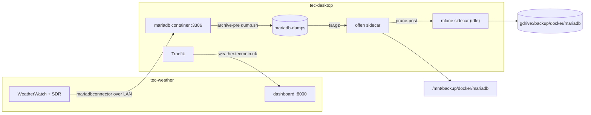

# Weather MariaDB Migration

Move the `weather` schema off the station host `tec-weather` and into the `src/services/mariadb` container on
tec-desktop, leaving WeatherWatch itself on the station and pointing it at the container over the LAN. This
finishes the one task left open in
[`container-management-overhaul.md`](container-management-overhaul.md): "when `src/services/mariadb` is in use,
add the rclone sidecar and put `deployMariadb` back in `deployAll`."

The station-to-station move
([WeatherWatch `mariadb_trixie_migration_runbook`](https://github.com/tim-oe/WeatherWatch/blob/main/.cursor/plans/mariadb_trixie_migration_runbook_3f04a621.plan.md))
already built and proved the tooling for this: `db-archive.sh`, `db-stale-tables.sh`, `db-inventory.sh`,
`db-dump.sh` and `db-restore.sh` in the WeatherWatch repo. This plan reuses those scripts rather than writing
new ones. What is genuinely new is everything that follows from the database no longer being on localhost.

## Decisions

- **Database only.** WeatherWatch and its SDR hardware stay on tec-weather. Only the MariaDB instance moves.
- **Logical dump and restore**, same as the Trixie migration. No datadir copy, no replication.
- **Pin the container to `mariadb:11.8.9`, not the current `mariadb:11.4.13`.** This is not a preference; see
  below. 11.8 is also the current LTS line, and 11.4 is the previous one.
- **Reuse the WeatherWatch scripts** for archive, inventory, dump and restore. The only change is that
  `db-restore.sh` pipes into `docker exec -i mariadb mariadb …` instead of a local socket.
- **Keep the existing container backup model.** MariaDB is the one stack that stays up during its backup: the
  `archive-pre` hook runs `dump.sh` into the `mariadb-dumps` volume and offen archives that, not the live
  datadir. Add the rclone sidecar to push it to `gdrive:/backup/docker/mariadb`.
- **Turn off WeatherWatch's own scheduled DB backup.** Once offen owns the dump, `WW_DB_BACKUP_ENABLE=false`
  on the station. Leaving it on means the app dumps a *remote* database nightly across the LAN into
  `/mnt/backup/weather/db` and the same data is archived twice by two different schedulers.
- **Leave MariaDB installed but stopped on tec-weather** until the container has been running for a couple of
  weeks. Rollback is then `WW_DB_HOST` back to `127.0.0.1` and `systemctl start mariadb`.

### Why the image has to move off 11.4

The station is on **MariaDB 11.8.6** after the Trixie migration. The container in this repo is pinned to
**`mariadb:11.4.13`**. A dump taken on 11.8 will not restore into 11.4.

Since MariaDB 11.5 the default collation for Unicode character sets is `utf8mb4_uca1400_ai_ci`
([MDEV-25829](https://jira.mariadb.org/browse/MDEV-25829)), and the weather tables declare
`DEFAULT CHARSET=utf8mb4` with no explicit `COLLATE` — so when they were restored onto 11.8 they picked up that
new default. `mariadb-dump` writes the resolved collation into every `CREATE TABLE`, and 11.4 has no
`utf8mb4_uca1400_ai_ci` at all. The restore fails with `Unknown collation` on the first table.

The Trixie runbook already flagged this in the other direction and noted the `character_set_collations` pin as
the opt-out. Pinning collations to force a downgrade into 11.4 would be fighting the LTS line for no reason.
Going to 11.8.9 makes the source and target the same major version, which also removes any
`mariadb-upgrade` question. `MARIADB_AUTO_UPGRADE: "1"` is already set on the container.

## What exists today

- `src/services/mariadb/` is fully written but **has never been deployed**. `deployMariadb` exists and is
  deliberately excluded from `deployAll`, described as "stack not in production yet".
- The stack publishes 3306 in `host` mode, mounts `mariadb-data` and `mariadb-dumps`, runs `dump.sh` as an
  offen `archive-pre` hook, and archives `mariadb-dumps` nightly at 01:25 to `/mnt/backup/docker/mariadb`.
- WeatherWatch reads its DB settings from `config/weatherwatch.yml`, every one overridable by an env var:
  `WW_DB_HOST` (default `127.0.0.1`), `WW_PORT` (default 3306, note the name is not `WW_DB_PORT`), `WW_DB_NAME`
  (`weather`), `WW_DB_USERNAME`, `WW_DB_PASSWORD`. Driver is `mariadbconnector` with a pool of 3 plus 3
  overflow.
- Prod grants on the station are already host-wildcarded — `'weather'@'%'` and `'pyway'@'%'` per
  WeatherWatch `docs/SETUP.md` — so remote access needs no grant rewrite, only a decision about tightening.
- `/mnt/backup/weather/db` on tec-desktop holds the dumps WeatherWatch writes on its own 03:00 schedule. The
  `gdrive` stack syncs that path to `gdrive:/backup/weather/db` daily at 08:15 via `sync-orphans.sh`.

### Gaps found while reading the repo

- **Secrets will not resolve.** The compose file uses `${MARIADB_ROOT_PASSWORD}`, `${MARIADB_DATABASE}`,
  `${MARIADB_USERNAME}` and `${MARIADB_PASSWORD}`. These are Compose *interpolation*, which reads a stack
  `.env` or the invoking shell — never `/etc/environment`. Under `sudo docker compose` the environment is
  reset, so they expand to empty. This is exactly the failure that bit the Gotify and rclone stacks. It is
  worse here because `dump.sh` authenticates with `${MARIADB_ROOT_PASSWORD}`: an empty value means the nightly
  `archive-pre` hook fails and offen archives a stale or empty dump directory. A `.env` at
  `/mnt/raid/services/mariadb/` is required, and `deployMariadb` must not clobber it.
- **3306 is published on every interface.** Irrelevant while nothing connected; after this migration it is the
  actual data path and should be bound to the LAN address.
- **No DIUN labels.** With `watchByDefault: true` and the default `^\d+(\.\d+)+$` tag filter, the stack will
  start alerting on 12.x releases. It needs an `include_tags` regex to stay on the 11.8 LTS line.
- **`mariadb-data` and `mariadb-dumps` are not in `src/bin/volumes.sh`**, unlike every other stack's volumes.
- **No README**, unlike `traefik` and `unifi-os`.
- **Timezone is inherited, not asserted.** The container mounts tec-desktop's `/etc/timezone` and
  `/etc/localtime`. The reading tables use `timestamp`, which is stored UTC and rendered in the session zone,
  so if tec-desktop and tec-weather disagree every historical reading shifts. The Trixie runbook called this
  out; it applies unchanged here.

## Target state



Traefik's route to the dashboard is unchanged: `dynamic/external.yml` still points at
`http://tec-weather.localdomain:8000`. Only the arrow from the app to the database is new.

## Phases

| Phase | Scope | Risk | Can ship independently |
|---|---|---|---|
| 1 | Prepare the container stack: version, secrets, sidecar, exposure | low | yes |
| 2 | Dump on tec-weather, restore into the container, verify | medium, collection halted | no |
| 3 | Repoint WeatherWatch and confirm writes | medium | no |
| 4 | Retire the station database and rework the offsite backup path | low | yes, after 3 |

---

## Phase 1: prepare the container stack

All of this happens while the station keeps running on its local database. Nothing here is a cutover step.

**Bump the image and add the missing labels:**

```yaml
    image: mariadb:11.8.9
    labels:
      - docker-volume-backup.exec-label=mariadb
      - docker-volume-backup.archive-pre=/bin/sh /usr/local/bin/dump.sh
      - 'diun.include_tags=^11\.8\.\d+$$'
```

The `$$` is required — Compose eats a single `$`. This matches how `jenkins` and `sonarqube` already pin their
DIUN filters.

**Bind the port to the LAN address** instead of every interface:

```yaml
    ports:
      - target: 3306
        published: "192.168.1.x:3306"
        protocol: tcp
        mode: host
```

Substitute tec-desktop's actual LAN address. Optionally also narrow the grants from `'weather'@'%'` to
`'weather'@'192.168.1.%'`, which is the "might want to lock down host to source" note in WeatherWatch's
`docs/SETUP.md` finally being actioned.

**Add the rclone sidecar**, the standard idle-container pattern used by vaultwarden, wiki and the rest:

```yaml
  gdrive:
    image: rclone/rclone:1.75.0
    container_name: mariadb-gdrive
    restart: unless-stopped
    entrypoint: ["tail", "-f", "/dev/null"]
    env_file:
      - path: /etc/environment
        required: false
    environment:
      PATH: /usr/local/sbin:/usr/local/bin:/usr/sbin:/usr/bin:/sbin:/bin
      RCLONE_SRC: /archive
      RCLONE_DEST: gdrive:/backup/docker/mariadb
      GOTIFY_URL: http://gotify
    volumes:
      - /etc/timezone:/etc/timezone:ro
      - /etc/localtime:/etc/localtime:ro
      - /root/.config/rclone/rclone.conf:/config/rclone/rclone.conf:ro
      - /mnt/backup/docker/mariadb:/archive:ro
      - ./_common/rclone-sync.sh:/rclone-sync.sh:ro
    labels:
      - docker-volume-backup.exec-label=mariadb
      - docker-volume-backup.prune-post=/bin/sh /rclone-sync.sh
      - diun.enable=false
```

Note the two `exec-label=mariadb` containers: offen runs `archive-pre` on the database and `prune-post` on the
sidecar, both scoped by the same label. That is the same shape as every other stack; it just looks unusual here
because the hooks land on different containers.

**Write the stack `.env` on the host, after the gradle put**, at `/mnt/raid/services/mariadb/.env`:

```
MARIADB_ROOT_PASSWORD=…
MARIADB_DATABASE=weather
MARIADB_USERNAME=weather
MARIADB_PASSWORD=…
```

`deployMariadb` overwrites the service directory, so treat `.env` the same way as the Traefik Cloudflare token:
write it after deploying, and check it is still there before starting. Verify with
`sudo docker compose config` — the values must be populated, not empty.

**Tuning and gradle wiring:**

- Add `innodb_buffer_pool_size` via a `command:` override. The default 128M is small for years of partitioned
  readings; size it once Phase 2 reports the actual dataset size.
- Raise `max_allowed_packet` for the restore. The `raw` columns are JSON stored as LONGTEXT and dumped with
  `--hex-blob`, so a large row can exceed the default.
- Add `mariadb-data` and `mariadb-dumps` to `src/bin/volumes.sh`.
- Add `deployMariadb` to `deployAll` in `src/gradle/services.gradle`.
- Add a `deployMariadb` `doFirst` that creates `/mnt/backup/docker/mariadb`, matching `deployGotify` and
  `deployTraefik`.

**Bring the container up empty and confirm the plumbing** before any data exists: the healthcheck goes healthy,
`dump.sh` runs by hand without an auth error, and the timezone matches. Compare
`SELECT @@global.time_zone, @@system_time_zone;` in the container against the same query on tec-weather. Fix
any mismatch now, not after the data has landed.

---

## Phase 2: dump, restore, verify

This is the outage window. Collection stops when the station's app units stop and resumes at the end of
Phase 3, so every minute here is a gap in the record. An hour is comfortable.

**Staging.** The Trixie migration staged through the NFS share at `/mnt/clones/data/weather-migration` on
tec-truenas. Confirm whether tec-desktop mounts that share. If it does, the existing scripts work unchanged. If
not, either mount it or stage through `/mnt/backup`, which both hosts already reach.

**On tec-weather:**

1. Stop `weatherwatch` and `weatherdash`, leave `mariadb` running. The schema is now frozen.
2. Run `db-archive.sh` for the pre-migration keepsake dump, and verify its sha256.
3. Run `db-stale-tables.sh`, review the generated drops, apply them. The canonical set is `outdoor_sensor`,
   `indoor_sensor`, `aqi_sensor`, `light_sensor`, `pi_metrics`, `sdr_metrics`, `sonic_reading`,
   `apscheduler_jobs`, `pyway`.
4. Run `db-inventory.sh`. This is the comparison baseline and must be taken *after* the drops.
5. Run `db-dump.sh` — `--single-transaction --quick --hex-blob --routines --events --triggers`,
   `--ignore-table=weather.apscheduler_jobs`, gzipped with a sha256 sidecar.
6. Note the maximum `read_time`. That timestamp is the boundary the first post-cutover rows must sit after.

**On tec-desktop:**

7. Verify the checksum, then restore into the container:

```bash
gunzip -c weather_<stamp>.sql.gz \
  | sudo docker exec -i mariadb mariadb -u root -p"$MARIADB_ROOT_PASSWORD"
```

The dump was taken with `--databases weather`, so it carries its own `CREATE DATABASE` and `USE`. Do **not**
run `pyway migrate` first — the dump contains the `pyway` history table and migrating first collides with it.

8. Create the `pyway` user. The container's `MARIADB_USER` bootstrap only creates the app user:

```sql
CREATE USER 'pyway'@'192.168.1.%' IDENTIFIED BY '…';
GRANT ALL PRIVILEGES ON weather.* TO 'pyway'@'192.168.1.%';
```

9. Re-apply the `aqi_clean` stored procedure from `sql/sp/aqi_clean.sql`, as the Trixie restore script does.
10. Run `db-inventory.sh` against the container and diff against the Phase 0 baseline. Confirm the yearly RANGE
    partitions landed via `information_schema.PARTITIONS`, and that `pyway info` shows the full applied history
    with nothing pending.

---

## Phase 3: repoint WeatherWatch

One environment variable on the station, since `weatherwatch.yml` already reads the host from
`${WW_DB_HOST:127.0.0.1}`. Add to `/etc/environment` on tec-weather:

```
WW_DB_HOST=tec-desktop.localdomain
```

Leave `WW_PORT`, `WW_DB_NAME`, `WW_DB_USERNAME` and `WW_DB_PASSWORD` alone unless the grants were tightened.
Restart the two units, then tail `/var/log/WeatherWatch_err.log` and confirm new rows are landing with
`read_time` after the Phase 2 boundary, with a gap that matches the outage rather than hinting at a timezone
shift.

**The new failure mode to think about here** is that a scheduled reading now depends on the LAN and on
tec-desktop being up. Two things worth checking rather than assuming:

- The nightly offen run at 01:25 does **not** stop the database — that is the entire reason MariaDB uses a
  logical dump instead of `stop-during-backup`. So routine backups cause no outage.
- A `docker compose up -d` on the mariadb stack *does* drop every connection. Confirm the SQLAlchemy pool
  recovers rather than wedging the scheduler; the pool is only 3 connections plus 3 overflow. If it does not
  reconnect cleanly, that is an upstream fix in WeatherWatch, not something this repo can paper over.

---

## Phase 4: retire the station database and rework the backup path

**Stop and disable MariaDB on tec-weather**, but do not purge it. Keep the datadir until the container has a
couple of weeks and a verified offsite restore behind it.

**Turn off the app-side DB backup**: `WW_DB_BACKUP_ENABLE=false` on the station. Otherwise the 03:00 job keeps
dumping the now-remote database into `/mnt/backup/weather/db`, duplicating what offen already archives at
01:25.

**Then deal with `/mnt/backup/weather/db` carefully.** `sync-orphans.sh` runs `rclone sync` against it, and
`sync` mirrors deletions. If that directory is emptied while the sync leg is still active, the next 08:15 run
**deletes the historical dumps from Google Drive too**. Order matters:

1. Remove the weather leg from `src/services/gdrive/sync-orphans.sh` first, and redeploy.
2. Only then clean up the local directory.
3. If the old `gdrive:/backup/weather/db` contents are worth keeping, move them to an archival prefix on the
   remote before either step. Nothing will be writing to that path again.

Check whether `/mnt/backup/weather` also receives the station's *file* backups (pix and vid) before removing
anything. `backup.file.enable` and `backup.db.enable` are separate settings in `weatherwatch.yml`, and only the
db half is being replaced here.

**Update the WeatherWatch repo** to match: `docs/SETUP.md` gains the remote-host setup, and the note that the
production database now lives in a container on tec-desktop.

---

## Sequencing note

Phase 1 is independent and can be done any evening. Phases 2 and 3 are one sitting with collection halted, and
should not be split across a night — a station that is up but writing to the wrong database is worse than one
that is down. Phase 4 waits until the container has proven itself, and its ordering constraint around
`rclone sync` deletions is the one genuinely destructive step in this plan.

## Task list

### Phase 1: prepare the container stack

- [ ] Bump `src/services/mariadb/docker-compose.yml` to `mariadb:11.8.9` and add
  `diun.include_tags=^11\.8\.\d+$$`.
- [ ] Bind `published:` to tec-desktop's LAN address rather than all interfaces.
- [ ] Add the `mariadb-gdrive` rclone sidecar with `prune-post` and `RCLONE_DEST: gdrive:/backup/docker/mariadb`.
- [ ] Add a `doFirst` to `deployMariadb` creating `/mnt/backup/docker/mariadb`, and add `deployMariadb` to
  `deployAll`.
- [ ] Add `mariadb-data` and `mariadb-dumps` to `src/bin/volumes.sh`.
- [ ] Create `/mnt/raid/services/mariadb/.env` on the host after the gradle put, and verify with
  `docker compose config` that the four `MARIADB_*` values are populated rather than empty.
- [ ] Start the empty container, confirm the healthcheck goes healthy and `dump.sh` runs without an auth error.
- [ ] Compare `@@global.time_zone` and `@@system_time_zone` between the container and tec-weather; reconcile
  before any data is restored.
- [ ] Write `src/services/mariadb/README.md` covering the remote-client model, the `.env` requirement, the
  dump-not-stop backup model, and the restore procedure.

### Phase 2: dump, restore, verify

- [ ] Confirm whether tec-desktop can reach `/mnt/clones/data/weather-migration`; if not, choose a staging path
  both hosts share.
- [ ] Stop `weatherwatch` and `weatherdash` on tec-weather, leaving `mariadb` up.
- [ ] Run `db-archive.sh`, verify the checksum, then `db-stale-tables.sh` and apply the reviewed drops.
- [ ] Run `db-inventory.sh` for the baseline, then `db-dump.sh`. Record the maximum `read_time`.
- [ ] Restore into the container, create the `pyway` user, and re-apply `sql/sp/aqi_clean.sql`.
- [ ] Diff the post-restore inventory against the baseline; confirm partitions, `aqi_clean`, and `pyway info`.
- [ ] Size `innodb_buffer_pool_size` from the actual dataset size and redeploy.

### Phase 3: repoint WeatherWatch

- [ ] Set `WW_DB_HOST=tec-desktop.localdomain` in `/etc/environment` on tec-weather and restart both units.
- [ ] Confirm new rows land after the Phase 2 boundary timestamp and the gap matches the outage window.
- [ ] Verify the connection pool recovers from a `docker compose up -d` on the mariadb stack.

### Phase 4: retire the station database and rework backups

- [ ] Stop and disable `mariadb` on tec-weather, leaving the datadir in place as rollback.
- [ ] Set `WW_DB_BACKUP_ENABLE=false` on the station.
- [ ] Archive `gdrive:/backup/weather/db` to a retained prefix, remove the weather leg from
  `sync-orphans.sh`, redeploy `gdrive`, and only then clean up the local directory.
- [ ] Confirm the first offen run produces an archive in `/mnt/backup/docker/mariadb` and that the rclone
  sidecar pushes it to `gdrive:/backup/docker/mariadb`.
- [ ] Do one restore rehearsal from the offsite copy before purging anything on the station.
- [ ] Tick the deferred MariaDB task in [`container-management-overhaul.md`](container-management-overhaul.md).
- [ ] Update WeatherWatch `docs/SETUP.md` for the remote-database setup.
