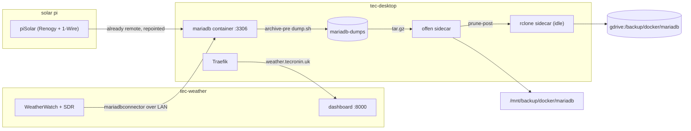

# Weather MariaDB Migration

Move the MariaDB instance off the station host `tec-weather` and into the `src/services/mariadb` container on
tec-desktop. WeatherWatch stays on the station and piSolar stays on its own Pi; both are repointed at the
container over the LAN. This finishes the one task left open in
[`container-management-overhaul.md`](container-management-overhaul.md): "when `src/services/mariadb` is in use,
add the rclone sidecar and put `deployMariadb` back in `deployAll`."

The station-to-station move
([WeatherWatch `mariadb_trixie_migration_runbook`](https://github.com/tim-oe/WeatherWatch/blob/main/.cursor/plans/mariadb_trixie_migration_runbook_3f04a621.plan.md))
already built the tooling: `db-archive.sh`, `db-stale-tables.sh`, `db-inventory.sh`, `db-dump.sh` and
`db-restore.sh` in the WeatherWatch repo. This plan reuses those scripts. What is new is everything that
follows from the database no longer being on the station's localhost, from there being **two** writers to
quiesce instead of one, and from the fact that the tooling was built but **not proved** — that migration lost
the historic contents of six tables.

## The failure this plan exists to not repeat

The Trixie migration completed, the app was cut over, and **six reading tables held no historic data at all**
— only rows collected from the cutover onward. Nobody noticed for three weeks. Recovering it needed a
five-phase plan of its own
([WeatherWatch `historic_data_recovery`](https://github.com/tim-oe/WeatherWatch/blob/main/.cursor/plans/historic_data_recovery_d1332e65.plan.md)),
and it only worked because the migration dump happened to still be on the NFS share and still checksummed
clean. Nothing in the migration guaranteed that; it was luck.

**The dump was fine.** The recovery read the historic rows straight back out of
`/mnt/clones/data/weather-migration/db/weather.sql.gz` — the same file the migration restored from — and found
them "already in their final form … they load directly". So the data left tec-weather intact and arrived on
tec-desktop intact. **The failure was on the restore-and-verify side of the pipeline**, which is where the
weight of the gates below sits.

| table | historic rows absent | rows present at detection |
|---|---:|---:|
| `indoor_sensor` | 334,660 | 11,381 |
| `sdr_metrics` | 173,530 | ~5,747 |
| `aqi_sensor` | 169,451 | 5,745 |
| `outdoor_sensor` | 166,880 | 5,720 |
| `pi_metrics` | 86,906 | 2,872 |
| `light_sensor` | 33,022 | 5,720 |

The Trixie runbook was not missing a verification step. `db-inventory.sh` was specified as "run on both sides
… for diffing", and Phase 2 said to diff it. What was missing is everything that makes such a step
load-bearing:

- **The diff was advisory.** Nothing said the cutover must not proceed on a non-empty diff, so proceeding was
  the path of least resistance.
- **Nothing verified the dump itself.** A sha256 proves the file arrived intact, not that `mariadb-dump`
  finished writing it or that it contains any rows. A truncated dump has a perfectly valid checksum of a
  truncated dump.
- **Nothing verified the restore's exit status.** `gunzip -c … | mariadb` reports *gunzip's* status unless
  `pipefail` is set, so a restore that aborted part way through looked like a success.
- **Every schema-shaped check passes on an empty database.** The tables existed with the right structure and
  the right partitions, `pyway info` showed a clean applied history, and `aqi_clean` was present. All of that
  was true, and all of it was equally true of zero rows. The one check that distinguishes the two — a
  per-table row count — is the one that was not enforced.
- **The writers were started before verification.** Once collection resumed, the empty tables began filling,
  which made "the tables have rows" true, buried the evidence, and handed the recovery an auto-increment
  collision to work around because the new rows had taken ids `1..N` that belonged to the historic ones.
- **Ordering assumptions were not enforced.** The stale-table drops were meant to precede the migration dump.
  That dump still contains the `_old` tables, so they did not. Nothing detected that a plan step had been
  skipped.

**The exact mechanism is not known** and, three weeks and a recovery later, is probably not recoverable — a
`max_allowed_packet` overflow on the two tables carrying JSON `raw` columns, a restore aborted part way and
unnoticed, or a filtered load that dropped table blocks are all consistent with what was found. That
uncertainty is itself an argument for gating broadly rather than fixing one suspected cause: the gates below
are arranged to catch *any* discrepancy between what left the source and what arrived, without needing a
theory about how it arose.

What follows is therefore not more verification queries. It is **gates**: named, with an explicit stop
condition, positioned so that every destructive or hard-to-reverse step sits on the far side of one.

### Gate rules

1. **A gate is a stop, not a note.** If a gate fails, the run stops and the phase's rollback is taken.
   There is no "carry on and check later" — that is precisely what happened last time.
2. **Row counts are the integrity check.** Schema, partition, `pyway` and routine checks are all necessary and
   none of them say anything about data.
3. **Counts are compared per table, per schema, at exact equality.** No tolerance, and no aggregate over the
   whole schema. The loss was six tables out of eleven; a schema-level total would have hidden it as
   effectively as no check at all.
4. **No writer starts until the restore gates pass.** A running writer destroys the evidence and multiplies
   the cost of the fix.
5. **Every gate writes a file** into the migration artefacts directory next to the dump. A gate whose result
   only ever existed on a terminal cannot be re-examined three weeks later, which is the timescale on which
   this class of failure actually gets noticed.

## Decisions

- **Database only.** WeatherWatch and its SDR hardware stay on tec-weather; piSolar stays on its Pi. Only the
  MariaDB instance moves.
- **Logical dump and restore**, same as the Trixie migration. No datadir copy, no replication.
- **Pin the container to whatever tec-weather is running, or newer — never older.** The container has never
  held data, so nothing constrains the choice from this side and the tag is free to pick. The source version is
  the only input. Confirm it in Phase 0 and pin from that; `mariadb:11.8.9` is the concrete answer if the
  station is still on the 11.8.6 it landed on after the Trixie migration.
- **Both writers are paused for the whole dump-and-restore window.** piSolar already connects remotely, so
  unlike WeatherWatch it will happily keep writing to the old database after the baseline inventory is taken.
  Anything it writes between the dump and the repoint is silently lost.
- **Recreate the database users by hand from captured grants.** A logical dump of the application schemas does
  not carry the `mysql` system database, so no user, password or grant survives the move.
- **The station database stays byte-identical until Phase 4.** The Trixie runbook dropped the stale `*_old`
  tables on the source before dumping, which makes the source no longer a complete rollback at the exact
  moment the rollback is most likely to be needed. Here the strays are excluded at dump time with
  `--ignore-table` instead, and nothing on tec-weather is modified before the cutover has been verified. The
  drops, if still wanted, happen in Phase 4 against a database that is no longer the only copy.
- **Phase 0 verifies the recovery's cleanup rather than assuming it.** `weather_hist`, `weather_new` and the
  six `*_pre_recovery` tables are due to be dropped shortly, which removes the problem entirely — but the
  schema enumeration in Phase 0 is a `SELECT`, so it costs nothing to have it confirm they are gone instead of
  taking it on trust. If any of them is still there when the dump is taken, it is excluded explicitly.
  Assuming the schema list is just `weather` is how the last migration went wrong.
- **Row counts are what release the cutover.** Both writers stay down until every table in every schema
  matches its pre-dump count exactly, and the maximum acceptable difference is zero rows.
- **Keep the existing container backup model.** MariaDB is the one stack that stays up during its backup: the
  `archive-pre` hook runs `dump.sh` into the `mariadb-dumps` volume and offen archives that, not the live
  datadir. Add the rclone sidecar to push it to `gdrive:/backup/docker/mariadb`.
- **Turn off WeatherWatch's own scheduled DB backup.** Once offen owns the dump, `WW_DB_BACKUP_ENABLE=false` on
  the station. Leaving it on means the app dumps a *remote* database nightly across the LAN into
  `/mnt/backup/weather/db`, and the same data is archived twice by two different schedulers.
- **Leave MariaDB installed but stopped on tec-weather** until the container has a couple of weeks and a
  verified restore behind it. Rollback is then repointing both clients and `systemctl start mariadb`.

### The version rule, and why 11.4.13 breaks it

**A logical restore only goes forward.** The target server has to understand everything `mariadb-dump` wrote,
so the container must be on the station's version or a later one. Since the container has never been started
with real data, there is no existing datadir arguing for any particular tag — the station's version is the only
thing that decides it.

The current pin **`mariadb:11.4.13` is older than the station's 11.8.6**, and that is not a theoretical
problem. Since MariaDB 11.5 the default collation for Unicode character sets is `utf8mb4_uca1400_ai_ci`
([MDEV-25829](https://jira.mariadb.org/browse/MDEV-25829)), and the tables declare `DEFAULT CHARSET=utf8mb4`
with no explicit `COLLATE` — so when they were restored onto 11.8 during the Trixie migration they picked up
that new default. `mariadb-dump` writes the resolved collation into every `CREATE TABLE`, and 11.4 has no
`utf8mb4_uca1400_ai_ci` at all. The restore fails with `Unknown collation` on the first table.

The Trixie runbook hit this in the other direction and noted the `character_set_collations` pin as the opt-out.
Pinning collations to force a downgrade into 11.4 would be fighting the LTS line for no reason.

So: read `SELECT VERSION();` off tec-weather in Phase 0 and pin the container to that or higher. Staying on the
same major version also removes any `mariadb-upgrade` question, and `MARIADB_AUTO_UPGRADE: "1"` is already set
for later patch bumps. As of writing, the 11.8 LTS line on Docker Hub runs to `11.8.9`.

## What exists today

- `src/services/mariadb/` is fully written but **has never been deployed**. `deployMariadb` exists and is
  deliberately excluded from `deployAll`, described as "stack not in production yet".
- The stack publishes 3306 in `host` mode, mounts `mariadb-data` and `mariadb-dumps`, runs `dump.sh` as an
  offen `archive-pre` hook, and archives `mariadb-dumps` nightly at 01:25 to `/mnt/backup/docker/mariadb`.
- **WeatherWatch** on tec-weather reads its DB settings from `config/weatherwatch.yml`, every one overridable
  by an env var: `WW_DB_HOST` (default `127.0.0.1`), `WW_PORT` (default 3306 — the name is not `WW_DB_PORT`),
  `WW_DB_NAME` (`weather`), `WW_DB_USERNAME`, `WW_DB_PASSWORD`. Driver is `mariadbconnector`, pool of 3 plus 3
  overflow.
- **piSolar** ([`tim-oe/piSolar`](https://github.com/tim-oe/piSolar)) runs on its own Pi and already writes to
  this database over the network, through one of its pluggable event-bus consumers. Its published
  `docs/CONFIGURATION.md` documents only a file metrics sink (`metrics.output_dir`), so the database consumer
  and its connection settings are either newer than those docs or configured locally — they need reading off
  the deployed `/etc/pisolar/config.yaml` rather than assumed.
- Grants on the station are already host-wildcarded — `'weather'@'%'` and `'pyway'@'%'` per WeatherWatch
  `docs/SETUP.md`, plus whatever piSolar uses — which is exactly why piSolar can connect remotely today.
- `/mnt/backup/weather/db` on tec-desktop holds the dumps WeatherWatch writes on its own 03:00 schedule. The
  `gdrive` stack syncs that path to `gdrive:/backup/weather/db` daily at 08:15 via `sync-orphans.sh`.
- **The station is still carrying the recovery's working state.** The historic data recovery completed its
  swap on 2026-09-02 and deliberately deferred cleanup, so `weather_hist`, `weather_new` and six
  `*_pre_recovery` tables are still present in the `weather` instance. The six recovered reading tables also
  now have `id` sequences that were rebuilt to run `1..N` in time order, which is a useful integrity property
  to carry forward and a fact the dump must preserve.

### Gaps found while reading the repo

- **Secrets will not resolve.** The compose file uses `${MARIADB_ROOT_PASSWORD}`, `${MARIADB_DATABASE}`,
  `${MARIADB_USERNAME}` and `${MARIADB_PASSWORD}`. These are Compose *interpolation*, which reads a stack
  `.env` or the invoking shell — never `/etc/environment`. Under `sudo docker compose` the environment is
  reset, so they expand to empty. This is the same failure that bit the Gotify and rclone stacks. It is worse
  here because `dump.sh` authenticates with `${MARIADB_ROOT_PASSWORD}`: an empty value means the nightly
  `archive-pre` hook fails and offen archives a stale or empty dump directory. A `.env` at
  `/mnt/raid/services/mariadb/` is required, and `deployMariadb` must not clobber it.
- **3306 is published on every interface.** Irrelevant while nothing connected; after this migration it is the
  actual data path for two hosts and should be bound to the LAN address.
- **No DIUN labels.** With `watchByDefault: true` and the default `^\d+(\.\d+)+$` tag filter, the stack will
  start alerting on 12.x releases. It needs an `include_tags` regex to stay on the 11.8 LTS line.
- **`mariadb-data` and `mariadb-dumps` are not in `src/bin/volumes.sh`**, unlike every other stack's volumes.
- **No README**, unlike `traefik` and `unifi-os`.
- **Timezone is inherited, not asserted** — but it turns out not to matter. See
  [the timezone question](#the-timezone-question-verified-against-both-codebases) below, which resolves this
  from the code rather than from either upstream plan.

## The timezone question, verified against both codebases

tec-weather's system zone is `America/Chicago`, yet the stored `read_time` values are UTC. That is deliberate,
and the container's timezone is **not** part of it. Verified against
[WeatherWatch](https://github.com/tim-oe/WeatherWatch) and [piSolar](https://github.com/tim-oe/piSolar) at
`main`:

**Every time column is `DATETIME`, and MariaDB never converts `DATETIME`.** `sql/schema/V1_2_1` through
`V1_2_6` converted the six reading tables from `TIMESTAMP` to `DATETIME(6)`; `V1_3_0` through `V1_3_5` then
re-populated them from the `_old` tables under `SET TIME_ZONE = '+00:00'` with a plain
`CAST(read_time AS DATETIME(6))`, whose stated purpose is "the goal is to store UTC". `solar_reading` is
`DATETIME(6)`, `solar_temperature_reading` and `sonic_reading` are `DATETIME`. Session and global `time_zone`
affect `TIMESTAMP` columns and the `NOW()` family — neither of which is left in this schema.

**Partitioning is timezone-independent.** Every table in the final state is `PARTITION BY RANGE COLUMNS`, on
`read_time` or `start_time`, comparing datetime literals directly. The `RANGE(UNIX_TIMESTAMP(read_time))`
form — which *would* have made partition routing depend on the session zone — survives only in the superseded
`V1_1_0__light.sql`, replaced by `V1_2_4`.

**No `CURRENT_TIMESTAMP` defaults remain.** `V1_3_6__sonic_reading.sql` removed the last one, with a comment
naming this exact hazard: "`current_timestamp()` returns the MariaDB server's local time (America/Chicago on
this host), so all existing rows store local time rather than UTC." Every timestamp is now set by the
application.

**`aqi_clean` contains no time functions at all** — its cursor and neighbour walk are purely `id`-ordered.

**Nothing pins a session zone on the connection.** `repository/DataStore.py` builds the engine with no
`connect_args`, and neither app's URL carries a `time_zone` parameter.

So: `mariadb:11.8` in a container will store and return these values byte-identically regardless of what
`/etc/timezone` it inherits. **tec-desktop is already `Etc/UTC`**, so the container will run UTC with no
change required — which is the desired end state, reached by doing nothing.

### What the actual invariant is, and why the original Phase 1 gate was checking the wrong thing

The conversion does not happen in MariaDB. It happens in `weatherwatch/entity/types.py`:

```python
class LocalToUTCDateTime(types.TypeDecorator):
    impl = DateTime
    _local_tz = pytz.timezone(tzlocal.get_localzone_name())

    def process_bind_param(self, value, dialect):        # write: local -> UTC
        return self._local_tz.localize(value, is_dst=False).astimezone(pytz.utc).replace(tzinfo=None)

    def process_result_value(self, value, dialect):      # read: UTC -> local
        return pytz.utc.localize(value).astimezone(self._local_tz).replace(tzinfo=None)
```

`_local_tz` is a class attribute resolved from **the application host's** zone at import time. The services
write `datetime.now()` — naive local — and the type converts on the way in and back on the way out, so the
app works in local time throughout and the database holds UTC. SDR readings take their timestamp from
rtl_433's reported `time` field, also naive local, through the same path.

The invariant is therefore **tec-weather's system timezone must stay `America/Chicago`**, because that is the
conversion factor for every row written. The container's zone is irrelevant. An earlier draft of this plan
gated on `@@global.time_zone` parity between the station and the container; that check would have passed or
failed for reasons unrelated to the data. Corrected in Phase 1 below.

piSolar reaches the same storage format without any host dependency — `sensor_reading.py` defaults
`read_time` to `datetime.now(timezone.utc)`, and `services/db/solar_model.py` does
`read_time=reading.read_time.replace(tzinfo=None)` at the persistence boundary, commented "MySQL `DATETIME`
columns are not timezone-aware". Same bytes on disk; no dependence on where the process runs. It also does
not call `create_all()`, so it will not try to reshape the schema when it reconnects to the container.

That difference is not just stylistic — WeatherWatch's version carries an annual DST defect that piSolar's
construction cannot have. Written up as a handoff for a WeatherWatch plan in
[WeatherWatch should adopt piSolar's UTC convention](#handoff-weatherwatch-should-adopt-pisolars-utc-convention),
and out of scope for this migration.

---

## Handoff: WeatherWatch should adopt piSolar's UTC convention

**This section is written to be linked to from a WeatherWatch plan.** It is not work for this repo and is not
a prerequisite for the migration. It is recorded here because the migration is why anyone looked, and because
externalising the database is the natural moment to schedule it.

| repo | state | action |
|---|---|---|
| [piSolar](https://github.com/tim-oe/piSolar) | **already correct** | none — it is the reference implementation |
| [WeatherWatch](https://github.com/tim-oe/WeatherWatch) | annual DST bug, host-dependent conversion | adopt piSolar's pattern |
| SonicModBus (`sonic_reading`) | not yet written | write it to piSolar's pattern, not WeatherWatch's |

The two apps write to the same schema and produce the same bytes on disk today, by different means. piSolar's
means is correct and portable; WeatherWatch's has a defect and a hidden host dependency. Converging on
piSolar's is the smaller change and it deletes code rather than adding it.

### The bug, in WeatherWatch only

`weatherwatch/entity/types.py` — `LocalToUTCDateTime.process_bind_param` uses
`localize(value, is_dst=False)`. On the first Sunday of November, 01:00–01:59 local occurs twice in
America/Chicago, and `is_dst=False` resolves both passes to the standard-time reading:

| local clock time | actually occurred at | stored under `is_dst=False` |
|---|---|---|
| 01:30 CDT (first pass) | 06:30 UTC | **07:30 UTC** |
| 01:30 CST (second pass) | 07:30 UTC | 07:30 UTC |

Two consequences, every November:

- readings from the first pass are written an hour later than they happened, and
- they collide with the second pass on `UNIQUE KEY (read_time, sensor_id)`. `light_sensor` has
  `UNIQUE KEY (read_time)` with no sensor discriminator, so it is tighter still.

`sql/schema/V1_2_1__outdoor_sensor.sql` already documents this exact behaviour and judges it acceptable — but
it was reasoning about a one-off historic backfill, where losing a handful of rows once is genuinely fine.
The same code runs in production every year.

Separately, `weatherwatch/util/Converter.py`'s `to_utc` uses `is_dst=None`, which **raises**
`AmbiguousTimeError` rather than silently shifting. That path is reached from `weatherwatch/wu/WUClient.py`,
so Weather Underground posts throw during that hour instead of mis-dating. Spring-forward needs no handling:
`datetime.now()` never returns a local time that does not exist.

There is also a stale docstring — `types.py` claims "On read: returns the value as-is (naive UTC)" while
`process_result_value` converts UTC back to local. Worth fixing whichever direction the code goes.

### The pattern to copy, from piSolar

Generate aware UTC at the source and strip `tzinfo` at the persistence boundary. Nothing consults the host's
timezone, so there is no ambiguity to resolve and no dependence on where the process runs:

```python
# src/pisolar/sensors/sensor_reading.py
read_time: datetime = Field(default_factory=lambda: datetime.now(timezone.utc))

# src/pisolar/services/db/solar_model.py  (and temperature_model.py)
#   "The read_time timezone info is stripped before storage because
#    MySQL DATETIME columns are not timezone-aware."
read_time=reading.read_time.replace(tzinfo=None)
```

piSolar applies it consistently, including in `services/sqlite_consumer.py`, where the offline spool also
stores `datetime.now(timezone.utc)`. It also does not call `create_all()` — `services/db/mysql_consumer.py`
notes the tables must already exist — so it will not try to reshape the schema when it is repointed at the
container in Phase 3.

### Scope of the WeatherWatch change

**Write side**, replace `datetime.now()` with an aware UTC value:

- `weatherwatch/svc/SensorSvc.py` — the light-sensor path, and the SDR path which takes rtl_433's reported
  local `time` field and needs an explicit local-to-UTC conversion rather than inheriting one
- `weatherwatch/svc/AQISvc.py`
- `weatherwatch/svc/PIMetricsSvc.py`
- `weatherwatch/sensor/sdr/SDRReader.py` — both `start_time` and `end_time`

`Converter.utcnow()` already exists for exactly this and is currently **dead code**, referenced only by its
own tests. That strongly suggests this direction was chosen once and left half-finished; finishing it is
mostly deletion.

**Persistence layer:** reduce `LocalToUTCDateTime` to attaching and stripping `tzinfo`, or remove it and let
the columns be plain `DATETIME(6)` as piSolar's models are. It is referenced by `BaseSensor`, `AQISensor`,
`LightSensor`, `PIMetrics` and `SDRMetricts`.

**Read side — this is the part with real size, and the reason it is not a one-liner.** Today the decorator
converts *filter bounds* as well as stored values, so local-date filtering is self-consistent by accident.
If reads start returning UTC, each of these needs an explicit conversion at the presentation edge:

- `weatherwatch/dashboard/page/OutdoorSensorPage.py` — `get_days_rainfall(date.today())` and a 7-day window
- `weatherwatch/dashboard/page/IndoorSensorPage.py`, `AirQualityPage.py` — 7-day windows
- `weatherwatch/dashboard/page/CameraPage.py` — 1-day window
- `weatherwatch/svc/WUSvc.py` — `get_days_rainfall(date.today())`, a local-day rainfall total
- `weatherwatch/backup/BackupRange.py` — local-date ranges
- `weatherwatch/repository/BaseRepository.py` — `_coerce_to_datetime`, which exists solely to feed bare
  `date` objects into the decorator and may become unnecessary

A local day is not a UTC day, so "today's rainfall" and "the last 7 days" have to be computed as explicit
local-midnight-to-UTC boundaries. Getting that wrong shifts totals by a few hours' worth of readings rather
than breaking loudly, which argues for tests on the boundary conversion specifically.

`aqi_clean` needs no attention: it is `id`-ordered throughout with no time functions.

### Sequencing

Do it **after** this migration, not with it. The migration deliberately changes one thing — where the
database lives — and its gates are built to detect any discrepancy between what left the station and what
arrived. Changing timestamp semantics in the same window would make a genuine data discrepancy
indistinguishable from an intended one, which is the specific failure mode
[the gates](#the-failure-this-plan-exists-to-not-repeat) exist to catch.

Two smaller notes for whoever picks this up:

- **The migration does not make the bug worse or better.** The conversion is entirely client-side on
  tec-weather, so moving the database changes nothing about it.
- **`V1_3_6__sonic_reading.sql` points the wrong way.** Its comment says SonicModBus "will be updated to set
  `read_time` explicitly from the application layer via the `LocalToUTCDateTime` TypeDecorator, consistent
  with the WeatherWatch UTC storage convention." Since that convention is the one being replaced, a
  yet-to-be-written third writer should follow piSolar instead. Worth correcting the comment so it does not
  propagate the pattern into a new app.

---

### Gaps in the ongoing integrity of the container's own backups

These are not migration steps, but they are the same class of failure as the historic loss — something that is
present, archived and offsite while being incomplete — and this migration is what makes them matter, because
it makes the container the only copy.

- **`dump.sh` writes in place with no completeness check.** It uses
  `--result-file=/dumps/all-databases.sql`, so every run overwrites the only copy in the volume. A dump that
  fails part way leaves a truncated file where a good one was, and `set -eu` catches the exit code but not the
  damage already done to the file. There is no gzip, no checksum, no `-- Dump completed` sentinel check and no
  row-count manifest, so a truncated dump is indistinguishable from a good one by inspection. It does at least
  use `--all-databases`, which means it captures the `mysql` system database and therefore the grants — the
  thing the migration dump cannot carry.
- **Nothing anywhere keeps a copy older than seven days.** `BACKUP_RETENTION_DAYS: 7` prunes the local
  archive, and `_common/rclone-sync.sh` runs `rclone sync`, which mirrors deletions — so the offsite copy is
  pruned to the same seven days. The historic loss was detected after three weeks. Had it happened to the
  container instead, with the station retired, there would have been no copy of the historic data left
  anywhere by the time anyone looked. Seven days is the estate-wide convention and is fine for stacks whose
  state is reconstructible; it is not fine for the one stack holding years of irreplaceable readings.

## Target state



Traefik's route to the dashboard is unchanged: `dynamic/external.yml` still points at
`http://tec-weather.localdomain:8000`. Only the arrows into the database are new.

## Phases

| Phase | Scope | Risk | Ships independently | Releasing gate |
|---|---|---|---|---|
| 0 | Discovery: schemas, users, piSolar's connection, count baseline | none | yes | G0 baseline captured and stored |
| 1 | Prepare the container stack: version, secrets, sidecar, exposure | low | yes | G1 empty container plumbing proven |
| 1.5 | Restore rehearsal with real data, collection still running | none | yes | G1.5 rehearsal counts match |
| 2 | Quiesce both writers, dump, restore, recreate users, verify | medium, collection halted | no | G2a–G2f, all blocking |
| 3 | Repoint WeatherWatch and piSolar, confirm writes | medium | no | G3 first rows land above the id high-water mark |
| 4 | Retire the station database and rework the offsite backup path | low | yes, after 3 | G4 offsite restore rehearsed |

Phase 1.5 is new and is the single largest change in this revision. The Trixie migration attempted its first
and only real restore inside the outage window, under time pressure, with no prior evidence that the restore
would work at all. Almost all of that risk can be moved outside the window: the container is empty, nothing
depends on it, and a full-size dump of the live database can be restored into it and counted while collection
carries on running. See [Phase 1.5](#phase-15-restore-rehearsal-with-real-data).

---

## Phase 0: discovery

Read-only. Four things are unknown from the repos alone and each one changes a later step, and one artefact —
the count baseline — is what every gate after this point compares against.

**Prerequisite: the recovery's cleanup has landed.** Confirm `weather_hist` and `weather_new` are gone and no
`*_pre_recovery` tables remain. These are scheduled for deletion, so this is expected to be a formality —
confirm it anyway, and if anything is still present, record the exact list of objects to exclude everywhere
they would otherwise be picked up.

**What version the station is actually on.** `SELECT VERSION();` on tec-weather. Everything else in Phase 1
keys off this: the container tag must equal it or exceed it. Do not take 11.8.6 from the Trixie runbook on
faith — the card has been taking apt updates since.

**Which schemas exist.** The Trixie runbook dumped `--databases weather`. If piSolar writes into its own schema
rather than into `weather`, that dump silently leaves it behind. Enumerate first:

```sql
SELECT table_schema, COUNT(*) AS tables, ROUND(SUM(data_length+index_length)/1024/1024) AS mb
FROM information_schema.TABLES
WHERE table_schema NOT IN ('mysql','information_schema','performance_schema','sys')
GROUP BY table_schema;
```

Every schema in that list has to be in the dump and in the verification diff. The `mb` column also sizes
`innodb_buffer_pool_size` for Phase 1 and tells you how long the restore will take. Expect `weather_hist` and
`weather_new` to appear if the recovery cleanup has not run — they are staging schemas, not application
schemas, and must not be migrated.

Then enumerate every *table* in every one of those schemas, and treat that list as closed. The dump command,
the restore verification and the Phase 2 gates all iterate over it. The last migration verified a schema and
lost six of its tables; a named table list is what turns "the schema restored" into "all eleven tables
restored".

**The count baseline.** This is the artefact the whole plan hangs on, and it is worth taking now as well as
again in Phase 2 — the Phase 2 figure is the authoritative one, but having a Phase 0 copy means a discrepancy
between them is itself informative. Per table, in every schema:

```sql
-- run per table; collect into one text file, sorted, one row per table
SELECT 'weather.outdoor_sensor' AS tbl, COUNT(*) AS rows_now,
       MIN(read_time) AS min_t, MAX(read_time) AS max_t,
       MAX(id) AS max_id, COUNT(*) = MAX(id) AS ids_contiguous
FROM weather.outdoor_sensor;
```

Also capture, per table, `AUTO_INCREMENT` and per-partition row counts:

```sql
SELECT table_schema, table_name, auto_increment FROM information_schema.TABLES
WHERE table_schema IN (<application schemas>);

SELECT table_schema, table_name, partition_name, table_rows
FROM information_schema.PARTITIONS
WHERE table_schema IN (<application schemas>) AND partition_name IS NOT NULL
ORDER BY table_schema, table_name, partition_name;
```

Three of those columns are doing specific work:

- **`MIN(<time column>)`** is the cheapest possible detector for exactly the failure that happened. If
  historic data is missing, this value jumps forward by years while every other check stays green. Record it
  per table and treat it as a permanent invariant, not a one-off migration figure — Phase 3 turns it into an
  ongoing check.
- **`COUNT(*) = MAX(id)`** held for the six recovered tables at the end of the recovery, which deliberately
  reinserted the new rows so ids ran `1..N` with no gaps. Where it holds now it must still hold after the
  restore, and it is a much sharper check than a row count alone because it fails if rows are lost from
  anywhere other than the end. Where it does not hold — `aqi_clean` deletes outliers from `aqi_sensor`, so
  gaps there are expected — record the actual relationship rather than the invariant.
- **`AUTO_INCREMENT`** must come out of the restore above the historic `MAX(id)`. If a table restores empty,
  this resets to 1, and the first app write then takes an id that belongs to a historic row. That is what made
  the recovery expensive rather than merely tedious, and it is checkable in one query before any writer starts.

Note that `information_schema.TABLES.table_rows` is an estimate for InnoDB and must never be used for any of
this. Every count above is a real `COUNT(*)`. `PARTITIONS.table_rows` is likewise approximate, so treat
per-partition counts as a shape check — that the rows are distributed across the same partitions — and let the
`COUNT(*)` totals be the exact test.

**Which users exist, and their grants.** Capture them in replayable form while the old server is still up:

```sql
SELECT CONCAT('SHOW GRANTS FOR ''', user, '''@''', host, ''';')
FROM mysql.user WHERE user NOT IN ('root','mariadb.sys','mysql');
```

Run each generated statement and save the output. MariaDB's `SHOW GRANTS` emits
`IDENTIFIED BY PASSWORD '<hash>'`, so replaying it preserves the existing passwords and neither WeatherWatch
nor piSolar needs a credential change. Expect at least `weather`, `pyway`, and whatever piSolar uses.

**How piSolar connects.** Read the deployed `/etc/pisolar/config.yaml` and the service's environment for the
database consumer's host, port, schema and user. Note the env var name that sets the host — that is the single
value Phase 3 changes. Also note how the service is stopped and started (`docs/SYSTEMD.md`).

**Gate G0.** Two things, both cheap and both prerequisites for everything after:

- The baseline file exists, covers every table in every application schema, and is stored on the share
  alongside the migration artefacts rather than only in a terminal.
- `/mnt/clones/data/weather-migration/db/weather.sql.gz` — the Trixie migration dump, the file the recovery
  read the historic rows back out of — still verifies against its sha256 sidecar. If it does not, fix that
  before going any further. Until Phase 2 takes a fresh archive, that file is the outermost rollback for the
  entire estate's weather history, and its continued existence has so far been nobody's explicit
  responsibility.

---

## Phase 1: prepare the container stack

All of this happens while the station keeps running on its local database. Nothing here is a cutover step.

**Bump the image to the Phase 0 version or newer, and add the missing labels.** Shown with `11.8.9`, the top of
the 11.8 LTS line; substitute whatever Phase 0 reported if the station has moved on.

```yaml
    image: mariadb:11.8.9
    labels:
      - docker-volume-backup.exec-label=mariadb
      - docker-volume-backup.archive-pre=/bin/sh /usr/local/bin/dump.sh
      - 'diun.include_tags=^11\.8\.\d+$$'
```

The `$$` is required — Compose eats a single `$`. This matches how `jenkins` and `sonarqube` already pin their
DIUN filters.

**Bind the port to the LAN address** instead of every interface:

```yaml
    ports:
      - target: 3306
        published: "192.168.1.x:3306"
        protocol: tcp
        mode: host
```

Substitute tec-desktop's actual LAN address. With two remote clients it is also worth narrowing the replayed
grants from `@'%'` to `@'192.168.1.%'`, which is the "might want to lock down host to source" note in
WeatherWatch's `docs/SETUP.md` finally being actioned. Decide this before Phase 2, because it changes the
statements you replay.

**Drop the bootstrap user.** `MARIADB_USER` and `MARIADB_PASSWORD` make the entrypoint create one user on first
boot. Since Phase 2 replays the captured grants for all of them, that bootstrap user is redundant and will
collide if the host part differs — you end up with both `'weather'@'%'` and `'weather'@'192.168.1.%'`. Keep
`MARIADB_ROOT_PASSWORD` and `MARIADB_DATABASE`, drop the user pair, and let the grant replay be the single
source of users.

**Add the rclone sidecar**, the standard idle-container pattern used by vaultwarden, wiki and the rest:

```yaml
  gdrive:
    image: rclone/rclone:1.75.0
    container_name: mariadb-gdrive
    restart: unless-stopped
    entrypoint: ["tail", "-f", "/dev/null"]
    env_file:
      - path: /etc/environment
        required: false
    environment:
      PATH: /usr/local/sbin:/usr/local/bin:/usr/sbin:/usr/bin:/sbin:/bin
      RCLONE_SRC: /archive
      RCLONE_DEST: gdrive:/backup/docker/mariadb
      GOTIFY_URL: http://gotify
    volumes:
      - /etc/timezone:/etc/timezone:ro
      - /etc/localtime:/etc/localtime:ro
      - /root/.config/rclone/rclone.conf:/config/rclone/rclone.conf:ro
      - /mnt/backup/docker/mariadb:/archive:ro
      - ./_common/rclone-sync.sh:/rclone-sync.sh:ro
    labels:
      - docker-volume-backup.exec-label=mariadb
      - docker-volume-backup.prune-post=/bin/sh /rclone-sync.sh
      - diun.enable=false
```

Note the two `exec-label=mariadb` containers: offen runs `archive-pre` on the database and `prune-post` on the
sidecar, both scoped by the same label. Same shape as every other stack; it only looks odd here because the
hooks land on different containers.

**Write the stack `.env` on the host, after the gradle put**, at `/mnt/raid/services/mariadb/.env`:

```
MARIADB_ROOT_PASSWORD=…
MARIADB_DATABASE=weather
```

`deployMariadb` overwrites the service directory, so treat `.env` the way the Traefik Cloudflare token is
treated: write it after deploying and check it survived before starting. Verify with `sudo docker compose
config` that the values are populated, not empty.

**Tuning and gradle wiring:**

- Set `innodb_buffer_pool_size` via a `command:` override, sized from the Phase 0 schema report. The 128M
  default is small for years of partitioned readings.
- Raise `max_allowed_packet` for the restore, **on the server and on the client**. The `raw` columns are JSON
  stored as LONGTEXT and dumped with `--hex-blob`, so a large row can exceed the default; hex doubles the
  wire size of every byte. `256M` in the `command:` override and `--max-allowed-packet=256M` on the restore
  invocation. A packet overflow aborts the restore part way through a table, which is one concrete way to end
  up with correct structure and missing rows.
- Add `mariadb-data` and `mariadb-dumps` to `src/bin/volumes.sh`.
- Add `deployMariadb` to `deployAll` in `src/gradle/services.gradle`.
- Add a `deployMariadb` `doFirst` creating `/mnt/backup/docker/mariadb`, matching `deployGotify` and
  `deployTraefik`.

### Harden `dump.sh` before it is the only backup

Once the station database is retired, this script is the sole thing standing between a container fault and the
loss of years of readings. In its current form it overwrites its only output file in place, unchecked. Three
changes, all small:

**Write to a temp file and move it into place only once it is complete.** `mariadb-dump` terminates a
successful dump with a `-- Dump completed` line; grep for it before the move. A failed dump then leaves the
previous good dump untouched in the volume rather than replacing it with a truncated one.

```sh
TMP=/dumps/.all-databases.sql.tmp
trap 'rm -f "$TMP"' EXIT

mariadb-dump … --result-file="$TMP"
tail -5 "$TMP" | grep -q '^-- Dump completed' || {
  echo "dump did not complete; keeping previous dump" >&2
  exit 1
}
mv "$TMP" /dumps/all-databases.sql
sha256sum /dumps/all-databases.sql > /dumps/all-databases.sql.sha256
```

`tail -5` rather than `tail -1` because the sentinel is followed by a blank line. The dot-prefixed temp name
and the `trap` stop a failed run from leaving a truncated file in the volume for offen to archive alongside
the good one.

Exiting non-zero matters: offen treats a failed `archive-pre` as a failed run, so the failure surfaces rather
than being archived silently. Worth confirming that behaviour on this version rather than assuming it — if a
failed hook does *not* abort the run, the sentinel check above is what saves the previous dump, and the
notification has to come from somewhere else.

**Write a row-count manifest next to the dump.** A per-table `COUNT(*)` and `MIN(<time column>)` written at
dump time, into the same volume offen archives, is what makes any future archive self-describing. Restoring a
backup and getting the wrong number of rows is only detectable if the right number travelled with it — the
recovery had to reconstruct those figures from a plan document written after the fact.

**Add `--triggers` explicitly** rather than relying on it being the default, and keep `--all-databases`: it is
what carries the `mysql` system database and therefore the grants, which is the one thing the migration dump
in Phase 2 cannot bring across.

### Retention: decide it here, not after something is lost

`BACKUP_RETENTION_DAYS: 7` plus `rclone sync` means no copy of this database exists anywhere beyond seven
days. The historic loss surfaced at three weeks. Pick one before Phase 2 makes this the production database:

- lengthen `BACKUP_RETENTION_DAYS` on this stack only, and note in the README why it deviates from the
  estate-wide 7; or
- keep 7 locally and give the mariadb leg `rclone copy` semantics instead of `sync`, so the offsite copy
  accumulates rather than mirroring the prune. `_common/rclone-sync.sh` is shared, so this means either a
  parameter on it or a stack-local variant; or
- add a separate retained tier — a monthly copy to `gdrive:/backup/docker/mariadb/monthly/` that nothing
  prunes.

The third is the cheapest to reason about and the only one that survives someone later "cleaning up" the
archive directory. Whichever is chosen, the pre-migration archive is not part of it — that one is kept
permanently and separately, per Phase 4.

**Gate G1: bring the container up empty and confirm the plumbing** before any data exists. The healthcheck
goes healthy; `dump.sh` runs by hand and produces a dump whose sentinel check passes and whose checksum
sidecar is written; and `sudo docker compose config` shows the `.env` values populated rather than empty.

On timezone, assert the three things that actually bear on the data rather than comparing
`@@global.time_zone` between the hosts, which is not the invariant — see
[the timezone question](#the-timezone-question-verified-against-both-codebases):

- **tec-weather is still `America/Chicago`.** `timedatectl` on the station. This is the conversion factor
  baked into every row WeatherWatch writes, and it is the only timezone value in the estate that can corrupt
  the data by changing.
- **The container is UTC**, which it will be by inheritance since tec-desktop is `Etc/UTC`. Confirm rather
  than assume, because it arrives via a bind mount that a future host change would silently alter.
- **`DATETIME` really is unconverted**, proven once rather than reasoned about. In the empty container:

```sql
CREATE TABLE tz_probe (dt DATETIME(6), ts TIMESTAMP);
INSERT INTO tz_probe VALUES ('2026-06-29 06:10:00.000000', '2026-06-29 06:10:00');
SET time_zone = '+00:00';  SELECT 'utc'     AS session, dt, ts FROM tz_probe;
SET time_zone = 'America/Chicago'; SELECT 'chicago' AS session, dt, ts FROM tz_probe;
DROP TABLE tz_probe;
```

`dt` must be identical in both rows and `ts` must differ by the offset. That is the whole argument for why the
container's zone does not matter, demonstrated in ten seconds on the actual image and version being deployed.
Requires the named timezone tables to be loaded for the `America/Chicago` half; if they are not, use
`'-05:00'` instead, or load them with `mariadb-tzinfo-to-sql` as `V1_2_1__outdoor_sensor.sql` describes.

---

## Phase 1.5: restore rehearsal with real data

Still no cutover, still no outage, both writers still running. This phase exists because the Trixie migration
performed its first ever restore of this dataset inside the outage window, and everything that went wrong went
wrong there.

The container is empty and nothing connects to it. That means a full-size restore can be rehearsed against it
with no consequences at all, and every failure mode that is a property of the data rather than of the cutover
— collation, packet size, disk space, partition definitions, restore duration — is found here, in an evening,
instead of at 22:00 with two collectors down.

Take a dump of the live database *with collection still running*. `--single-transaction` makes it consistent,
which is exactly what the recovery plan's own Phase 0 safety dump relied on:

```bash
mariadb-dump --single-transaction --quick --hex-blob \
  --routines --events --triggers --default-character-set=utf8mb4 \
  --databases <every application schema from Phase 0> \
  | gzip -6 > <staging>/rehearsal_$(date +%Y%m%d_%H%M).sql.gz
```

Restore it into the container using the exact command Phase 2 will use, then run the same count comparison
Phase 2 will run, against a baseline taken from the source at the same moment. Time it.

**Gate G1.5.** Per-table counts match, the restore exited zero, and its output log is empty. Record the
elapsed time — that is the number that sizes the Phase 2 outage window, replacing a guess.

Then **drop the rehearsal data** and confirm the container is empty again before Phase 2. A half-remembered
rehearsal schema still sitting there when the real restore runs is its own hazard: the real dump's
`CREATE DATABASE` is not `IF NOT EXISTS`-guarded in a way you should rely on, and reconciling counts against a
table that already had rows in it is exactly the sort of ambiguity these gates exist to remove.

If the rehearsal cannot be done — no window to take a second dump, or no disk headroom on tec-desktop — that
is worth knowing, but it should be a deliberate decision recorded here rather than a step quietly skipped.
Everything it would have caught then has to be caught inside the outage window instead.

---

## Phase 2: quiesce, dump, restore, recreate users, verify

This is the outage window. Collection stops for both weather and solar and resumes at the end of Phase 3, so
every minute here is a gap in two records. Size it from the Phase 1.5 measured restore time plus the gate
checks rather than guessing; if the rehearsal was skipped, budget generously.

The gates below lengthen the window, and that trade is deliberate. The last migration's window was short and
cost three weeks and a five-phase recovery. Ten more minutes of counting rows while both collectors are down
is the cheapest insurance in this plan, and the alternative is not "a shorter outage" but "an outage plus the
possibility of silently losing the archive".

**Staging.** The Trixie migration staged through the NFS share at `/mnt/clones/data/weather-migration` on
tec-truenas. Confirm whether tec-desktop mounts that share. If it does, the existing scripts work unchanged. If
not, either mount it or stage through `/mnt/backup`, which both hosts already reach.

Six gates, G2a to G2f. Each one stops the run if it fails. The rollback throughout Phase 2 is free: the
station database is never modified, so aborting means starting the writers again and losing only the minutes
already spent.

### Step 1 — quiesce both writers, and prove it

This is the step the single-host runbook did not need.

1. On tec-weather, stop **and disable** `weatherwatch` and `weatherdash`. Leave `mariadb` running. The disable
   matters: both units are `Restart=always` and enabled, so a reboot part way through the migration would
   silently resume collection into a database that is about to be abandoned.
2. On the solar Pi, stop and disable the piSolar service.
3. Record the freeze moment: `date -u +%Y-%m-%dT%H:%M:%SZ`.

**Gate G2a.** All three of these, not just the first:

- `systemctl is-active` reports inactive for `weatherwatch`, `weatherdash` and the piSolar unit.
- No application connections remain:

```sql
SELECT id, user, host, db, command, time FROM information_schema.PROCESSLIST
WHERE user NOT IN ('root','system user');
```

- **The counts are static.** Sample `COUNT(*)` and `MAX(id)` on every table twice, ninety seconds apart, and
  confirm they are identical. WeatherWatch collects on a one-minute cycle, so a genuine freeze shows no
  movement across that window and a `PROCESSLIST` that merely happened to be empty at the instant it was
  sampled does not. This is the check the recovery plan used and the migration did not.

If piSolar reconnects on a timer, the disable is what stops it; do not rely on `stop` alone.

Record the static counts. **These, not the Phase 0 figures, are the authoritative baseline** for every gate
below, along with the per-table `MIN`/`MAX` of the time column, `MAX(id)`, `AUTO_INCREMENT` and per-partition
counts from Phase 0's queries. Write them to the share.

### Step 2 — archive, then dump

4. Run `db-archive.sh` for the pre-migration archive of everything as it stands, and verify its sha256. This
   is the file that saved the last migration. It is not a keepsake; it is the outermost rollback, and Phase 4
   keeps it permanently.
5. **Do not run the stale-table drops.** Exclude strays at dump time with `--ignore-table` instead, per the
   decision above, and leave tec-weather untouched. The canonical WeatherWatch set is `outdoor_sensor`,
   `indoor_sensor`, `aqi_sensor`, `light_sensor`, `pi_metrics`, `sdr_metrics`, `sonic_reading`,
   `apscheduler_jobs`, `pyway`, plus piSolar's tables; anything else — including any `*_pre_recovery` table
   the recovery cleanup has not yet removed — gets an `--ignore-table`. Run `db-stale-tables.sh` in report
   mode to generate that list, but apply nothing.
6. Run `db-dump.sh` — `--single-transaction --quick --hex-blob --routines --events --triggers
   --default-character-set=utf8mb4`, `--ignore-table` for `apscheduler_jobs` and each stray, gzipped with a
   sha256 sidecar. **Extend `--databases` to every application schema found in Phase 0**, not just `weather`,
   and **exclude `weather_hist` and `weather_new`** if the recovery cleanup has not run.
7. Note the maximum `read_time` per table, the maximum `id` per table, and the equivalent high-water values in
   piSolar's tables. Those are the boundaries the first post-cutover rows must sit above.

**Gate G2b: the dump is complete, before it is trusted.** A checksum proves the file did not corrupt in
transit. It says nothing about whether `mariadb-dump` finished. The last migration's dump passed this gate
without it existing — the rows were in there — so this is the cheap one, not the load-bearing one. It is still
worth having: it costs seconds on the source host while the source is still authoritative, and it cleanly
separates "the dump is wrong" from "the restore is wrong" so that a G2d failure has only one possible cause
left. Three checks, on the dump, on the source host:

```bash
# 1. gzip stream is intact end to end
gzip -t weather_<stamp>.sql.gz

# 2. mariadb-dump wrote its completion sentinel
gunzip -c weather_<stamp>.sql.gz | tail -5 | grep '^-- Dump completed'

# 3. every expected table has both a structure block and a data block
gunzip -c weather_<stamp>.sql.gz \
  | grep -c '^-- Dumping data for table'
```

The third is the most useful of the three, and is worth doing per table rather than as a total: for each table
on the closed list from Phase 0, confirm its `-- Dumping data for table` marker exists **and** that
`INSERT INTO` lines follow it. A table whose structure is dumped with no data behind it is detectable here in
seconds, on the source host, while the source is still the authoritative copy.

Row counts could be extracted from the dump itself by counting `VALUES` tuples, but that is fragile and the
post-restore comparison in G2d covers the same ground properly.

### Step 3 — restore into the container

8. Verify the checksum, then restore. Note `pipefail`, the explicit packet size, and the captured output:

```bash
set -o pipefail
gunzip -c weather_<stamp>.sql.gz \
  | sudo docker exec -i mariadb mariadb -u root -p"$MARIADB_ROOT_PASSWORD" \
      --max-allowed-packet=256M --show-warnings \
  > <staging>/restore_<stamp>.log 2>&1
echo "restore exit: $?"
```

`set -o pipefail` is not decoration. Without it the pipeline reports gunzip's status, `mariadb` can abort on
statement 40,000 of 60,000, and the command still looks like it succeeded. Redirecting both streams into one
log keeps warnings and errors together — `--show-warnings` writes to stdout, errors to stderr, and a warning
is exactly the kind of thing that gets lost when only one of the two is captured. Do **not** use `--force`,
which skips failing statements and carries on, converting a loud failure into precisely the silent one this
plan is built to prevent.

The dump carries its own `CREATE DATABASE` and `USE` statements. Do **not** run `pyway migrate` first — the
dump contains the `pyway` history table and migrating first collides with it.

**Gate G2c.** The restore exited zero and `restore_<stamp>.log` is empty. Any error, and any warning that is
not understood, stops the run. The rollback is `DROP DATABASE` per schema and start again; the station is
still intact and still holds the only live copy.

### Step 4 — verify the data, table by table

9. Re-apply the `aqi_clean` stored procedure from `sql/sp/aqi_clean.sql`, as the Trixie restore script does.
10. Run `db-inventory.sh` against the container and diff against the Step 1 baseline.

**Gate G2d: per-table parity, at exact equality.** For every table in every application schema:

| check | must be |
|---|---|
| `COUNT(*)` | exactly equal to the frozen baseline count |
| `MIN(<time column>)` | exactly equal to the baseline minimum |
| `MAX(<time column>)` | exactly equal to the baseline maximum |
| `MAX(id)` | exactly equal to the baseline maximum id |
| `COUNT(*) = MAX(id)` | the same answer as the baseline gave |
| `AUTO_INCREMENT` | greater than `MAX(id)` |
| per-partition counts | same partitions populated, counts within InnoDB estimate noise |

The `MIN` check is the direct test for the failure that happened: a table that restored empty and then filled
from scratch has a minimum that is weeks old rather than years. The `AUTO_INCREMENT` check is what stops the
Phase 3 writers from taking ids that belong to historic rows even if something has gone wrong undetected.

**Gate G2e: no table is empty, and no table is unaccounted for.** A separate, explicit sweep, because it is
the cheapest possible statement of the actual failure:

Generate a real `COUNT(*)` for every table that exists, the same trick the Phase 0 grant capture uses, so the
sweep covers whatever is actually there rather than whatever was expected to be there:

```sql
SELECT CONCAT('SELECT ''', table_schema, '.', table_name, ''' AS tbl, COUNT(*) AS n FROM `',
              table_schema, '`.`', table_name, '` UNION ALL')
FROM information_schema.TABLES
WHERE table_schema IN (<application schemas>) AND table_type = 'BASE TABLE'
ORDER BY table_schema, table_name;
```

Run the generated statement. **No table returns 0 unless the baseline said 0**, and the set of table names it
reports is identical to Phase 0's closed list — nothing missing, and no `_old`, `_rebuild`, `_pre_recovery` or
staging-schema object that should have been excluded. The last migration's dump carried `_old` tables it was
not supposed to and nothing noticed, because nothing was comparing lists.

**Gate G2f: users, grants and schema objects.**

11. **Recreate the users.** Replay the grant statements captured in Phase 0, adjusting the host part if you
    decided to narrow `@'%'` to `@'192.168.1.%'`. Then confirm nothing was missed:

```sql
SELECT user, host FROM mysql.user WHERE user NOT IN ('root','mariadb.sys','mysql');
SHOW GRANTS FOR 'weather'@'192.168.1.%';
```

Every application user from Phase 0 must be present with its grants scoped to the right schema. Confirm the
yearly partitions landed via `information_schema.PARTITIONS`, that `aqi_clean` exists, and that `pyway info`
shows the full applied history with nothing pending — remembering that all three of these were true and
green on the last migration while six tables sat empty. They are necessary, not sufficient; G2d and G2e are
the ones that decide.

**Nothing proceeds to Phase 3 until G2a through G2f have all passed and their output files are on the share.**
This is the ordering rule that matters most in the entire plan. Starting a writer before this point is what
turned a re-runnable restore into a three-week recovery, because from the first inserted row the evidence is
gone and the ids are contested.

---

## Phase 3: repoint both clients

**Entry condition: G2a through G2f have all passed.** Nothing in this phase begins otherwise. Restarting a
writer is the one action in this plan that cannot be undone cheaply.

**WeatherWatch** is one environment variable, since `weatherwatch.yml` already reads the host from
`${WW_DB_HOST:127.0.0.1}`. Add to `/etc/environment` on tec-weather:

```
WW_DB_HOST=tec-desktop.localdomain
```

Leave `WW_PORT`, `WW_DB_NAME`, `WW_DB_USERNAME` and `WW_DB_PASSWORD` alone unless the grants were narrowed.
Re-enable both units, start them, and tail `/var/log/WeatherWatch_err.log`.

**piSolar** changes the host in whatever `/etc/pisolar/config.yaml` or env var Phase 0 identified. Because it
was already pointing across the network at tec-weather, this is a hostname swap rather than a
localhost-to-remote conversion — the connection handling, retries and grants are all already exercised. Restart
and re-enable the unit disabled in Phase 2.

Expect a burst rather than the usual one-minute cycle as the scheduler fires jobs it missed during the pause.
That is harmless — each one collects a reading, which is what it would have done anyway — but it means the
first few minutes are not a good sample of steady state.

**Gate G3, within one collection cycle**, per table:

- new rows have landed, with `id` greater than the Phase 2 high-water `MAX(id)` for that table
- `MIN(<time column>)` is **unchanged from the Phase 2 baseline** — this is the one check that would have
  caught the historic loss on day one instead of week three, and it costs one query
- `COUNT(*)` equals the Phase 2 baseline plus the rows collected since, with no unexplained shortfall
- the gap between the Phase 2 maximum and the first new row matches the outage window, rather than being
  offset by a whole number of hours, which would indicate a timezone problem rather than a data problem
- `/var/log/WeatherWatch_err.log` is clean, and the dashboard shows a continuous history with only the
  expected gaps

If `MIN(<time column>)` has moved forward on any table, stop and treat it as the same failure recurring. The
station database is still intact and still stopped-but-present, so the rollback is repointing both clients
back and starting `mariadb` on tec-weather.

### Make the sentinel permanent

The historic loss was not hard to detect. It was simply never looked for again after cutover. One query,
scheduled, would have caught it within a day:

```sql
-- alert if any table's oldest reading moves forward
SELECT 'outdoor_sensor' AS tbl, MIN(read_time) AS oldest FROM weather.outdoor_sensor
UNION ALL SELECT 'indoor_sensor', MIN(read_time) FROM weather.indoor_sensor
-- … one line per reading table
;
```

Compare against the recorded baseline and notify through Gotify on any forward movement, alongside a per-table
`COUNT(*)` that should only ever increase. The natural home is the same `dump.sh` run that already
authenticates as root nightly and already needs to write a row-count manifest — the check and the manifest are
the same query. Whatever the mechanism, the property worth holding onto is that **the oldest reading in each
table is monitored, not just the newest**; every dashboard, healthcheck and backup in this estate currently
watches the newest, and the newest was perfectly healthy throughout the three weeks the historic data was
gone.

Re-check G3 explicitly at 24 hours and at seven days, before Phase 4 retires the station database. Those
recheck points are what convert "the restore looked right" into "the restore was right", and seven days is
inside the current backup retention while three weeks is not.

**The new failure mode** for WeatherWatch — not for piSolar, which already lives with it — is that a scheduled
reading now depends on the LAN and on tec-desktop being up. Two things worth checking rather than assuming:

- The nightly offen run at 01:25 does **not** stop the database. That is the entire reason MariaDB uses a
  logical dump instead of `stop-during-backup`, so routine backups cause no outage for either client.
- A `docker compose up -d` on the mariadb stack *does* drop every connection. Confirm both clients reconnect
  rather than wedging their schedulers; WeatherWatch's pool is only 3 connections plus 3 overflow. If either
  does not recover cleanly, that is an upstream fix in the app, not something this repo can paper over.

---

## Phase 4: retire the station database and rework the backup path

**Entry condition: G3 has been re-checked at seven days and still passes.** Until then the station datadir is
the rollback and stays where it is.

**Gate G4: rehearse a restore from the offsite copy before retiring anything.** Not from the local
`/mnt/backup/docker/mariadb` archive — from `gdrive:/backup/docker/mariadb`, pulled down and restored into a
throwaway container or schema, with the per-table count comparison from G2d run against it. Until that has
been done once, the offsite copy is an assumption. This is the step that decides whether the estate genuinely
has a recoverable copy of these readings or merely a directory that looks like one.

**Keep the pre-migration archive permanently and outside every prune path.** The archive from Phase 2 step 4,
and the Trixie-era `weather.sql.gz` that made the recovery possible, are the only copies that predate this
migration. Move them somewhere no retention policy and no `rclone sync` can reach — a dated prefix on the
remote that nothing syncs into, plus a local copy outside `/mnt/backup/docker/`. `rclone sync` mirrors
deletions, so anything left inside a synced tree is one stray `rm` away from being gone in both places.

**Stop and disable MariaDB on tec-weather**, but do not purge it. Keep the datadir until the container has a
couple of weeks, a passing seven-day G3, and a verified offsite restore behind it. Only then consider the
stale-table drops that this plan deliberately deferred out of Phase 2.

**Turn off the app-side DB backup**: `WW_DB_BACKUP_ENABLE=false` on the station. Otherwise the 03:00 job keeps
dumping the now-remote database into `/mnt/backup/weather/db`, duplicating what offen archives at 01:25.

**Then deal with `/mnt/backup/weather/db` carefully.** `sync-orphans.sh` runs `rclone sync` against it, and
`sync` mirrors deletions. If that directory is emptied while the sync leg is still active, the next 08:15 run
**deletes the historical dumps from Google Drive too**. Order matters:

1. Remove the weather leg from `src/services/gdrive/sync-orphans.sh` first, and redeploy.
2. Only then clean up the local directory.
3. If the old `gdrive:/backup/weather/db` contents are worth keeping, move them to an archival prefix on the
   remote before either step. Nothing will be writing to that path again.

Check whether `/mnt/backup/weather` also receives the station's *file* backups (pix and vid) before removing
anything. `backup.file.enable` and `backup.db.enable` are separate settings in `weatherwatch.yml`, and only the
db half is being replaced here.

**Update both app repos** to match: WeatherWatch `docs/SETUP.md` gains the remote-host setup and the note that
production now lives in a container on tec-desktop; piSolar's configuration docs get the same treatment, along
with the database consumer that is currently undocumented.

**Open the WeatherWatch plan for the UTC convention**, pointing at
[the handoff section](#handoff-weatherwatch-should-adopt-pisolars-utc-convention) for the analysis rather than
restating it. This is the natural moment: the database is externalised, the migration's gates have been
satisfied, and nothing else is in flight against that schema. Note that it is a WeatherWatch-only change —
piSolar is already the reference implementation and needs no work.

---

## Sequencing note

Phase 0 is read-only and should be done first and separately — it is what tells you whether the dump command
from the Trixie runbook is even complete for this estate, and it produces the baseline every later gate
compares against. Phases 1 and 1.5 are independent and can be done any evening; between them they move every
data-shaped risk out of the outage window. Phases 2 and 3 are one sitting with both collectors halted, and
should not be split across a night: a collector that is up but writing to the old database is worse than one
that is down, because those rows are lost rather than merely missing. Phase 4 waits until the container has
proven itself over seven days, and its ordering constraint around `rclone sync` deletions is the one genuinely
destructive step in this plan.

## Abort criteria and rollback

Worth stating plainly, because the reason the last migration carried on past a bad state is that carrying on
was easier than deciding not to.

| Failing gate | Rollback | Cost |
|---|---|---|
| G0 | none needed; nothing has changed | none |
| G1, G1.5 | drop the rehearsal data, container returns to empty | none |
| G2a | writers are already down; restart and reschedule | minutes of collection |
| G2b | dump is bad; re-take it. The source is untouched | minutes |
| G2c, G2d, G2e, G2f | `DROP DATABASE` per schema in the container, then either re-restore or restart the writers against tec-weather and reschedule | the outage so far |
| G3 | repoint both clients back to `127.0.0.1` / tec-weather and `systemctl start mariadb` on the station | the outage so far |
| G4 | do not retire the station database; the estate keeps two copies until it passes | none |

Two properties make all of these cheap, and both are deliberate:

- **The station database is not modified before Phase 4.** `--single-transaction` dumps read; the stale-table
  drops are deferred; the datadir stays in place. Right up to the Phase 3 cutover the station is a complete,
  bootable copy of the data.
- **The container holds no other data.** Until this migration it has never been in production, so
  `DROP DATABASE` is a genuinely available reset. There is never a reason to attempt a partial repair of a bad
  restore under time pressure — start it again from the dump instead, which is a thing this plan can afford
  precisely because nothing else lives in that container.

The one asymmetry: **after the writers start in Phase 3, rollback stops being free**, because rows written to
the container are not in the station's copy and rows written to the station are not in the container's.
Everything above is arranged so that the decision to start the writers is taken once, deliberately, on the far
side of six gates.

## Task list

### Phase 0: discovery

- [ ] Confirm the recovery's Phase 5 cleanup has run — no `weather_hist`, no `weather_new`, no
  `*_pre_recovery` tables — or record the exact objects to exclude everywhere.
- [ ] Record `SELECT VERSION();` on tec-weather and pick the container tag from it — equal or newer, never
  older.
- [ ] Enumerate application schemas and their sizes on tec-weather; confirm whether piSolar writes into
  `weather` or its own schema. Exclude the recovery staging schemas from that list.
- [ ] Enumerate every table in every application schema and record it as the closed list the dump, restore and
  all Phase 2 gates iterate over.
- [ ] Read `SHOW CREATE TABLE` for every reading table and confirm the live schema matches what the
  migrations say it should be: `DATETIME`/`DATETIME(6)` time columns, `RANGE COLUMNS` partitioning, no
  `TIMESTAMP` column and no `CURRENT_TIMESTAMP` default anywhere. This has been verified from the code, so
  it is a confirmation rather than a discovery — but it is the premise the timezone reasoning rests on, and
  it is one query.
- [ ] **Capture the count baseline** to a file on the share: per table `COUNT(*)`, `MIN` and `MAX` of the time
  column, `MAX(id)`, whether `COUNT(*) = MAX(id)` holds, `AUTO_INCREMENT`, and per-partition counts.
- [ ] Capture `SHOW GRANTS` output for every non-system user in replayable form, and store it with the
  migration artifacts.
- [ ] Read piSolar's deployed config for its DB host, port, schema, user, and the env var that sets the host;
  note how the service is stopped and started.
- [ ] Confirm whether tec-desktop can reach `/mnt/clones/data/weather-migration`; if not, choose a staging path
  all hosts share.
- [ ] **Gate G0:** the baseline file is on the share, and the Trixie-era `weather.sql.gz` still verifies
  against its sha256 sidecar.

### Phase 1: prepare the container stack

- [ ] Bump `src/services/mariadb/docker-compose.yml` to the tag chosen in Phase 0 and add a matching
  `diun.include_tags` regex so the stack stays on that LTS line (`^11\.8\.\d+$$` for 11.8).
- [ ] Bind `published:` to tec-desktop's LAN address rather than all interfaces, and decide whether grants
  narrow to `@'192.168.1.%'`.
- [ ] Drop `MARIADB_USER` / `MARIADB_PASSWORD` so the Phase 2 grant replay is the only source of users.
- [ ] Add the `mariadb-gdrive` rclone sidecar with `prune-post` and `RCLONE_DEST: gdrive:/backup/docker/mariadb`.
- [ ] Add a `doFirst` to `deployMariadb` creating `/mnt/backup/docker/mariadb`, and add `deployMariadb` to
  `deployAll`.
- [ ] Add `mariadb-data` and `mariadb-dumps` to `src/bin/volumes.sh`.
- [ ] Create `/mnt/raid/services/mariadb/.env` after the gradle put, and verify with `docker compose config`
  that the values are populated rather than empty.
- [ ] Set `max_allowed_packet=256M` in the `command:` override alongside `innodb_buffer_pool_size`.
- [ ] **Harden `dump.sh`:** temp file plus `-- Dump completed` sentinel check plus atomic move so a failed run
  keeps the previous good dump; write a sha256 sidecar; write a per-table row-count and `MIN(<time column>)`
  manifest into the same volume; add `--triggers` explicitly.
- [ ] **Decide retention** so that a copy survives longer than seven days, given `rclone sync` mirrors the
  prune offsite: longer `BACKUP_RETENTION_DAYS` on this stack, `copy` rather than `sync` semantics for this
  leg, or a separate unpruned monthly prefix. Record the choice in the README.
- [ ] Start the empty container, confirm the healthcheck goes healthy and `dump.sh` runs without an auth error
  and passes its own sentinel and checksum checks.
- [ ] Confirm tec-weather is still `America/Chicago` (the conversion factor for every row WeatherWatch
  writes), confirm the container is UTC by inheritance from tec-desktop, and run the `tz_probe` check to
  demonstrate `DATETIME` is unconverted on the deployed image.
- [ ] Write `src/services/mariadb/README.md` covering the two remote clients, the `.env` requirement, the
  dump-not-stop backup model, the retention deviation, the `MIN(read_time)` sentinel, and the restore
  procedure.
- [ ] **Gate G1:** empty container healthy, `.env` resolving, hardened `dump.sh` proven, timezone reconciled.

### Phase 1.5: restore rehearsal, no outage

- [ ] Take a `--single-transaction` dump of the live database with collection still running, covering every
  application schema.
- [ ] Restore it into the empty container using the exact Phase 2 command, with `pipefail` and both output
  streams captured to a log.
- [ ] Run the full per-table count comparison against a source baseline taken at the same moment.
- [ ] Record the elapsed restore time and use it to size the Phase 2 outage window.
- [ ] **Gate G1.5:** counts match, exit zero, log empty. Then drop the rehearsal data and confirm the
  container is empty again.

### Phase 2: quiesce, dump, restore, verify

- [ ] Stop **and disable** WeatherWatch, weatherdash and piSolar; record the freeze moment.
- [ ] **Gate G2a:** units inactive, `PROCESSLIST` free of application connections, and per-table `COUNT(*)`
  and `MAX(id)` identical across two samples ninety seconds apart. Record those static counts as the
  authoritative baseline and write them to the share.
- [ ] Run `db-archive.sh` and verify its checksum. **Do not apply any stale-table drops** — generate the
  report only, and turn the strays into `--ignore-table` arguments.
- [ ] Run `db-dump.sh` with `--databases` covering every application schema, `--ignore-table` for
  `apscheduler_jobs` and each stray, and the recovery staging schemas excluded. Record the high-water
  `MAX(<time column>)` and `MAX(id)` per table.
- [ ] **Gate G2b:** `gzip -t` passes, the `-- Dump completed` sentinel is present, and every table on the
  closed list has both a `-- Dumping data for table` marker and `INSERT INTO` lines behind it.
- [ ] Restore into the container with `set -o pipefail`, `--max-allowed-packet=256M`, both output streams to a
  log file, and **no `--force`**. Re-apply `sql/sp/aqi_clean.sql`.
- [ ] **Gate G2c:** the restore exited zero and its output log is empty.
- [ ] **Gate G2d:** per table, exact equality on `COUNT(*)`, `MIN` and `MAX` of the time column and `MAX(id)`;
  the `COUNT(*) = MAX(id)` relationship unchanged; `AUTO_INCREMENT` greater than `MAX(id)`; per-partition
  distribution unchanged.
- [ ] **Gate G2e:** no application table is empty unless the baseline said so, and the table list matches the
  Phase 0 closed list exactly — nothing missing, no `_old` or `_pre_recovery` stowaways.
- [ ] **Gate G2f:** replay the captured grants and verify every application user exists with the right scope;
  confirm partitions, `aqi_clean` and a clean `pyway info` — necessary checks, not sufficient ones.
- [ ] Size `innodb_buffer_pool_size` from the actual dataset size and redeploy.

### Phase 3: repoint both clients

- [ ] Confirm G2a–G2f have all passed and their output files are on the share **before** touching either
  writer.
- [ ] Set `WW_DB_HOST=tec-desktop.localdomain` in `/etc/environment` on tec-weather, then re-enable and start
  both units.
- [ ] Repoint piSolar's database host, restart and re-enable the service.
- [ ] **Gate G3:** within one collection cycle, new rows land with `id` above the Phase 2 high-water mark,
  `MIN(<time column>)` is unchanged on every table, counts equal baseline plus new rows, and the gap matches
  the outage rather than a whole number of hours.
- [ ] Verify both clients recover from a `docker compose up -d` on the mariadb stack.
- [ ] **Add the permanent `MIN(read_time)` sentinel** with Gotify notification on forward movement, alongside
  the nightly row-count manifest.
- [ ] Re-check G3 at 24 hours and at seven days, and record both.

### Phase 4: retire the station database and rework backups

- [ ] **Gate G4:** pull the archive back from `gdrive:/backup/docker/mariadb`, restore it into a throwaway
  target, and run the G2d count comparison against it. Do this before anything below.
- [ ] Move the pre-migration archive and the Trixie-era `weather.sql.gz` to a permanently retained location
  outside every prune and `rclone sync` path.
- [ ] Stop and disable `mariadb` on tec-weather, leaving the datadir in place as rollback.
- [ ] Set `WW_DB_BACKUP_ENABLE=false` on the station.
- [ ] Archive `gdrive:/backup/weather/db` to a retained prefix, remove the weather leg from
  `sync-orphans.sh`, redeploy `gdrive`, and only then clean up the local directory.
- [ ] Confirm the first offen run produces an archive in `/mnt/backup/docker/mariadb` and that the rclone
  sidecar pushes it to `gdrive:/backup/docker/mariadb`.
- [ ] Tick the deferred MariaDB task in [`container-management-overhaul.md`](container-management-overhaul.md).
- [ ] Update WeatherWatch `docs/SETUP.md` and piSolar's configuration docs for the remote-database setup.
- [ ] Open a WeatherWatch plan to adopt piSolar's UTC convention, linking
  [the handoff section](#handoff-weatherwatch-should-adopt-pisolars-utc-convention). WeatherWatch only —
  piSolar is already correct. Include correcting the `V1_3_6__sonic_reading.sql` comment so a future
  SonicModBus follows piSolar rather than `LocalToUTCDateTime`.
- [ ] Only after all of the above, consider the stale-table drops deferred out of Phase 2.
