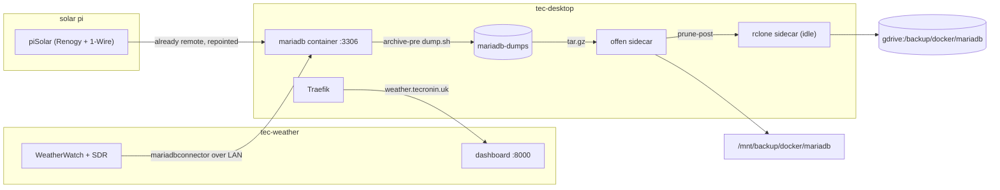

# Weather MariaDB Migration

Move the MariaDB instance off the station host `tec-weather` and into the `src/services/mariadb` container on
tec-desktop. WeatherWatch stays on the station and piSolar stays on its own Pi; both are repointed at the
container over the LAN. This finishes the one task left open in
[`container-management-overhaul.md`](container-management-overhaul.md): "when `src/services/mariadb` is in use,
add the rclone sidecar and put `deployMariadb` back in `deployAll`."

The station-to-station move
([WeatherWatch `mariadb_trixie_migration_runbook`](https://github.com/tim-oe/WeatherWatch/blob/main/.cursor/plans/mariadb_trixie_migration_runbook_3f04a621.plan.md))
already built and proved the tooling: `db-archive.sh`, `db-stale-tables.sh`, `db-inventory.sh`, `db-dump.sh`
and `db-restore.sh` in the WeatherWatch repo. This plan reuses those scripts. What is new is everything that
follows from the database no longer being on the station's localhost, and from there being **two** writers to
quiesce instead of one.

## Decisions

- **Database only.** WeatherWatch and its SDR hardware stay on tec-weather; piSolar stays on its Pi. Only the
  MariaDB instance moves.
- **Logical dump and restore**, same as the Trixie migration. No datadir copy, no replication.
- **Pin the container to whatever tec-weather is running, or newer — never older.** The container has never
  held data, so nothing constrains the choice from this side and the tag is free to pick. The source version is
  the only input. Confirm it in Phase 0 and pin from that; `mariadb:11.8.9` is the concrete answer if the
  station is still on the 11.8.6 it landed on after the Trixie migration.
- **Both writers are paused for the whole dump-and-restore window.** piSolar already connects remotely, so
  unlike WeatherWatch it will happily keep writing to the old database after the baseline inventory is taken.
  Anything it writes between the dump and the repoint is silently lost.
- **Recreate the database users by hand from captured grants.** A logical dump of the application schemas does
  not carry the `mysql` system database, so no user, password or grant survives the move.
- **Keep the existing container backup model.** MariaDB is the one stack that stays up during its backup: the
  `archive-pre` hook runs `dump.sh` into the `mariadb-dumps` volume and offen archives that, not the live
  datadir. Add the rclone sidecar to push it to `gdrive:/backup/docker/mariadb`.
- **Turn off WeatherWatch's own scheduled DB backup.** Once offen owns the dump, `WW_DB_BACKUP_ENABLE=false` on
  the station. Leaving it on means the app dumps a *remote* database nightly across the LAN into
  `/mnt/backup/weather/db`, and the same data is archived twice by two different schedulers.
- **Leave MariaDB installed but stopped on tec-weather** until the container has a couple of weeks and a
  verified restore behind it. Rollback is then repointing both clients and `systemctl start mariadb`.

### The version rule, and why 11.4.13 breaks it

**A logical restore only goes forward.** The target server has to understand everything `mariadb-dump` wrote,
so the container must be on the station's version or a later one. Since the container has never been started
with real data, there is no existing datadir arguing for any particular tag — the station's version is the only
thing that decides it.

The current pin **`mariadb:11.4.13` is older than the station's 11.8.6**, and that is not a theoretical
problem. Since MariaDB 11.5 the default collation for Unicode character sets is `utf8mb4_uca1400_ai_ci`
([MDEV-25829](https://jira.mariadb.org/browse/MDEV-25829)), and the tables declare `DEFAULT CHARSET=utf8mb4`
with no explicit `COLLATE` — so when they were restored onto 11.8 during the Trixie migration they picked up
that new default. `mariadb-dump` writes the resolved collation into every `CREATE TABLE`, and 11.4 has no
`utf8mb4_uca1400_ai_ci` at all. The restore fails with `Unknown collation` on the first table.

The Trixie runbook hit this in the other direction and noted the `character_set_collations` pin as the opt-out.
Pinning collations to force a downgrade into 11.4 would be fighting the LTS line for no reason.

So: read `SELECT VERSION();` off tec-weather in Phase 0 and pin the container to that or higher. Staying on the
same major version also removes any `mariadb-upgrade` question, and `MARIADB_AUTO_UPGRADE: "1"` is already set
for later patch bumps. As of writing, the 11.8 LTS line on Docker Hub runs to `11.8.9`.

## What exists today

- `src/services/mariadb/` is fully written but **has never been deployed**. `deployMariadb` exists and is
  deliberately excluded from `deployAll`, described as "stack not in production yet".
- The stack publishes 3306 in `host` mode, mounts `mariadb-data` and `mariadb-dumps`, runs `dump.sh` as an
  offen `archive-pre` hook, and archives `mariadb-dumps` nightly at 01:25 to `/mnt/backup/docker/mariadb`.
- **WeatherWatch** on tec-weather reads its DB settings from `config/weatherwatch.yml`, every one overridable
  by an env var: `WW_DB_HOST` (default `127.0.0.1`), `WW_PORT` (default 3306 — the name is not `WW_DB_PORT`),
  `WW_DB_NAME` (`weather`), `WW_DB_USERNAME`, `WW_DB_PASSWORD`. Driver is `mariadbconnector`, pool of 3 plus 3
  overflow.
- **piSolar** ([`tim-oe/piSolar`](https://github.com/tim-oe/piSolar)) runs on its own Pi and already writes to
  this database over the network, through one of its pluggable event-bus consumers. Its published
  `docs/CONFIGURATION.md` documents only a file metrics sink (`metrics.output_dir`), so the database consumer
  and its connection settings are either newer than those docs or configured locally — they need reading off
  the deployed `/etc/pisolar/config.yaml` rather than assumed.
- Grants on the station are already host-wildcarded — `'weather'@'%'` and `'pyway'@'%'` per WeatherWatch
  `docs/SETUP.md`, plus whatever piSolar uses — which is exactly why piSolar can connect remotely today.
- `/mnt/backup/weather/db` on tec-desktop holds the dumps WeatherWatch writes on its own 03:00 schedule. The
  `gdrive` stack syncs that path to `gdrive:/backup/weather/db` daily at 08:15 via `sync-orphans.sh`.

### Gaps found while reading the repo

- **Secrets will not resolve.** The compose file uses `${MARIADB_ROOT_PASSWORD}`, `${MARIADB_DATABASE}`,
  `${MARIADB_USERNAME}` and `${MARIADB_PASSWORD}`. These are Compose *interpolation*, which reads a stack
  `.env` or the invoking shell — never `/etc/environment`. Under `sudo docker compose` the environment is
  reset, so they expand to empty. This is the same failure that bit the Gotify and rclone stacks. It is worse
  here because `dump.sh` authenticates with `${MARIADB_ROOT_PASSWORD}`: an empty value means the nightly
  `archive-pre` hook fails and offen archives a stale or empty dump directory. A `.env` at
  `/mnt/raid/services/mariadb/` is required, and `deployMariadb` must not clobber it.
- **3306 is published on every interface.** Irrelevant while nothing connected; after this migration it is the
  actual data path for two hosts and should be bound to the LAN address.
- **No DIUN labels.** With `watchByDefault: true` and the default `^\d+(\.\d+)+$` tag filter, the stack will
  start alerting on 12.x releases. It needs an `include_tags` regex to stay on the 11.8 LTS line.
- **`mariadb-data` and `mariadb-dumps` are not in `src/bin/volumes.sh`**, unlike every other stack's volumes.
- **No README**, unlike `traefik` and `unifi-os`.
- **Timezone is inherited, not asserted.** The container mounts tec-desktop's `/etc/timezone` and
  `/etc/localtime`. The reading tables use `timestamp`, stored UTC and rendered in the session zone, so if
  tec-desktop and tec-weather disagree every historical reading shifts.

## Target state



Traefik's route to the dashboard is unchanged: `dynamic/external.yml` still points at
`http://tec-weather.localdomain:8000`. Only the arrows into the database are new.

## Phases

| Phase | Scope | Risk | Can ship independently |
|---|---|---|---|
| 0 | Discovery: schemas, users, piSolar's connection | none | yes |
| 1 | Prepare the container stack: version, secrets, sidecar, exposure | low | yes |
| 2 | Quiesce both writers, dump, restore, recreate users, verify | medium, collection halted | no |
| 3 | Repoint WeatherWatch and piSolar, confirm writes | medium | no |
| 4 | Retire the station database and rework the offsite backup path | low | yes, after 3 |

---

## Phase 0: discovery

Three things are unknown from the repos alone and each one changes a later step.

**What version the station is actually on.** `SELECT VERSION();` on tec-weather. Everything else in Phase 1
keys off this: the container tag must equal it or exceed it. Do not take 11.8.6 from the Trixie runbook on
faith — the card has been taking apt updates since.

**Which schemas exist.** The Trixie runbook dumped `--databases weather`. If piSolar writes into its own schema
rather than into `weather`, that dump silently leaves it behind. Enumerate first:

```sql
SELECT table_schema, COUNT(*) AS tables, ROUND(SUM(data_length+index_length)/1024/1024) AS mb
FROM information_schema.TABLES
WHERE table_schema NOT IN ('mysql','information_schema','performance_schema','sys')
GROUP BY table_schema;
```

Every schema in that list has to be in the dump and in the verification diff. The `mb` column also sizes
`innodb_buffer_pool_size` for Phase 1 and tells you how long the restore will take.

**Which users exist, and their grants.** Capture them in replayable form while the old server is still up:

```sql
SELECT CONCAT('SHOW GRANTS FOR ''', user, '''@''', host, ''';')
FROM mysql.user WHERE user NOT IN ('root','mariadb.sys','mysql');
```

Run each generated statement and save the output. MariaDB's `SHOW GRANTS` emits
`IDENTIFIED BY PASSWORD '<hash>'`, so replaying it preserves the existing passwords and neither WeatherWatch
nor piSolar needs a credential change. Expect at least `weather`, `pyway`, and whatever piSolar uses.

**How piSolar connects.** Read the deployed `/etc/pisolar/config.yaml` and the service's environment for the
database consumer's host, port, schema and user. Note the env var name that sets the host — that is the single
value Phase 3 changes. Also note how the service is stopped and started (`docs/SYSTEMD.md`).

---

## Phase 1: prepare the container stack

All of this happens while the station keeps running on its local database. Nothing here is a cutover step.

**Bump the image to the Phase 0 version or newer, and add the missing labels.** Shown with `11.8.9`, the top of
the 11.8 LTS line; substitute whatever Phase 0 reported if the station has moved on.

```yaml
    image: mariadb:11.8.9
    labels:
      - docker-volume-backup.exec-label=mariadb
      - docker-volume-backup.archive-pre=/bin/sh /usr/local/bin/dump.sh
      - 'diun.include_tags=^11\.8\.\d+$$'
```

The `$$` is required — Compose eats a single `$`. This matches how `jenkins` and `sonarqube` already pin their
DIUN filters.

**Bind the port to the LAN address** instead of every interface:

```yaml
    ports:
      - target: 3306
        published: "192.168.1.x:3306"
        protocol: tcp
        mode: host
```

Substitute tec-desktop's actual LAN address. With two remote clients it is also worth narrowing the replayed
grants from `@'%'` to `@'192.168.1.%'`, which is the "might want to lock down host to source" note in
WeatherWatch's `docs/SETUP.md` finally being actioned. Decide this before Phase 2, because it changes the
statements you replay.

**Drop the bootstrap user.** `MARIADB_USER` and `MARIADB_PASSWORD` make the entrypoint create one user on first
boot. Since Phase 2 replays the captured grants for all of them, that bootstrap user is redundant and will
collide if the host part differs — you end up with both `'weather'@'%'` and `'weather'@'192.168.1.%'`. Keep
`MARIADB_ROOT_PASSWORD` and `MARIADB_DATABASE`, drop the user pair, and let the grant replay be the single
source of users.

**Add the rclone sidecar**, the standard idle-container pattern used by vaultwarden, wiki and the rest:

```yaml
  gdrive:
    image: rclone/rclone:1.75.0
    container_name: mariadb-gdrive
    restart: unless-stopped
    entrypoint: ["tail", "-f", "/dev/null"]
    env_file:
      - path: /etc/environment
        required: false
    environment:
      PATH: /usr/local/sbin:/usr/local/bin:/usr/sbin:/usr/bin:/sbin:/bin
      RCLONE_SRC: /archive
      RCLONE_DEST: gdrive:/backup/docker/mariadb
      GOTIFY_URL: http://gotify
    volumes:
      - /etc/timezone:/etc/timezone:ro
      - /etc/localtime:/etc/localtime:ro
      - /root/.config/rclone/rclone.conf:/config/rclone/rclone.conf:ro
      - /mnt/backup/docker/mariadb:/archive:ro
      - ./_common/rclone-sync.sh:/rclone-sync.sh:ro
    labels:
      - docker-volume-backup.exec-label=mariadb
      - docker-volume-backup.prune-post=/bin/sh /rclone-sync.sh
      - diun.enable=false
```

Note the two `exec-label=mariadb` containers: offen runs `archive-pre` on the database and `prune-post` on the
sidecar, both scoped by the same label. Same shape as every other stack; it only looks odd here because the
hooks land on different containers.

**Write the stack `.env` on the host, after the gradle put**, at `/mnt/raid/services/mariadb/.env`:

```
MARIADB_ROOT_PASSWORD=…
MARIADB_DATABASE=weather
```

`deployMariadb` overwrites the service directory, so treat `.env` the way the Traefik Cloudflare token is
treated: write it after deploying and check it survived before starting. Verify with `sudo docker compose
config` that the values are populated, not empty.

**Tuning and gradle wiring:**

- Set `innodb_buffer_pool_size` via a `command:` override, sized from the Phase 0 schema report. The 128M
  default is small for years of partitioned readings.
- Raise `max_allowed_packet` for the restore. The `raw` columns are JSON stored as LONGTEXT and dumped with
  `--hex-blob`, so a large row can exceed the default.
- Add `mariadb-data` and `mariadb-dumps` to `src/bin/volumes.sh`.
- Add `deployMariadb` to `deployAll` in `src/gradle/services.gradle`.
- Add a `deployMariadb` `doFirst` creating `/mnt/backup/docker/mariadb`, matching `deployGotify` and
  `deployTraefik`.

**Bring the container up empty and confirm the plumbing** before any data exists: the healthcheck goes healthy,
`dump.sh` runs by hand without an auth error, and the timezone matches. Compare
`SELECT @@global.time_zone, @@system_time_zone;` in the container against the same query on tec-weather. Fix
any mismatch now, not after the data has landed.

---

## Phase 2: quiesce, dump, restore, recreate users, verify

This is the outage window. Collection stops for both weather and solar and resumes at the end of Phase 3, so
every minute here is a gap in two records. An hour is comfortable.

**Staging.** The Trixie migration staged through the NFS share at `/mnt/clones/data/weather-migration` on
tec-truenas. Confirm whether tec-desktop mounts that share. If it does, the existing scripts work unchanged. If
not, either mount it or stage through `/mnt/backup`, which both hosts already reach.

**Stop both writers first.** This is the step the single-host runbook did not need:

1. On tec-weather, stop `weatherwatch` and `weatherdash`. Leave `mariadb` running.
2. On the solar Pi, stop the piSolar service.
3. Confirm nothing is still connected before taking the baseline:

```sql
SELECT id, user, host, db, command, time FROM information_schema.PROCESSLIST
WHERE user NOT IN ('root','system user');
```

An empty result is the gate for the next step. If piSolar reconnects on a timer, disable the unit rather than
just stopping it.

**On tec-weather:**

4. Run `db-archive.sh` for the pre-migration keepsake dump and verify its sha256.
5. Run `db-stale-tables.sh`, review the generated drops, apply them. The canonical WeatherWatch set is
   `outdoor_sensor`, `indoor_sensor`, `aqi_sensor`, `light_sensor`, `pi_metrics`, `sdr_metrics`,
   `sonic_reading`, `apscheduler_jobs`, `pyway`. Add piSolar's tables to that allowlist before running it, or
   the report will offer to drop them.
6. Run `db-inventory.sh` for the comparison baseline, after the drops, covering every schema from Phase 0.
7. Run `db-dump.sh` — `--single-transaction --quick --hex-blob --routines --events --triggers`,
   `--ignore-table=weather.apscheduler_jobs`, gzipped with a sha256 sidecar. **Extend `--databases` to every
   application schema found in Phase 0**, not just `weather`.
8. Note the maximum `read_time`, and the equivalent high-water timestamp in piSolar's tables. Those are the
   boundaries the first post-cutover rows must sit after.

**On tec-desktop:**

9. Verify the checksum, then restore into the container:

```bash
gunzip -c weather_<stamp>.sql.gz \
  | sudo docker exec -i mariadb mariadb -u root -p"$MARIADB_ROOT_PASSWORD"
```

The dump carries its own `CREATE DATABASE` and `USE` statements. Do **not** run `pyway migrate` first — the
dump contains the `pyway` history table and migrating first collides with it.

10. **Recreate the users.** Replay the grant statements captured in Phase 0, adjusting the host part if you
    decided to narrow `@'%'` to `@'192.168.1.%'`. Then confirm nothing was missed:

```sql
SELECT user, host FROM mysql.user WHERE user NOT IN ('root','mariadb.sys','mysql');
SHOW GRANTS FOR 'weather'@'192.168.1.%';
```

Every application user from Phase 0 must be present with its grants scoped to the right schema. This is the
step with no safety net: the dump gives no hint that a user is missing, and the failure only shows up as a
connection error in Phase 3.

11. Re-apply the `aqi_clean` stored procedure from `sql/sp/aqi_clean.sql`, as the Trixie restore script does.
12. Run `db-inventory.sh` against the container and diff against the baseline. Confirm the yearly RANGE
    partitions landed via `information_schema.PARTITIONS`, and that `pyway info` shows the full applied history
    with nothing pending.

---

## Phase 3: repoint both clients

**WeatherWatch** is one environment variable, since `weatherwatch.yml` already reads the host from
`${WW_DB_HOST:127.0.0.1}`. Add to `/etc/environment` on tec-weather:

```
WW_DB_HOST=tec-desktop.localdomain
```

Leave `WW_PORT`, `WW_DB_NAME`, `WW_DB_USERNAME` and `WW_DB_PASSWORD` alone unless the grants were narrowed.
Restart both units and tail `/var/log/WeatherWatch_err.log`.

**piSolar** changes the host in whatever `/etc/pisolar/config.yaml` or env var Phase 0 identified. Because it
was already pointing across the network at tec-weather, this is a hostname swap rather than a
localhost-to-remote conversion — the connection handling, retries and grants are all already exercised. Restart
the service and re-enable the unit if it was disabled in Phase 2.

**Verify both.** New rows in each schema must land after their Phase 2 boundary timestamps, with a gap that
matches the outage rather than hinting at a timezone shift.

**The new failure mode** for WeatherWatch — not for piSolar, which already lives with it — is that a scheduled
reading now depends on the LAN and on tec-desktop being up. Two things worth checking rather than assuming:

- The nightly offen run at 01:25 does **not** stop the database. That is the entire reason MariaDB uses a
  logical dump instead of `stop-during-backup`, so routine backups cause no outage for either client.
- A `docker compose up -d` on the mariadb stack *does* drop every connection. Confirm both clients reconnect
  rather than wedging their schedulers; WeatherWatch's pool is only 3 connections plus 3 overflow. If either
  does not recover cleanly, that is an upstream fix in the app, not something this repo can paper over.

---

## Phase 4: retire the station database and rework the backup path

**Stop and disable MariaDB on tec-weather**, but do not purge it. Keep the datadir until the container has a
couple of weeks and a verified offsite restore behind it.

**Turn off the app-side DB backup**: `WW_DB_BACKUP_ENABLE=false` on the station. Otherwise the 03:00 job keeps
dumping the now-remote database into `/mnt/backup/weather/db`, duplicating what offen archives at 01:25.

**Then deal with `/mnt/backup/weather/db` carefully.** `sync-orphans.sh` runs `rclone sync` against it, and
`sync` mirrors deletions. If that directory is emptied while the sync leg is still active, the next 08:15 run
**deletes the historical dumps from Google Drive too**. Order matters:

1. Remove the weather leg from `src/services/gdrive/sync-orphans.sh` first, and redeploy.
2. Only then clean up the local directory.
3. If the old `gdrive:/backup/weather/db` contents are worth keeping, move them to an archival prefix on the
   remote before either step. Nothing will be writing to that path again.

Check whether `/mnt/backup/weather` also receives the station's *file* backups (pix and vid) before removing
anything. `backup.file.enable` and `backup.db.enable` are separate settings in `weatherwatch.yml`, and only the
db half is being replaced here.

**Update both app repos** to match: WeatherWatch `docs/SETUP.md` gains the remote-host setup and the note that
production now lives in a container on tec-desktop; piSolar's configuration docs get the same treatment, along
with the database consumer that is currently undocumented.

---

## Sequencing note

Phase 0 is read-only and should be done first and separately — it is what tells you whether the dump command
from the Trixie runbook is even complete for this estate. Phase 1 is independent and can be done any evening.
Phases 2 and 3 are one sitting with both collectors halted, and should not be split across a night: a
collector that is up but writing to the old database is worse than one that is down, because those rows are
lost rather than merely missing. Phase 4 waits until the container has proven itself, and its ordering
constraint around `rclone sync` deletions is the one genuinely destructive step in this plan.

## Task list

### Phase 0: discovery

- [ ] Record `SELECT VERSION();` on tec-weather and pick the container tag from it — equal or newer, never
  older.
- [ ] Enumerate application schemas and their sizes on tec-weather; confirm whether piSolar writes into
  `weather` or its own schema.
- [ ] Capture `SHOW GRANTS` output for every non-system user in replayable form, and store it with the
  migration artifacts.
- [ ] Read piSolar's deployed config for its DB host, port, schema, user, and the env var that sets the host;
  note how the service is stopped and started.
- [ ] Confirm whether tec-desktop can reach `/mnt/clones/data/weather-migration`; if not, choose a staging path
  all hosts share.

### Phase 1: prepare the container stack

- [ ] Bump `src/services/mariadb/docker-compose.yml` to the tag chosen in Phase 0 and add a matching
  `diun.include_tags` regex so the stack stays on that LTS line (`^11\.8\.\d+$$` for 11.8).
- [ ] Bind `published:` to tec-desktop's LAN address rather than all interfaces, and decide whether grants
  narrow to `@'192.168.1.%'`.
- [ ] Drop `MARIADB_USER` / `MARIADB_PASSWORD` so the Phase 2 grant replay is the only source of users.
- [ ] Add the `mariadb-gdrive` rclone sidecar with `prune-post` and `RCLONE_DEST: gdrive:/backup/docker/mariadb`.
- [ ] Add a `doFirst` to `deployMariadb` creating `/mnt/backup/docker/mariadb`, and add `deployMariadb` to
  `deployAll`.
- [ ] Add `mariadb-data` and `mariadb-dumps` to `src/bin/volumes.sh`.
- [ ] Create `/mnt/raid/services/mariadb/.env` after the gradle put, and verify with `docker compose config`
  that the values are populated rather than empty.
- [ ] Start the empty container, confirm the healthcheck goes healthy and `dump.sh` runs without an auth error.
- [ ] Compare `@@global.time_zone` and `@@system_time_zone` between the container and tec-weather; reconcile
  before any data is restored.
- [ ] Write `src/services/mariadb/README.md` covering the two remote clients, the `.env` requirement, the
  dump-not-stop backup model, and the restore procedure.

### Phase 2: quiesce, dump, restore, verify

- [ ] Stop WeatherWatch and piSolar, then confirm `information_schema.PROCESSLIST` shows no application
  connections before taking the baseline.
- [ ] Run `db-archive.sh`, verify the checksum, then `db-stale-tables.sh` with piSolar's tables added to the
  canonical allowlist, and apply the reviewed drops.
- [ ] Run `db-inventory.sh` across every schema for the baseline, then `db-dump.sh` with `--databases` covering
  all of them. Record the high-water timestamp per schema.
- [ ] Restore into the container and re-apply `sql/sp/aqi_clean.sql`.
- [ ] Replay the captured grants, then verify every application user exists with the right scope.
- [ ] Diff the post-restore inventory against the baseline; confirm partitions and `pyway info`.
- [ ] Size `innodb_buffer_pool_size` from the actual dataset size and redeploy.

### Phase 3: repoint both clients

- [ ] Set `WW_DB_HOST=tec-desktop.localdomain` in `/etc/environment` on tec-weather and restart both units.
- [ ] Repoint piSolar's database host, restart and re-enable the service.
- [ ] Confirm new rows in each schema land after that schema's boundary timestamp and the gap matches the
  outage window.
- [ ] Verify both clients recover from a `docker compose up -d` on the mariadb stack.

### Phase 4: retire the station database and rework backups

- [ ] Stop and disable `mariadb` on tec-weather, leaving the datadir in place as rollback.
- [ ] Set `WW_DB_BACKUP_ENABLE=false` on the station.
- [ ] Archive `gdrive:/backup/weather/db` to a retained prefix, remove the weather leg from
  `sync-orphans.sh`, redeploy `gdrive`, and only then clean up the local directory.
- [ ] Confirm the first offen run produces an archive in `/mnt/backup/docker/mariadb` and that the rclone
  sidecar pushes it to `gdrive:/backup/docker/mariadb`.
- [ ] Do one restore rehearsal from the offsite copy before purging anything on the station.
- [ ] Tick the deferred MariaDB task in [`container-management-overhaul.md`](container-management-overhaul.md).
- [ ] Update WeatherWatch `docs/SETUP.md` and piSolar's configuration docs for the remote-database setup.
