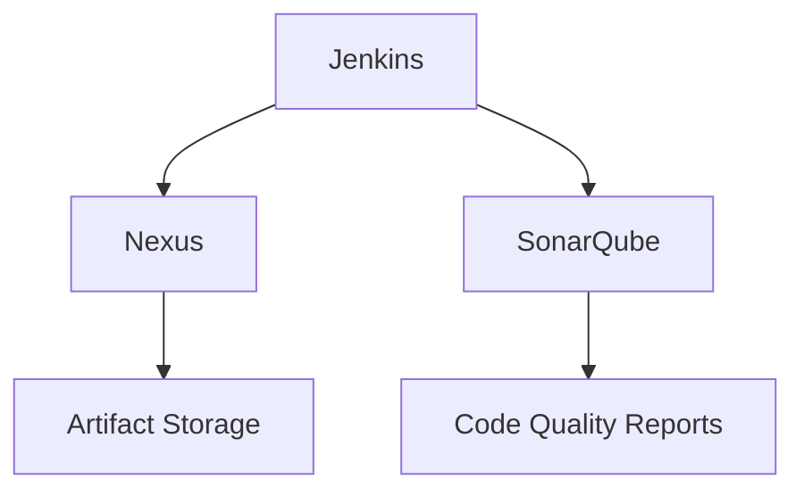
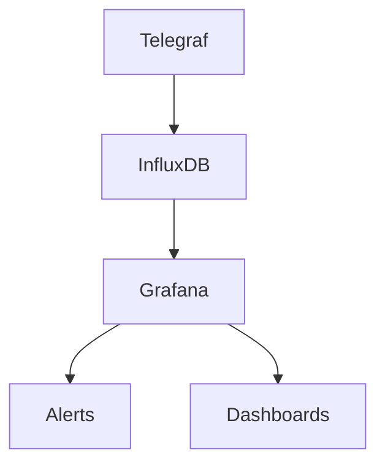
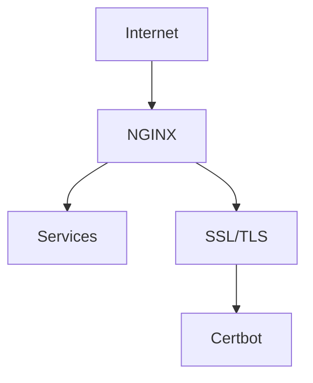

# Service Configuration Guide

## Build Tools

### Jenkins
- **Purpose**: Continuous Integration/Continuous Deployment server
- **Configuration Location**: `src/services/build/jenkins/`
- **Default Port**: 8080
- **Configuration Steps**:
  1. Initial setup using configuration as code
  2. Plugin installation and configuration
  3. Pipeline setup and credentials management
  4. Integration with other services

### Nexus
- **Purpose**: Repository manager for artifacts
- **Configuration Location**: `src/services/build/nexus/`
- **Default Port**: 8081
- **Configuration Steps**:
  1. Repository setup (Maven, Docker, etc.)
  2. Security configuration
  3. Cleanup policies
  4. Storage configuration

### SonarQube
- **Purpose**: Code quality and security analysis
- **Configuration Location**: `src/services/build/sonarqube/`
- **Default Port**: 9000
- **Configuration Steps**:
  1. Database setup
  2. Quality profiles configuration
  3. Integration with CI/CD
  4. Custom rule configuration

## Monitoring Stack

### Grafana
- **Purpose**: Visualization and analytics
- **Configuration Location**: `src/services/monitoring/grafana/`
- **Default Port**: 3000
- **Configuration Steps**:
  1. Data source configuration
  2. Dashboard import/setup
  3. Alert configuration
  4. User management

### InfluxDB
- **Purpose**: Time series database
- **Configuration Location**: `src/services/monitoring/influxdb/`
- **Default Port**: 8086
- **Configuration Steps**:
  1. Database creation
  2. Retention policy setup
  3. User access configuration
  4. Backup configuration

### Telegraf
- **Purpose**: Server agent for collecting metrics
- **Configuration Location**: `src/services/monitoring/telegraf/`
- **Configuration Steps**:
  1. Input plugin configuration
  2. Output plugin setup
  3. Monitoring interval configuration
  4. System resource monitoring setup

## Network Management

### Unifi Controller
- **Purpose**: Wireless Access Point management
- **Configuration Location**: `src/services/network/unifi/`
- **Default Port**: 8443
- **Configuration Steps**:
  1. Initial setup wizard
  2. Device adoption
  3. Network configuration
  4. Security settings

### NGINX
- **Purpose**: Reverse proxy server
- **Configuration Location**: `src/services/network/nginx/`
- **Default Port**: 80/443
- **Configuration Steps**:
  1. Virtual host configuration
  2. SSL certificate setup
  3. Security headers
  4. Load balancing configuration

## Security Services

### Vaultwarden
- **Purpose**: Password management system
- **Configuration Location**: `src/services/security/vaultwarden/`
- **Default Port**: 8000
- **Configuration Steps**:
  1. Initial admin setup
  2. SMTP configuration
  3. Security policy configuration
  4. Backup setup

### Certbot
- **Purpose**: SSL certificate automation
- **Configuration Location**: `src/services/security/certbot/`
- **Configuration Steps**:
  1. DNS provider setup (Cloudflare)
  2. Domain configuration
  3. Auto-renewal setup
  4. Hook script configuration

## Infrastructure Management

### Portainer
- **Purpose**: Docker container management
- **Configuration Location**: `src/services/infrastructure/portainer/`
- **Default Port**: 9000
- **Configuration Steps**:
  1. Initial admin setup
  2. Environment configuration
  3. Registry setup
  4. Team/user management

### Docker Volume Backup
- **Purpose**: Data persistence and backup
- **Configuration Location**: `src/services/backup/`
- **Configuration Steps**:
  1. Volume selection
  2. Schedule configuration
  3. Retention policy
  4. Notification setup

## Home Automation

### OpenHAB
- **Purpose**: Home automation platform
- **Configuration Location**: `src/services/automation/openhab/`
- **Default Port**: 8080
- **Configuration Steps**:
  1. Initial setup
  2. Thing configuration
  3. Rule creation
  4. UI configuration

## Environment Variables

### Required Environment Variables
```bash
# Jenkins Configuration
JENKINS_ADMIN_ID=admin
JENKINS_ADMIN_PASSWORD=your_secure_password

# Database Credentials
DB_USER=dbuser
DB_PASSWORD=your_secure_password

# Backup Configuration
BACKUP_RETENTION_DAYS=7
RCLONE_REMOTE_NAME=your_remote

# Security
SSL_EMAIL=your_email@domain.com
CLOUDFLARE_API_TOKEN=your_token
```

### Optional Environment Variables
```bash
# Monitoring
GRAFANA_ADMIN_PASSWORD=your_secure_password
INFLUXDB_RETENTION=30d

# Network
NGINX_WORKER_PROCESSES=auto
NGINX_WORKER_CONNECTIONS=1024

# Security
FAIL2BAN_BANTIME=1h
FAIL2BAN_FINDTIME=1h
```

## Service Dependencies

### Build Pipeline


### Monitoring Pipeline


### Network Flow


## Service Ports

| Service | Port | Protocol | Purpose |
|---------|------|----------|----------|
| Jenkins | 8080 | HTTP | Web Interface |
| Nexus | 8081 | HTTP | Repository Manager |
| SonarQube | 9000 | HTTP | Code Analysis |
| Grafana | 3000 | HTTP | Monitoring UI |
| InfluxDB | 8086 | HTTP | Time Series DB |
| Unifi | 8443 | HTTPS | Controller UI |
| NGINX | 80/443 | HTTP/HTTPS | Reverse Proxy |
| Vaultwarden | 8000 | HTTP | Password Manager |
| Portainer | 9000 | HTTP | Container Management |
| OpenHAB | 8080 | HTTP | Home Automation | 