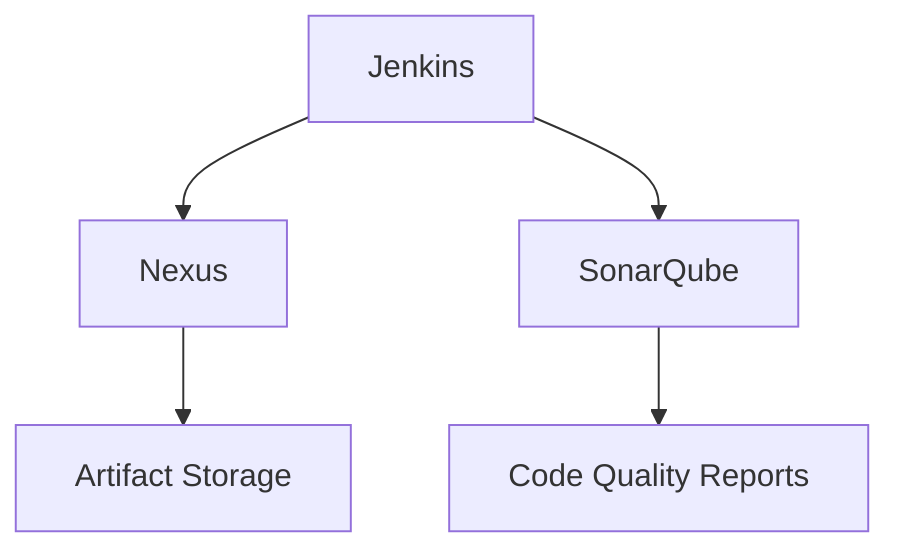
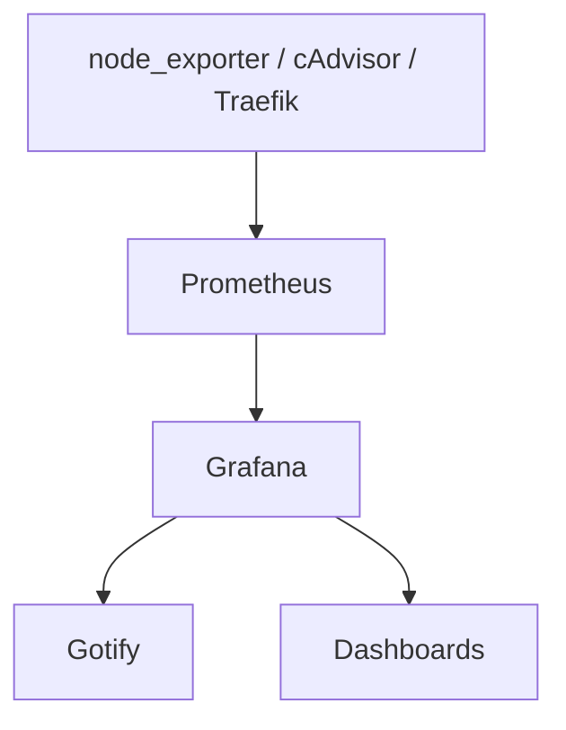
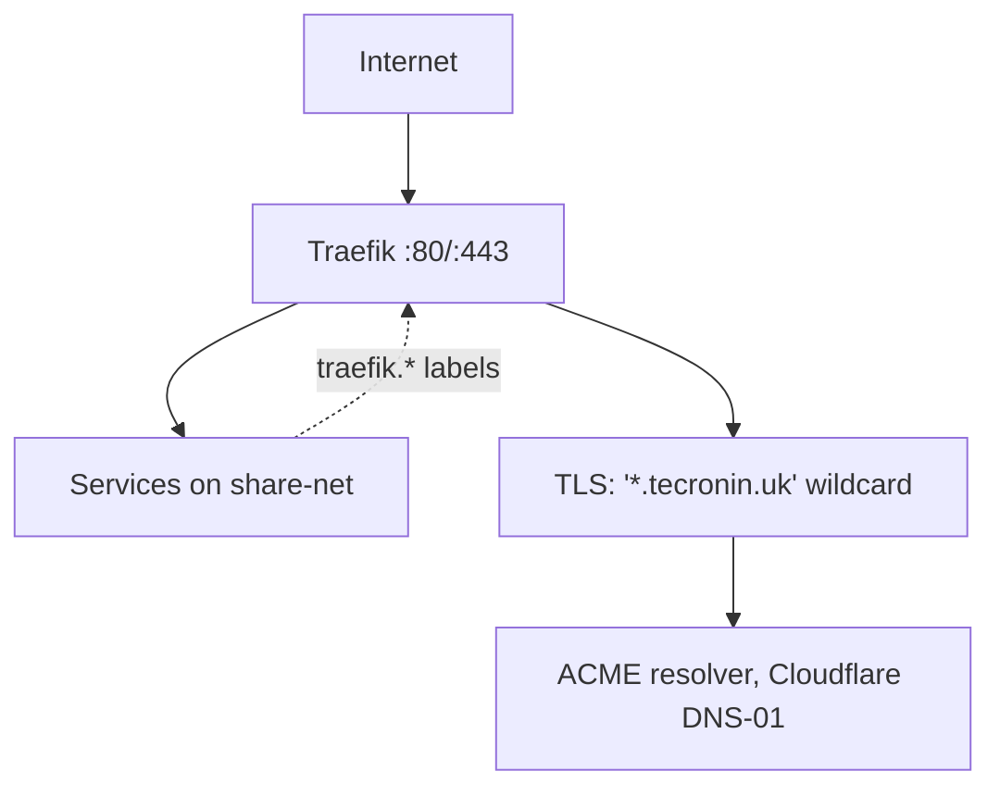

# Service Configuration Guide

## Build Tools

### Jenkins
- **Purpose**: Continuous Integration/Continuous Deployment server
- **Configuration Location**: `src/services/jenkins/`
- **Default Port**: 8088 (container still listens on 8080; Traefik routes to `jenkins:8080` over share-net)
- **Configuration Steps**:
  1. Initial setup using configuration as code
  2. Plugin installation and configuration
  3. Pipeline setup and credentials management
  4. Integration with other services

### Nexus
- **Purpose**: Repository manager for artifacts
- **Configuration Location**: `src/services/nexus/`
- **Default Port**: 8081
- **Configuration Steps**:
  1. Repository setup (Maven, Docker, etc.)
  2. Security configuration
  3. Cleanup policies
  4. Storage configuration

### SonarQube
- **Purpose**: Code quality and security analysis
- **Configuration Location**: `src/services/sonarqube/`
- **Default Port**: 9000 (its postgres publishes 5432)
- **Configuration Steps**:
  1. Database setup
  2. Quality profiles configuration
  3. Integration with CI/CD
  4. Custom rule configuration

## Monitoring Stack

### Grafana
- **Purpose**: Visualization, git-tracked dashboards, and unified alerting
- **Configuration Location**: `src/services/grafana/` — `provisioning/` and `dashboards/` are bind-mounted
- **Default Port**: 3000
- **Configuration Steps**:
  1. Stack `.env` on the host: `GRAFANA_USERNAME`, `GRAFANA_PASSWORD`, `GRAFANA_DOMAIN`, `GOTIFY_TOKEN`
  2. Datasource, dashboards, contact point, and alert rules are provisioned from this repo
  3. Create a dedicated Gotify application for alerts (not DIUN's) and put its token in `.env`

### Prometheus
- **Purpose**: Time series scrape store for hosts, containers, and Traefik
- **Configuration Location**: `src/services/prometheus/` — see [its README](../src/services/prometheus/README.md)
- **Default Port**: 9090 inside the container, LAN-only via Traefik (`prometheus.tecronin.uk`)
- **Configuration Steps**:
  1. `prometheus.yml` lists scrape targets; adding a host is a new static_config line
  2. Retention is 90 days / 15 GB, scrape interval 30s
  3. Native node_exporter on Debian hosts is [piImage `common/node_exporter`](https://github.com/tim-oe/piImage); tec-kvm is pacman on PiKVM; fort-apache is the OPNsense plugin

### Metrics collection
node_exporter on each host (`:9100`), cAdvisor for containers on tec-desktop, Traefik's unpublished
`:8082` metrics entrypoint. No Telegraf, no InfluxDB.

## Network Management

### UniFi OS Server
- **Purpose**: Wireless Access Point management
- **Configuration Location**: `src/services/unifi-os/`
- **Default Port**: 11443 (GUI; device inform is 8080)
- **Configuration Steps**:
  1. Initial setup wizard
  2. Device adoption
  3. Network configuration
  4. Security settings

### Traefik
- **Purpose**: Reverse proxy and TLS termination for every routed service
- **Configuration Location**: `src/services/traefik/` — see [its README](../src/services/traefik/README.md) for the route inventory and label reference
- **Default Port**: 80/443
- **Configuration Steps**:
  1. Static config in `traefik.yml`: entrypoints, Cloudflare DNS-01 resolver, docker and file providers
  2. Per-service routes as `traefik.*` labels on the service's own container
  3. File-provider exceptions in `dynamic/`: LAN allow list, UniFi transport, external weather route
  4. `CF_DNS_API_TOKEN` written once to `/mnt/raid/services/traefik/.env` on the host

## Security Services

### Vaultwarden
- **Purpose**: Password management system
- **Configuration Location**: `src/services/vaultwarden/`
- **Default Port**: 8860 (LAN-only via the `lan-only@file` middleware)
- **Configuration Steps**:
  1. Initial admin setup
  2. SMTP configuration
  3. Security policy configuration
  4. Backup setup

TLS is no longer a separate service. Traefik's ACME resolver issues and renews the
`*.tecronin.uk` wildcard over the Cloudflare DNS-01 challenge and stores it in `acme.json`.

## Infrastructure Management

### Portainer
- **Purpose**: Docker container management
- **Configuration Location**: `src/services/portainer/`
- **Default Port**: 9000 in the container, published on the host as 8050
- **Configuration Steps**:
  1. Initial admin setup
  2. Environment configuration
  3. Registry setup
  4. Team/user management

### Docker Volume Backup
- **Purpose**: Data persistence and backup
- **Configuration Location**: per stack, not central — an `offen/docker-volume-backup` sidecar in
  each of `vaultwarden`, `unifi-os`, `wiki`, `gotify`, `traefik`, `grafana` (and `mariadb`, deferred), paired
  with an `rclone` sidecar for the offsite push
- **Configuration Steps**:
  1. Volume selection: mount it `:ro` under `/backup` in the sidecar
  2. Schedule via `BACKUP_CRON_EXPRESSION`, retention via `BACKUP_RETENTION_DAYS`
  3. `docker-volume-backup.stop-during-backup=true` on every container in the stack
  4. `EXEC_LABEL` on the sidecar so lifecycle hooks do not cross-fire between stacks
- See the backup section of the [main README](../README.md) for the full picture

## Home Automation

### OpenHAB
- **Purpose**: Home automation platform
- **Configuration Location**: `src/services/openhab/`
- **Default Port**: 8881
- **Configuration Steps**:
  1. Initial setup
  2. Thing configuration
  3. Rule creation
  4. UI configuration

## Environment Variables

### Required Environment Variables
```bash
# Jenkins Configuration
JENKINS_ADMIN_ID=admin
JENKINS_ADMIN_PASSWORD=your_secure_password

# Database Credentials
DB_USER=dbuser
DB_PASSWORD=your_secure_password

# Backup Configuration
BACKUP_RETENTION_DAYS=7

# Traefik (src/services/traefik/.env on the host)
CF_DNS_API_TOKEN=your_cloudflare_dns_token

# Grafana (src/services/grafana/.env on the host)
GRAFANA_USERNAME=admin
GRAFANA_PASSWORD=your_secure_password
GRAFANA_DOMAIN=grafana.tecronin.uk
GOTIFY_TOKEN=your_grafana_alert_app_token
```

### Host `/etc/environment`
Injected into the rclone sidecars and DIUN via compose `env_file`, so notification tokens live in
one place rather than per stack. Grafana's alert token is an exception: it lives in
`/mnt/raid/services/grafana/.env` (`GOTIFY_TOKEN`).
```bash
GOTIFY_APP_TOKEN=your_rclone_app_token
DIUN_NOTIF_GOTIFY_TOKEN=your_diun_app_token
```

### Optional Environment Variables
```bash
# Security
FAIL2BAN_BANTIME=1h
FAIL2BAN_FINDTIME=1h
```

## Service Dependencies

### Build Pipeline

```mermaid
graph TD
    A[Jenkins] --> B[Nexus]
    A --> C[SonarQube]
    B --> D[Artifact Storage]
    C --> E[Code Quality Reports]
```

### Monitoring Pipeline

```mermaid
graph TD
    A[node_exporter / cAdvisor / Traefik] --> B[Prometheus]
    B --> C[Grafana]
    C --> D[Gotify]
    C --> E[Dashboards]
```

### Network Flow

```mermaid
graph TD
    A[Internet] --> B[Traefik :80/:443]
    B --> C[Services on share-net]
    B --> D[TLS: '*.tecronin.uk' wildcard]
    D --> E[ACME resolver, Cloudflare DNS-01]
    C -.->|traefik.* labels| B
```

## Service Ports

| Service | Port | Protocol | Purpose |
|---------|------|----------|----------|
| Jenkins | 8088 | HTTP | Web Interface (host publish; container 8080) |
| Nexus | 8081 | HTTP | Repository Manager |
| SonarQube | 9000 | HTTP | Code Analysis |
| Grafana | 3000 | HTTP | Monitoring UI |
| Prometheus | 9090 | HTTP | Scrape store (Traefik, LAN-only; not published) |
| node_exporter | 9100 | HTTP | Host metrics on each machine |
| UniFi OS Server | 11443 | HTTPS | Controller UI |
| Traefik | 80/443 | HTTP/HTTPS | Reverse Proxy |
| Vaultwarden | 8860 | HTTP | Password Manager |
| Portainer | 8050 | HTTP | Container Management (container 9000) |
| OpenHAB | 8881 | HTTP | Home Automation |

Ports here are the host-published ones, used for troubleshooting. Normal access is
`https://<svc>.tecronin.uk` through Traefik, which reaches each container over `share-net`.
